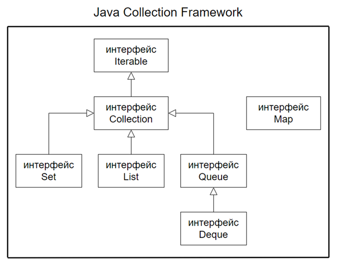

## *Collection lite*

- [Что такое "коллекция".](#1-что-такое-коллекция)
- [Перечислите основные методы из интерфейса java.util.Collection. Назовите преимущества использования коллекций по сравнению с массивами.](#2-назовите-преимущества-использования-коллекций-по-сравнению-с-массивами)
- [Какие данные могут хранить коллекции?](#3-какие-данные-могут-хранить-коллекции)
- [Какие есть типы коллекций? Как они характеризуются? Расскажите про иерархию коллекций List, Set, Map.](#4-какие-есть-типы-коллекций-как-они-характеризуются-расскажите-про-иерархию-коллекций-list-set-map)
- [Назовите основные классы, которые имплементируют/реализуют интерфейсы List, Set, Map.](#5-назовите-основные-классы-которые-имплементируютреализуют-интерфейсы-list-set-map)
- [В чём отличие ArrayList от LinkedList?](#6-в-чём-отличие-arraylist-от-linkedlist)
- [В чём отличие HashSet от TreeSet?](#7-в-чём-отличие-hashset-от-treeset)
- [В чём отличие Set от Map?](#8-в-чём-отличие-set-от-map)
- [Как задается порядок следования объектов в коллекции, как отсортировать коллекцию?](#9-как-задается-порядок-следования-объектов-в-коллекции-как-отсортировать-коллекцию)
- [Чем отличается Comparable от Comparator?](#10-чем-отличается-comparable-от-comparator)
- [Что такое сортировка по принципу Natural Order?](#11-что-такое-сортировка-по-принципу-natural-order)
- [Что такое equals и hashcode?](#12-что-такое-equals-и-hashcode)
- [Какие есть способы перебора всех элементов List?](#13-какие-есть-способы-перебора-всех-элементов-list)
- [Расскажите об основных методах Map.](#14-расскажите-об-основных-методах-map)
- [Расскажите, какие классы реализовывают интерфейс Map?](#15-расскажите-какие-классы-реализовывают-интерфейс-map)
- [Расскажите о методах map.keySet и map.entrySet? Что такое Entry?](#16-расскажите-о-методах-mapkeyset-и-mapentryset-что-такое-entry)
- [Что будет если вызвать метод map.put несколько раз с одинаковым ключом?](#17-что-будет-если-вызвать-метод-mapput-несколько-раз-с-одинаковым-ключом)
- [Как реализован цикл foreach?](#18-как-реализован-цикл-foreach)
- [В чем разница между Iterator и Iterable?](#19-в-чем-разница-между-iterator-и-iterable)
- [Как происходит удаление элементов из ArrayList?](#20-как-происходит-удаление-элементов-из-arraylist)
- [Как происходит удаление элементов из LinkedList?](#21-как-происходит-удаление-элементов-из-linkedlist)
- [Что такое автоупаковка и распаковка? Зачем они нужны?](#22-что-такое-автоупаков-ка-и-распаковка-зачем-они-нужны)
- [В каком случае при работе с упакованными значениями может возникнуть проблема с производительностью?](#23-в-каком-случае-при-работе-с-упакованными-значениями-может-возникнуть-проблема-с-производительностью)
- [Опишите недостатки и преимущества в использовании примитивных типов и классов-оберток.](#24-опишите-недостатки-и-преимущества-в-использовании-примитивных-типов-и-классов-оберток)
- [Что такое очередь? Расскажите принцип работы и для чего она используется.](#25-что-такое-очередь-расскажите-принцип-работы-и-для-чего-она-используется)
- [Расскажите про интерфейсы Queue, Deque и их иерархию.](#26-расскажите-про-интерфейсы-queue-deque-и-их-иерархию)
- [В чем отличие метода poll() от remove()?](#27-в-чем-отличие-метода-poll-от-remove)
- [В чем отличие метода element() от peek()?](#28-в-чем-отличие-метода-element-от-peek)
- [В чем отличие метода element() от poll()?](#29-в-чем-отличие-метода-element-от-poll)
- [Перечислите наиболее часто используемые реализации интерфейса Queue.](#30-перечислите-наиболее-часто-используемые-реализации-интерфейса-queue)
- [Что такое ограниченные и неограниченные очереди?](#31-что-такое-ограниченные-и-неограниченные-очереди)
- [Что такой односторонние и двусторонние очереди?](#32-что-такой-односторонние-и-двусторонние-очереди)
- [В чём отличие Deque от Queue?](#33-в-чём-отличие-deque-от-queue)
- [В чём отличие методов removeLast() и pollLast()?](#34-в-чём-отличие-методов-removelast-и-polllast)
- [Назовите самую распространенную реализацию Deque.](#35-назовите-самую-распространенную-реализацию-deque)

---

### 1. Что такое "коллекция".
Коллекция — это объект, предназначенный для хранения и управления группой других объектов (элементов).
+ Коллекции позволяют:
    +	хранить наборы данных (числа, строки, объекты пользовательских классов),
    +	динамически добавлять, удалять и искать элементы,
    +	работать с данными удобнее и безопаснее, чем с массивами.
### 1.1. Перечислите основные методы из интерфейса java.util.Collection.
| Группа | Метод | Описание |
|------|------|---------|
| Добавление | `add(E e)` | Добавляет элемент в коллекцию |
| Добавление | `addAll(Collection<? extends E> c)` | Добавляет все элементы из другой коллекции |
| Удаление | `remove(Object o)` | Удаляет указанный элемент |
| Удаление | `removeAll(Collection<?> c)` | Удаляет все элементы, содержащиеся в другой коллекции |
| Удаление | `retainAll(Collection<?> c)` | Оставляет только элементы, содержащиеся в другой коллекции |
| Удаление | `clear()` | Удаляет все элементы из коллекции |
| Проверка | `contains(Object o)` | Проверяет, содержится ли элемент в коллекции |
| Проверка | `containsAll(Collection<?> c)` | Проверяет, содержит ли коллекция все элементы другой |
| Проверка | `isEmpty()` | Проверяет, пуста ли коллекция |
| Проверка | `size()` | Возвращает количество элементов |
| Обход | `iterator()` | Возвращает итератор для обхода элементов |
| Обход | `forEach(Consumer<? super E> action)` | Выполняет действие для каждого элемента (Java 8+) |
| Преобразование | `toArray()` | Возвращает массив элементов |
| Преобразование | `toArray(T[] a)` | Возвращает массив указанного типа |

### 2. Назовите преимущества использования коллекций по сравнению с массивами.
+	Динамический размер — нет необходимости заранее задавать и вручную контролировать размер коллекции;
+	Богатый API — предоставляют готовые методы для добавления, удаления, поиска, сортировки и обработки элементов;
+	Повышение производительности — при правильном выборе реализации коллекции можно добиться более эффективной работы программы;
+	Универсальность — служат стандартным способом хранения и передачи данных между различными частями приложения;
+	Поддержка обобщений (generics) — обеспечивают безопасность типов во время компиляции;
+  Удобный обход элементов — поддержка итераторов, for-each, Stream API.
### 3. Какие данные могут хранить коллекции?
Коллекции в Java могут хранить только ссылочные типы данных (объекты).

**Это могут быть**:
+	объекты стандартных классов (String, Integer, LocalDate и т.д.),
+	объекты пользовательских классов,
+	объекты-обёртки над примитивами (Integer, Double, Boolean и др.).

### 4. Какие есть типы коллекций? Как они характеризуются? Расскажите про иерархию коллекций List, Set, Map.

  

В основе Java Collections Framework лежит интерфейс Iterable, который содержит один метод:
        
    Iterator<T> iterator();

+ Интерфейс Collection расширяет Iterable и является базовым интерфейсом для большинства коллекций.
    + Все коллекции, реализующие Collection, можно перебирать с помощью for-each.
      + Итератор — это объект, реализующий паттерн Iterator, который предоставляет единый способ последовательного доступа к элементам коллекции без знания её внутренней структуры.

Основные типы коллекций
1. List — упорядоченная коллекция

Характеристики:
+ сохраняет порядок добавления элементов;
+ допускает дубликаты;
+ поддерживает доступ по индексу.

**Основные реализации**:

ArrayList
+ основан на динамическом массиве;
+ быстрый доступ по индексу (O(1));
+ медленные вставки и удаления в середине списка.

LinkedList
+ двусвязный список;
+ быстрые вставки и удаления;
+ медленный доступ по индексу.

Vector
+ устаревшая потокобезопасная реализация List;
+ методы синхронизированы.

Stack
+ наследуется от Vector;
+ реализует стек (LIFO);
+ считается устаревшим, рекомендуется Deque.

2. Set — коллекция уникальных элементов
   Характеристики:
   не допускает дубликатов;
   порядок хранения зависит от реализации.

**Основные реализации**:

HashSet
+ основан на HashMap;
+ порядок элементов не гарантируется.

LinkedHashSet
+ сохраняет порядок добавления элементов.

TreeSet
+ хранит элементы в отсортированном виде;
+ использует natural ordering или Comparator;
+ основан на красно-чёрном дереве.

3. Queue / Deque — очереди

Queue

Предназначена для обработки элементов в порядке FIFO (first-in-first-out).

PriorityQueue
+ элементы извлекаются по приоритету;
+ порядок задаётся Comparator или естественным порядком.

Deque (двусторонняя очередь)
+ Расширяет Queue, позволяет работать как с FIFO, так и с LIFO.

ArrayDeque
+ замена Stack;
+ эффективная реализация очереди и стека.

**Map — ассоциативная коллекция (НЕ наследуется от Collection)**

Map хранит данные в виде пар ключ–значение.

Характеристики:
+ ключи уникальны;
+ значения могут повторяться.

Основные реализации:

HashMap
+ неупорядоченная хэш-таблица;
+ допускает один null-ключ и null-значения.

LinkedHashMap
+ сохраняет порядок вставки.

TreeMap
+ отсортированная карта;
+ использует Comparator или natural ordering;
+ основана на красно-чёрном дереве.

Hashtable
+ устаревшая синхронизированная реализация;
+ не допускает null.

WeakHashMap
+ ключи хранятся как weak references;
+ элементы удаляются GC при отсутствии жёстких ссылок на ключ.

### 5. Назовите основные классы, которые имплементируют/реализуют интерфейсы List, Set, Map.

### 6. В чём отличие ArrayList от LinkedList?

### 7. В чём отличие HashSet от TreeSet?

### 8. В чём отличие Set от Map?

### 9. Как задается порядок следования объектов в коллекции, как отсортировать коллекцию?

### 10. Чем отличается Comparable от Comparator?

### 11. Что такое сортировка по принципу Natural Order?

### 12. Что такое equals и hashcode?

### 13. Какие есть способы перебора всех элементов List?

### 14. Расскажите об основных методах Map.

### 15. Расскажите, какие классы реализовывают интерфейс Map?

### 16. Расскажите о методах map.keySet и map.entrySet? Что такое Entry?

### 17. Что будет если вызвать метод map.put несколько раз с одинаковым ключом?

### 18. Как реализован цикл foreach?

### 19. В чем разница между Iterator и Iterable?

### 20. Как происходит удаление элементов из ArrayList?

### 21. Как происходит удаление элементов из LinkedList?

### 22. Что такое автоупаков### ка и распаковка? Зачем они нужны?

### 23. В каком случае при работе с упакованными значениями может возникнуть проблема с производительностью?

### 24. Опишите недостатки и преимущества в использовании примитивных типов и классов-оберток.

### 25. Что такое очередь? Расскажите принцип работы и для чего она используется.

### 26. Расскажите про интерфейсы Queue, Deque и их иерархию.

### 27. В чем отличие метода poll() от remove()?

### 28. В чем отличие метода element() от peek()?

### 29. В чем отличие метода element() от poll()?

### 30. Перечислите наиболее часто используемые реализации интерфейса Queue.

### 31. Что такое ограниченные и неограниченные очереди?

### 32. Что такой односторонние и двусторонние очереди?

### 33. В чём отличие Deque от Queue?

### 34. В чём отличие методов removeLast() и pollLast()?

### 35. Назовите самую распространенную реализацию Deque.