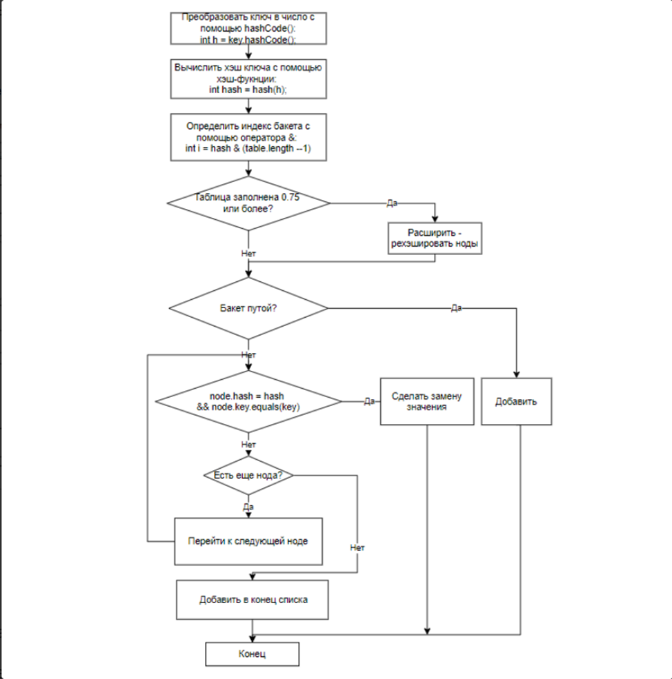
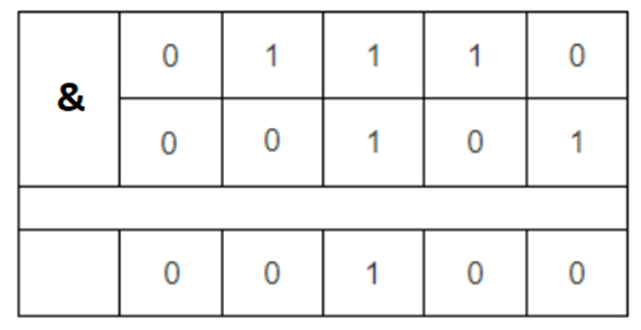
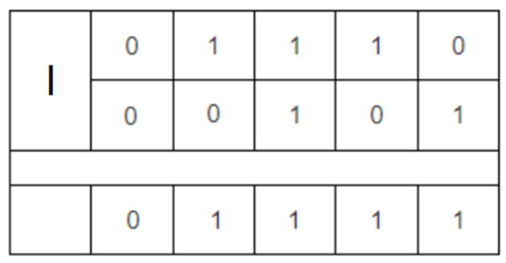
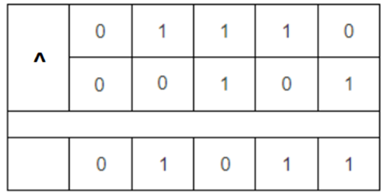

## *Структуры данных и алгоритмы*

- [Что такое generics?](#1-что-такое-generics)
- [Что такое wild cards?](#2-что-такое-wild-cards)
- [Что такое bounded wild cards?](#3-что-такое-bounded-wild-cards)
- [Что такое unbounded wild cards?](#4-что-такое-unbounded-wild-cards)
- [Где хранится информация про Generics?](#5-где-хранится-информация-про-generics)
- [Как можно получить тип Generics?](#6-как-можно-получить-тип-generics)
- [Что такое итератор? В чем разница между itetator и listIterator? Что такое fail-fast и fail-safe поведение итератора и в чем между ними разница?  Когда возникает ConcurrentModificationException?](#7-что-такое-итератор-в-чем-разница-между-itetator-и-listiterator-что-такое-fail-fast-и-fail-safe-поведение-итератора-и-в-чем-между-ними-разница-когда-возникает-concurrentmodificationexception)
- [Что такое коллекции?](#8-что-такое-коллекции)
- [Назовите базовые интерфейсы коллекций?](#9-назовите-базовые-интерфейсы-коллекций)
- [Расскажите реализации интерфейса List?](#10-расскажите-реализации-интерфейса-list)
- [Расскажите реализации интерфейса Set?](#11-расскажите-реализации-интерфейса-set)
- [Расскажите реализации интерфейса Map?](#12-расскажите-реализации-интерфейса-map)
- [Отличие ArrayList от LinkedList?](#13-отличие-arraylist-от-linkedlist)
- [Отличие Set от List?](#14-отличие-set-от-list)
- [Расскажите про методы Object hashCode и equals?](#15-расскажите-про-методы-object-hashcode-и-equals)
- [Расскажите, что такое коллизии в Map? Как с ними бороться?](#16-расскажите-что-такое-коллизии-в-map-как-с-ними-бороться)
- [Расскажите, что такое анализ алгоритма?](#17-расскажите-что-такое-анализ-алгоритма)
- [Какая временная сложность алгоритмов(O-нотация) добавления, замены и удаления в каждой из коллекций? С чем связаны отличия?](#18-какая-временная-сложность-алгоритмовo-нотация-добавления-замены-и-удаления-в-каждой-из-коллекций-с-чем-связаны-----отличия)
- [Расскажите реализации данных очередей и стеков.](#19-расскажите-реализации-данных-очередей-и-стеков)
- [Расскажите про реализации деревьев.](#20-расскажите-про-реализации-деревьев)
- [Что такое loadFactor?](#21-что-такое-loadfactor)
- [Перечислите побитовые логические операции, которые Вы знаете? Расскажите, как они работают.](#22-перечислите-побитовые-логические-операции-которые-вы-знаете-расскажите-как-они-работают)
- [Расскажите про операции сдвига. Какие они бывают и что делают?](#23-расскажите-про-операции-сдвига-какие-они-бывают-и-что-делают)
- [Как хранится знак числа в Java? Как хранятся отрицательные числа?](#24-как-хранится-знак-числа-в-java-как-хранятся-отрицательные-числа)
- [Расскажите о системах сборки проекта. В чем отличие систем сборки Ant, Maven и Gradle ?](#25-расскажите-о-системах-сборки-проекта-в-чем-отличие-систем-сборки-ant-maven-и-gradle-)
- [Как создать maven - проект?](#26-как-создать-maven---проект)
- [Какова структура maven-проекта?](#27-какова-структура-maven-проекта)
- [Расскажите о файле pom.xml. Как он структурирован и за что отвечает содержание каждой части?](#28-расскажите-о-файле-pomxml-как-он-структурирован-и-за-что-отвечает-содержание-каждой-части)
- [Что такое координаты зависимости? ](#29-что-такое-координаты-зависимости)
- [Что такое транзитивные зависимости?](#30-что-такое-транзитивные-зависимости)
- [Что такое область видимости зависимости? Сколько областей видимости предусмотрено и где они применяются?](#31-что-такое-область-видимости-зависимости-сколько-областей-видимости-предусмотрено-и-где-они-применяются)
- [Расскажите о жизненном цикле maven. В какой последовательности выполняются фазы цикла и что происходит на каждой фазе сборки?](#32-расскажите-о-жизненном-цикле-maven-в-какой-последовательности-выполняются-фазы-цикла-и-что-происходит-на-каждой-фазе-сборки)

---

### 1. Что такое generics?
Generics — это механизм параметризации типов, позволяющий писать классы, интерфейсы и методы, работающие с разными типами данных, сохраняя строгую типизацию на этапе компиляции.
```java
public class GenericClass<T> {
    private T value;

    public T getValue() {
        return value;
    }

    public void setValue(T value) {
        this.value = value;
    }
}
```
В Java вся информация о дженериках стирается во время компиляции.
```java
public class GenericClass<T> {
    private T value;

    public T getValue() {
        return value;
    }

    public void setValue(T value) {
        this.value = value;
    }
}
После стирания T заменяется границами (bounds) или Object.
public class GenericClass {
    private Object value;

    public Object getValue() {
        return value;
    }

    public void setValue(Object value) {
        this.value = value;
    }
}
```

Свойства дженериков: строгая типизация, единая реализация, отсутствие информации о типе.

Существует 2 типа дженериков:

+ ```<Т>``` Обычные дженерики (параметризованные типы) - представляет возможность указать в классе или методе неопределенный тип или несколько типов, дать ему имя, которое в дальнейшем можно использовать в рамках класса или метода, как эквивалентное оригинальному типу.
Может быть использован с ключевым словом ```extends```, ограничен этим классом и его наследниками. Так же можно использовать ```&``` и```/```или ```|``` указать несколько классов и/или интерфейсов. Поддерживает рекурсивное расширение типов.
```java
public static class NumberContainer<T extends Number & Comparable> {
}
```

+ ```<?>``` Wildcard (подстановочные типы или маски) - используются в сигнатуре методов, но для параметризации класса - нет! Может быть использован в сочитании ключевыми словами ```extends``` и ```super```. Делятся на три типа: 

+	Upper Bounded Wildcards ```<? extends Number>```
+	Unbounded Wildcards ```<?>```
+	Lower Bounded Wildcards ```<? super Integer>```

Для выбора типа используют принцип *PECS* (Producer Extends Consumer Super)
+	extends - когда надо только получать данные из объекта. Метод передает данные в аргумент.

Producer – extends
```java
void printNumbers(List<? extends Number> list) {
    for (Number n : list) {
        System.out.println(n);
    }
    // list.add(10); НЕЛЬЗЯ может быть List<Double> будет попытка Int засунуть
}
List<Integer> ints = List.of(1, 2, 3);
printNumbers(ints);
```
+	super - когда надо надо только вставлять данные в объект. Метод читает данные из аргумента.

Consumer — super
```java
void addIntegers(List<? super Integer> list) {
    list.add(10);
    list.add(20);
    // Integer x = list.get(0); нельзя
    Object o = list.get(0);    
}
List<Number> nums = new ArrayList<>();
addIntegers(nums);
```
+	не использовать wildcard, когда требуется и получать и вставлять данные в структуру.
### 2. Что такое wild cards?
Wildcard ```<?>``` — это подстановочный тип в generics, означающий “неизвестный тип”. Он используется только в сигнатурах (параметрах методов, полях, переменных), но не при объявлении классов.

    List<?> list

### 3. Что такое bounded wild cards?
Bounded wildcard — это wildcard ```<? extends>``` с ограничением типа.

Ограничение задаёт верхнюю границу допустимых типов.

Используется, когда нужно работать не с любым типом, а только с определённым классом и его иерархией.

```java
List<? extends Number> // список Number или любой наследник
```
```<? extends T> → чтения T``` - методах используется для чтения.
### 4. Что такое unbounded wild cards?
Bounded wildcard — это wildcard ```<? super>``` с ограничением типа снизу.

```java
List<? super Number> // список Number или любой родитель
list.add(10);      // Integer — подтип Number, OK
list.add(3.14);    // Double — подтип Number, OK

Object obj = list.get(0); // OK, читаем как Object
// Number n = list.get(0); // Ошибка! Тип точно неизвестен
```
```<? super T> → пишем T``` - методах используется для записи.

### 5. Где хранится информация про Generics?
Информация о generics хранится только на этапе компиляции. В Java используется type erasure (стирание типов): компилятор заменяет все generic-типы на их bounds (по умолчанию Object) и добавляет casts где нужно. В байт-коде (runtime) generics не существуют — все становится сырыми типами (raw types).

Где именно:
+	В исходном коде: В .java файлах.
+	В скомпилированном коде: В .class файлах сохраняется сигнатура generics в метаданных (attribute "Signature" в байт-коде), но не в исполняемом коде. Это позволяет рефлексии (Reflection API) получить информацию о generics.
+	На runtime: Нет, из-за type erasure. list.getClass() для ArrayList<String> вернет class java.util.ArrayList, без <String>.

Нюансы:
+	Type erasure обеспечивает обратную совместимость с кодом до Java 5.
+	Исключения: Generic-методы и классы сохраняют info в метаданных для рефлексии.
+	Пример: ParameterizedType в Reflection.
### 6. Как можно получить тип Generics?
Получить тип generics на runtime можно только через Reflection API, используя классы вроде ParameterizedType, GenericArrayType и т.д. Прямой доступ невозможен из-за type erasure, но метаданные в .class сохраняются.
```java
public class TestClass {
    class MyClass extends OtherClass<GenericClass>{
        String myName;
        //Whatever
    }
    class OtherClass<T> {
        T myfield;
    }
    class GenericClass {
        String field;
    }

    public static void main(String[] args){
        OtherClass<GenericClass> ttt = new MyClass();
        ParameterizedType t = (ParameterizedType) ttt.getClass().getGenericSuperclass();
        Class<?> cls = (Class<?>) t.getActualTypeArguments()[0]; //
        System.out.println(cls);  // напечатает TestClass#GenericClass
    }
}

public class GetGenericType {
    static class GenericClass<T> {
        List<T> list = new ArrayList<>();
    }
    public static void main(String[] args) throws NoSuchFieldException {
        GenericClass<String> instance = new GenericClass<>();
        Type type = instance.getClass().getDeclaredField("list").getGenericType();
        if (type instanceof ParameterizedType) {
            ParameterizedType pType = (ParameterizedType) type;
            Type[] actualArgs = pType.getActualTypeArguments();
            System.out.println(actualArgs[0]); // class java.lang.String
        }
    }
}
```
Через анонимный подкласс
```java
List<String> list = new ArrayList<>() {}; // Анонимный класс
ParameterizedType pType = (ParameterizedType) list.getClass().getGenericSuperclass();
Type arg = pType.getActualTypeArguments()[0]; // String
```

+ Работает только для полей, методов, суперклассов с сохраненными generics.
+ Для локальных переменных info теряется.
+ Не работает для стертых типов или если generics не указаны.

### 7. Что такое итератор? В чем разница между itetator и listIterator? Что такое fail-fast и fail-safe поведение итератора и в чем между ними разница?  Когда возникает ConcurrentModificationException?
Это шаблон проектирования для прохода по всем элементам множества, в java реализован с помощью объекта Iterator.

Основные методы:
+	hasNext() - существует ли следующий элемент.
+	next() - возвращает сам элемет.

В стандартной библиотеке java существует 2 интерфейса это Iterable и Iterator.
+	Iterable - вынуждает релизовать метод возвращающий итератор.
+	Iterator - вернуть объект итератора.

Реализация интератора https://github.com/WhiteVax/job4j_design/blob/master/src/main/java/ru/job4j/iterator/NonNullIterator.java

Разница между itetator и listIterator.

| Характеристика           | Iterator                    | ListIterator                                 |
| ------------------------ | --------------------------- | -------------------------------------------- |
| Доступные коллекции      | Подходит для всех коллекций | Только List                                  |
| Движение                 | Только вперёд               | Вперёд и назад                               |
| Методы навигации         | hasNext(), next()           | hasNext(), next(), hasPrevious(), previous() |
| Манипуляции с коллекцией | remove()                    | add(E e), remove(), set(E e)                 |
| Итерация с позиции       | Всегда с первого элемента   | Можно начинать с произвольной позиции        |

```java
ListIterator<String> lit = list.listIterator();
lit.next();
lit.set("New");
```

Что такое fail-fast и fail-safe поведение итератора и в чем между ними разница?

+ Fail-fast поведение: Итераторы, которые выбрасывают ConcurrentModificationException при обнаружении структурных изменений коллекции (add/remove) вне итератора во время итерации. Итераторы ArrayList, HashMap (modCount проверка)
+ Fail-safe поведение: Итераторы, которые не выбрасывают исключения при модификациях, а работают с копией или позволяют изменения. Итераторы ConcurrentHashMap, CopyOnWriteArrayList.

| Характеристика                 | Fail-Fast                                     | Fail-Safe                               |
| ------------------------------ | --------------------------------------------- | --------------------------------------- |
| Реакция на изменение коллекции | Выбрасывает `ConcurrentModificationException` | Работает без ошибки                     |
| Как работает                   | Следит за `modCount`, проверяет изменения     | Работает с копией данных                |
| Производительность             | Быстрее (нет лишних копий)                    | Медленнее (из-за копирования)           |
| Где используется               | ArrayList, HashSet, HashMap                   | CopyOnWriteArrayList, ConcurrentHashMap |
| Видит изменения коллекции      | Да                                            | Нет                                     |
| Разница                        | Если коллекция меняется — выбрасывает CME     | Работает с копией, изменения не видит   |

Когда возникает ConcurrentModificationException?

Когда коллекция модифицируется структурно (не через итератор) во время итерации fail-fast итератором.
```java
while(iterator.hasNext()) {
            if (iterator.next() == 1) {
            //    list.remove(1); ConcurrentModificationException
                iterator.remove();
            }
        }

for (String s : list) { // Использует Iterator внутри
    list.add("New"); // Exception
}
```

### 8. Что такое коллекции?
«Коллекция» - это структура данных, набор каких-либо объектов. Данными (объектами в наборе) могут быть числа, строки, объекты пользовательских классов и т.п.


Базовые интерфейсы Collections Framework

| Интерфейс      | Назначение                                                               |
| -------------- | ------------------------------------------------------------------------ |
| **Collection** | Базовый интерфейс для всех коллекций (List, Set)                         |
| **List**       | Упорядоченный набор элементов, допускает дубликаты                       |
| **Set**        | Набор уникальных элементов                                               |
| **Queue**      | Коллекция для обработки элементов по принципу FIFO (очередь)             |
| **Deque**      | Двусторонняя очередь (можно добавлять/удалять с обоих концов)            |
| **Map**        | Отображение ключ → значение (не является Collection, но часть Framework) |

### 9. Назовите базовые интерфейсы коллекций?

Интерфейсы с их реализациями

```java
Iterable (interface)
└── Collection (interface)
    ├── List (interface)
    │   ├── AbstractList (abstract)
    │   │   ├── ArrayList
    │   │   ├── Vector (legacy)
    │   │   │   └── Stack (legacy)
    │   │   └── CopyOnWriteArrayList (concurrent)
    │   └── AbstractSequentialList (abstract)
    │       └── LinkedList
    │
    ├── Set (interface)
    │   ├── AbstractSet (abstract)
    │   │   ├── HashSet
    │   │   │   └── LinkedHashSet
    │   │   ├── EnumSet
    │   │   ├── TreeSet (implements NavigableSet)
    │   │   └── CopyOnWriteArraySet (concurrent)
    │   ├── SortedSet (interface)
    │   │   └── NavigableSet (interface)
    │   └── ConcurrentSkipListSet (concurrent)
    │
    └── Queue (interface)
        ├── Deque (interface)
        │   ├── ArrayDeque
        │   ├── LinkedList
        │   └── ConcurrentLinkedDeque (concurrent)
        │
        ├── AbstractQueue (abstract)
        │   └── PriorityQueue
        │
        ├── ConcurrentLinkedQueue (concurrent)
        │
        └── BlockingQueue (interface)
            ├── ArrayBlockingQueue
            ├── LinkedBlockingQueue
            ├── PriorityBlockingQueue
            ├── DelayQueue
            ├── SynchronousQueue
            │
            ├── BlockingDeque (interface)
            │   └── LinkedBlockingDeque
            │
            └── TransferQueue (interface)
                └── LinkedTransferQueue


Map (interface)   // НЕ наследуется от Collection
├── AbstractMap (abstract)
│   ├── HashMap
│   │   └── LinkedHashMap
│   ├── Hashtable (legacy + synchronized)
│   ├── WeakHashMap
│   ├── IdentityHashMap
│   ├── EnumMap
│   ├── SortedMap (interface)
│   │   └── NavigableMap (interface)
│   │       └── TreeMap
│   └── ConcurrentHashMap (concurrent)
│
└── ConcurrentNavigableMap (interface)
    └── ConcurrentSkipListMap (concurrent)
```

На вершине иерархии в Java Collection Framework располагаются 2 интерфейса: Collection и Map. Эти интерфейсы разделяют все коллекции, входящие во фреймворк на две части по типу хранения данных: простые последовательные наборы элементов и наборы пар «ключ — значение» соответственно.

Интерфейс Collection расширяют интерфейсы (основные):
+ List (список) представляет собой коллекцию, в которой допустимы дублирующие значения. Реализации:
  + ArrayList - инкапсулирует в себе обычный массив, длина которого автоматически увеличивается при добавлении новых элементов. Элементы такой коллекции пронумерованы, начиная от нуля, к ним можно обратиться по индексу.
  + LinkedList (двунаправленный связный список) - состоит из узлов, каждый из которых содержит как собственно данные, так и две ссылки на следующий и предыдущий узел.
  + Vector — реализация динамического массива объектов, методы которой синхронизированы.
  + Stack — реализация стека LIFO (last-in-first-out).
+ Set (сет) описывает неупорядоченную коллекцию, не содержащую повторяющихся элементов. Реализации:
  + HashSet - использует HashMap для хранения данных. В качестве ключа и значения используется добавляемый элемент. Из-за особенностей реализации порядок элементов не гарантируется при добавлении.
  +	LinkedHashSet — гарантирует, что порядок элементов при обходе коллекции будет идентичен порядку добавления элементов.
  + TreeSet — предоставляет возможность управлять порядком элементов в коллекции при помощи объекта Comparator, либо сохраняет элементы с использованием «natural ordering».
+ Queue (очередь) предназначена для хранения элементов с предопределённым способом вставки и извлечения FIFO (first-in-first-out):
  + PriorityQueue — предоставляет возможность управлять порядком элементов в коллекции при помощи объекта Comparator, либо сохраняет элементы с использованием «natural ordering».
  + ArrayDeque — реализация интерфейса Deque, который расширяет интерфейс Queue методами, позволяющими реализовать конструкцию вида LIFO (last-in-first-out).

Интерфейс Map реализован классами:
+ Hashtable — хэш-таблица, методы которой синхронизированы. Не позволяет использовать null в качестве значения или ключа и не является упорядоченной.
+ HashMap — хэш-таблица. Позволяет использовать null в качестве значения или ключа и не является упорядоченной.
+ LinkedHashMap — упорядоченная реализация хэш-таблицы.
+ TreeMap — реализация, основанная на красно-чёрных деревьях. Является упорядоченной и предоставляет возможность управлять порядком элементов в коллекции при помощи объекта Comparator, либо сохраняет элементы с использованием «natural ordering».
+ WeakHashMap — реализация хэш-таблицы, которая организована с использованием weak references для ключей (сборщик мусора автоматически удалит элемент из коллекции при следующей сборке мусора, если на ключ этого элемента нет жёстких ссылок).

### 10. Расскажите реализации интерфейса List?

+	ArrayList - на массиве с несинхронизированными методами.
+	Vector - на массиве с синхронизированными методами.
+	Stack - на массиве есть синхронизированные методы, но не все.
+	LinkedList - двусвязный список.

Сравнение реализаций

| Характеристика        | ArrayList                | LinkedList              | Vector                  | Stack                   |
|----------------------|--------------------------|-------------------------|-------------------------|-------------------------|
| Базовая структура   | Динамический массив     | Двусвязный список      | Динамический массив    | Динамический массив    |
| Доступ по индексу   | Быстрый O(1)            | Медленный O(n)         | Быстрый O(1)           | Быстрый O(1)           |
| Добавление/удаление | Медленно в середине O(n)| Быстро на краях O(1)   | Медленно в середине O(n)| Быстро (LIFO, O(1))   |
| Потокобезопасность  | Нет                     | Нет                     | Да                      | Да                      |
| Когда использовать  | Частый random access    | Частые вставки/удаления| Устаревшее             | Работа со стеком       |

### 11. Расскажите реализации интерфейса Set?

Set набор-множество, не может содержать дубликаты.
+ HashSet — основан на HashMap. Порядок элементов не гарантирован.
+	  LinkedHashSet — расширяет HashSet, сохраняет порядок добавления (за счёт связного списка).
+	  TreeSet — основан на красно-чёрном дереве, элементы сортируются по compareTo() или Comparator.
+	  EnumSet — специализированная реализация для enum, очень быстрая и компактная.

Сравнение реализаций

| Характеристика     | HashSet           | LinkedHashSet        | TreeSet              | EnumSet              |
|-------------------|-------------------|----------------------|----------------------|----------------------|
| Упорядоченность  | Нет               | Порядок добавления  | Сортированный порядок| Порядок enum        |
| Скорость операций| O(1)              | O(1)                | O(log n)             | Очень быстрая       |
| Уникальность     | Да                | Да                   | Да                   | Да                   |
| Поддержка null   | Да (один раз)     | Да (один раз)        | Нет                  | Нет                  |
| Когда использовать| Общие множества | Когда важен порядок | Когда нужна сортировка | Только для enum |

### 12. Расскажите реализации интерфейса Map?
+	HashMap — несинхронизированная хэш-таблица, самая популярная.
+	LinkedHashMap — HashMap + порядок вставки.
+	TreeMap — отсортированная карта (по Comparable или Comparator).
+	Hashtable — синхронизированная, устаревшая.
+	WeakHashMap — ключи хранятся как weak references.
+	IdentityHashMap — сравнение ключей по ==, а не equals.
+	ConcurrentHashMap — потокобезопасная высокопроизводительная карта.

Сравнение реализаций

| Характеристика       | HashMap        | LinkedHashMap     | TreeMap           | Hashtable       | WeakHashMap     | IdentityHashMap | ConcurrentHashMap |
|---------------------|---------------|-------------------|-------------------|-----------------|-----------------|-----------------|-------------------|
| Упорядоченность    | Нет           | Порядок добавления| Сортированный порядок | Нет        | Нет             | Нет             | Нет               |
| Потокобезопасность | Нет           | Нет               | Нет               | Да              | Нет             | Нет             | Да                |
| null ключи/значения| Да / Да       | Да / Да           | Нет / Да          | Нет / Нет       | Да / Да         | Да / Да         | Нет / Нет         |
| Скорость операций  | O(1) средняя  | O(1)              | O(log n)          | Медленная       | Быстрая         | Быстрая         | Высокая           |

### 13. Отличие ArrayList от LinkedList?

ArrayList - основан на динамическом массиве, хранит свои элементы в массиве. (используют, если элементы чаще читаются, чем добавляются)
+ Быстрая навигация по коллекции - осуществляется быстрый поиск элементов;
+ меньше расходует памяти на хранение элементов;
+ увеличение ArrayList происходит медленно;
+ при вставке или удалении элемента в середину или в начало, приходится переписывать все элементы;

LinkedList - двунаправленный список (цепочка), хранит элементы в объектах ```Node<E>```, у которых есть ссылки на предыдущий и следующий элементы (используют, если элементы чаще добавляются, чем читаются)
+ быстрая вставка и удаление в середину списка (переписать next и previous и всё);
+ долгий поиск в середине (нужно перебрать все элементы);
+ Очевидно, что плюсы одного являются минусами второго. В среднем, сложности одинаковые, но все же ArrayList предпочтительнее использовать. LinkedList рекомендуется использовать, только когда преобладает удаление или вставка в начало или конец списка.

| Операция                     | ArrayList                                      | LinkedList                                  |
|-----------------------------|-----------------------------------------------|---------------------------------------------|
| Добавление в конец          | O(1) (если не растёт массив)                 | O(1) (добавление в хвост)                  |
| Добавление в середину/начало| O(n) (сдвиг элементов)                       | O(1) (перепривязка ссылок)                 |
| Удаление элемента           | O(n) (сдвиг элементов)                       | O(1), если известна позиция                |
| Доступ по индексу           | O(1)                                         | O(n)                                       |
| Итерация                    | Быстрая (непрерывная память)                | Медленная (переходы по ссылкам)           |

### 14. Отличие Set от List?
+	Set - не хранит дубликаты.
+	List - может содержать дубли.

Разница между Set и List

| Характеристика           | Set                                                                 | List                                                      |
|--------------------------|---------------------------------------------------------------------|-----------------------------------------------------------|
| Уникальность элементов  | Не допускает дублирующихся элементов                             | Допускает дублирующиеся элементы                       |
| Порядок элементов       | Может не сохранять (HashSet). LinkedHashSet сохраняет порядок       | Всегда сохраняет порядок добавления                      |
| Доступ по индексу       | Нет индексации                                                   | Есть доступ по индексу `get(int index)`                |
| Операции добавления     | Проверяет уникальность (может быть медленнее)                       | Быстро добавляет без проверки уникальности               |
| Итерация                | Может быть неопределённой (HashSet)                                 | Всегда в порядке добавления                              |
| Предназначение          | Для хранения уникальных значений                                    | Для упорядоченного списка с возможными дубликатами       |
### 15. Расскажите про методы Object hashCode и equals?

По умолчанию метод ```hashCode()``` в классе Object возвращает хеш на основе адреса объекта в памяти (некоторое значение, производное от внутреннего указателя). Это не обязательно прямой адрес памяти, но поведение именно такое.

Метод ```equals()``` по умолчанию проверяет равенство ссылок ```(==)```, то есть два объекта считаются равными, только если это один и тот же экземпляр в памяти.

Основные правила контракта:

+ Если два объекта равны по equals() → их hashCode()обязательно должен быть одинаковым.
+ Если hashCode() одинаковый → это не значит, что объекты равны (возможны коллизии).
+ Если вы переопределяете equals(), то обязательно нужно переопределять и hashCode().
+ Поля, участвующие в equals(), должны участвовать и в hashCode() (и наоборот — почти всегда).

Типичная реализация equals()

```java
@Override
public boolean equals(Object obj) {
    // 1. Проверка на идентичность ссылок (самый быстрый случай)
    if (this == obj) {
        return true;
    }

    // 2. Проверка на null и на совпадение классов
    if (obj == null || getClass() != obj.getClass()) {
        return false;
    }

    // 3. Приведение типов и сравнение значимых полей
    Person other = (Person) obj;

    return id == other.id &&
           Objects.equals(firstName, other.firstName) &&
           Objects.equals(lastName, other.lastName);
}
```

Класс Objects безопасно обрабатывает ```null``` → нет риска ```NullPointerException```.

Типичные реализации ```hashCode()```
Вариант 1 — классический (формула Джошуа Блоха)
```java
@Override
public int hashCode() {
    int result = 17;           // любое простое число ≠ 0
    result = 31 * result + Short.hashCode(areaCode);
    result = 31 * result + Short.hashCode(prefix);
    result = 31 * result + Short.hashCode(lineNum);
    return result;
}
```

Число 31 популярно, потому что:
+ простое
+ нечётное
+ его умножение быстро оптимизируется (31 * x = (x << 5) - x)

Вариант 2 — самый удобный (Java 7+)
```java
@Override
public int hashCode() {
    return Objects.hash(areaCode, prefix, lineNum);
}
```

Очень читаемо, надёжно, обрабатывает null автоматически.

Вариант 3 — с кэшированием (для неизменяемых классов)

Если объект immutable и вычисление hashCode дорогое:

```java
Javaprivate volatile int hashCode;  // 0 означает "не вычислен"

@Override
public int hashCode() {
    int result = hashCode;
    if (result == 0) {
        result = 17;
        result = 31 * result + Short.hashCode(areaCode);
        result = 31 * result + Short.hashCode(prefix);
        result = 31 * result + Short.hashCode(lineNum);
        hashCode = result;          // кэшируем
    }
    return result;
}
```

Короче (Java 7+):

```java
@Override
public int hashCode() {
    int result = hashCode;
    if (result == 0) {
        hashCode = result = Objects.hash(areaCode, prefix, lineNum);
    }
    return result;
}
```
Частые ошибки

+ Переопределили ```equals()```, забыли про ```hashCode()``` → объекты не находятся в HashMap/HashSet
+ Использовали разные поля в ```equals()``` и ```hashCode()```
+ Включили в ```hashCode()``` изменяемые поля, которые не участвуют в ```equals()```
+ Использовали ```== ``` вместо ```Objects.equals()``` для объектных полей

Если класс неизменяемый (immutable) и активно используется в коллекциях — почти всегда стоит кэшировать hashCode.

### 16. Расскажите, что такое коллизии в Map? Как с ними бороться?

Коллизия — это ситуация, когда два разных ключа (по методу ```equals()``` ```== false```) имеют одинаковый индекс корзины (bucket) после вычисления ```hashCode()``` → (h ^ (h >>> 16)) & (capacity-1).

Причины возникновения:
+	Ограниченное количество возможных хешей (2³² для int)
+	Плохая хеш-функция в классе ключа → много ключей попадают в одну корзину
+	Злонамеренная атака (HashDoS) — специально подобранные ключи с одинаковым/похожим хешем

+ Методы разрешения коллизии в HashMap (Java 8+)
1.	Базовый механизм — отдельное цепочка (separate chaining) Каждая корзина (ячейка массива) содержит:
      +	либо null (пустая)
      +	либо Node (один элемент)
      +	либо связный список (Node → Node → …)
      +	либо красно-чёрное дерево (TreeNode)
2.	Переход на дерево (treeify)
      +	Список превращается в красно-чёрное дерево, когда в одной корзине ≥ **8** элементов (TREEIFY_THRESHOLD = 8)
      +	И размер таблицы ≥ 64 **(MIN_TREEIFY_CAPACITY = 64)**
      +	Почему два условия? Чтобы не создавать маленькие деревья в маленькой таблице (это было бы неэффективно по памяти и скорости)
3.	Обратный переход (untreeify)
      +	При удалении элементов дерево превращается обратно в список, если в корзине ≤ 6 элементов (UNTREEIFY_THRESHOLD = 6)
      +	Разница 8 → 6 сделана специально, чтобы избежать постоянного переключения туда-обратно при колебаниях размера около 7–8
4.	Важное уточнение про сравнение в дереве
      +	Дерево в HashMap не требует, чтобы ключи реализовывали Comparable во всех случаях
      +	Сначала сравниваются хеши (если разные → лево/право)
      +	Если хеши равны → вызывается Comparable.compareTo() (если ключ реализует Comparable)
      +	Если не реализует → используется системный порядок (identity hash или fallback-механизм через System.identityHashCode() + класс + адрес) → Поэтому переход на дерево имеет смысл всегда, а не только для Comparable типов

| Ситуация                                  | Время get/put (worst case) | Комментарий |
|------------------------------------------|----------------------------|-------------|
| Нет коллизий / мало элементов в бакете   | O(1)                       | Идеальный случай |
| Обычная коллизия (список до 8 элементов)| O(n)                       | n — число элементов в конкретной корзине |
| ≥ 8 элементов + размер таблицы ≥ 64     | O(log n)                   | Бакет превращается в красно-чёрное дерево |
| Все ключи с одинаковым hashCode         | O(n)                       | Деградация: фактически LinkedList, дерево полностью не спасает |

Минимизация влияния коллизий
+	Хороший hashCode() — равномерно распределяет значения по всему диапазону int Рекомендации: использовать prime числа, XOR, сдвиги, Objects.hash(...)
+	Правильно переопределять equals() + hashCode() по контракту
+	Load factor по умолчанию **0.75** — при превышении происходит resize (×2) + перехеширование всех элементов → помогает распределить коллизии
+	В ConcurrentHashMap — дополнительно сегментирование (до Java 8) / CAS + мелкие synchronized блоки (Java 8+)

### 17. Расскажите, что такое анализ алгоритма?
Это то как соотносится количество данных и количества операций над ними со скоростью работы алгоритма (асимптотическая сложность). n - количество входных данных.

Основная цель анализа алгоритма — понять, как будет вести себя алгоритм при увеличении размера входных данных (n → ∞), и сравнивать разные алгоритмы между собой.
+	1 = O(1) (**константная**) const
+	f(n) = O(log(n)) (**логарифмическая**) логарифмический рост (бинарный поиск, red black tree)
+	f(n) = O(n) (**линейная**) линейный рост (линейный поиск)
+	f(n) = O(n * log(n)) (**линейно-логарифмическая**) квазилинейный рост (очень быстрый - быстрая сортировка)
+	f(n) = O(n ^ m)  полиномиальный рост (n^2 - **квадратичная сложность** (чаще всего, двумерный массив, медленный алгоритм сортировки (пузырьковая)) - необходимо для улучшения производительности приводить к квазилинейному росту)
+	f(n) = O(2 ^ n) (**экспоненциальная**) экспоненциальный рост (не должен быть в проекте - поиск чисел Фибоначчи) Последовательность чисел Фибоначчи определяется формулой Fn = Fn-1 + Fn-2 . То есть, следующее число получается как сумма двух предыдущих. Первые два числа равны 1, затем 2(1+1) , затем 3(1+2) , 5(2+3) и так далее: 1, 1, 2, 3, 5, 8, 13, 21... . Данный код будет быстро возрастать по памяти и количеству действий необходимых для вычисления
+	f(n) = O(n!) (**факториальная**) факториальный рост (не должен быть в проекте) - задача коммивояжёра. Задача коммивояжёра (или TSP от англ. travelling salesman problem) — одна из самых известных задач комбинаторной оптимизации, заключающаяся в поиске самого выгодного маршрута, проходящего через указанные города хотя бы по одному разу с последующим возвратом в исходный город.

<p align="center">
  
</p>

Виды анализа алгоритма

| Вид анализа                 | Что оценивается                                  | Когда используется                                   | Примеры вопросов, на которые отвечает |
|---------------------------|--------------------------------------------------|-----------------------------------------------------|---------------------------------------|
| Асимптотический (главный) | Поведение при n → ∞                              | Сравнение алгоритмов, выбор подхода                 | O(n²) лучше O(n³)?                    |
| Амортизированный          | Средняя стоимость операции в серии              | Структуры данных (ArrayList, HashMap, динамические массивы) | Сколько в среднем стоит добавление? |
| Средний случай            | Ожидаемое время при случайном входе             | Сортировки, хеш-таблицы                             | QuickSort в среднем — O(n log n)     |
| Худший случай             | Максимально возможное время                     | Когда важны гарантии производительности             | QuickSort худший — O(n²)            |
| Лучший случай             | Минимально возможное время                      | Редко полезен, но иногда важен                      | Bubble Sort на отсортированном массиве — O(n) |
| Пространственный анализ   | Требуемая память                                | Ограниченные ресурсы (встраиваемые системы)         | Можно ли уложиться в O(1) доп. памяти? |
### 18. Какая временная сложность алгоритмов(O-нотация) добавления, замены и удаления в каждой из коллекций? С чем связаны     отличия?
Отличия связаные с внутренним различиями коллекций, ArrayList - построен на динамическом массиве, LinkedList - двухстрононний массив тд.

<p align="center">
  
</p>

<p align="center">
  
</p>

### 19. Расскажите реализации данных очередей и стеков.
Queue (FIFO) - одностороняя очередь, элементы можно получить в том порядке в котором добавляли.
+	```PriorityQueue<E>```: Heap, O(log n) offer/poll, приоритет по Comparable.
+	```ConcurrentLinkedQueue<E>```: Thread-safe, non-blocking.

Dequeue - двусторонняя очередь, можно вставлять/получать элементы из начала и конца.
+	```ArrayDeque<E>```: Кольцевой буфер, O(1), эффективнее LinkedList.
+	```LinkedList<E>```: FIFO, O(1) offer/poll.

Stack (LIFO) - стек, можно получить только последний элемент.
+	```Stack```: Устаревшая, extends Vector.
### 20. Расскажите про реализации деревьев.
Основные реализации Map

**HashMap**

+	Основан на хеш-таблице (массив + цепочки).
+	Ключи и значения — любые типы, включая null (один null-ключ и много null-значений).
+	Порядок элементов не гарантируется совсем (может меняться при resize).
+	Средняя сложность: O(1), худшая — O(log n) после treeify.

**LinkedHashMap**

+	Наследуется от HashMap.
+	Дополнительно хранит двусвязный список всех элементов.
+ По умолчанию — порядок вставки (insertion-order).
+	Есть режим access-order (порядок последнего доступа) — удобно для LRU-кэша.

**TreeMap**

+	Основан на красно-чёрном дереве (red-black tree).
+	Ключи всегда отсортированы (natural ordering или через Comparator).
+	Ключ null запрещён, значение — можно.
+	Все операции — O(log n).
+	Поддерживает навигацию: floorKey, ceilingKey, subMap, headMap, tailMap и т.д.

**TreeSet**

+	TreeSet построен на TreeMap (элемент → фиктивное значение)
+	Сортировка идёт исключительно по compareTo() (natural ordering) или по переданному Comparator
+	hashCode()не участвует в определении порядка
+	Элементы всегда в отсортированном виде (по логике сравнения)

**Как работает HashMap внутри (put / get)**
1.	Вычисляется key.hashCode()
2.	Происходит перемешивание битов:
```java
static final int hash(Object key) {
    int h;
    return (key == null) ? 0 : (h = key.hashCode()) ^ (h >>> 16);
}
```
```(hf = hk ^ (hk >>> 16)``` — стандартный способ распределить старшие биты)

3.	Вычисляется индекс бакета:
```java
int i = hash ^ (table.length - 1);
```
(быстрее чем %, потому что table.length — всегда степень двойки)
4. В бакете:
 +	Если пусто → просто новый узел
   + Если уже есть узлы → сравниваем сначала по hash, потом по equals()
   - Если ключ равен (по equals) → заменяем значение
   - Если нет → добавляем в цепочку
5.	Структура внутри бакета (с Java 8+):
      +	Обычно односвязный список (Node) → O(n) в худшем случае
      +	Если в одном бакете ≥ 8 элементов и общее количество бакетов ≥ 64 → превращается в красно-чёрное дерево (TreeNode) → O(log n)
      +	Если после удалений остаётся ≤ 6 элементов → обратно в связный список

hk = 31 * 17 * Object.field — способ улучшить хеш вручную, в самой HashMap используется ^ (>>> 16).

Схематично

<p align="center">
  
</p>

### 21. Что такое loadFactor?
loadFactor - это коэффициент загрузки (таблицах HashMap, HashSet), равен соотношению (размер коллекции / колличество элементов). При достижении порогового значения размер коллекции увеличивается.

Например, в хеш-таблице поле, которое показывает на сколько заполнен массив, на котором эта таблица основана. Если на ¾ (0.75), то создается новый массив с большим размером и данные перераспределяются.
       
     threshold = capacity * loadFactor.

Фактор загрузки ввели для того, чтобы понизить число коллизий.
### 22. Перечислите побитовые логические операции, которые Вы знаете? Расскажите, как они работают.
1.	AND (&) — Побитовая конъюнкция.
2.	OR (|) — Побитовая дизъюнкция.
3.	XOR (^) — Побитовая операция "исключающее ИЛИ".
4.	NOT (~) — Побитовая инверсия.
5.	Сдвиги:
      o	Логический сдвиг влево (<<).
      o	Арифметический сдвиг вправо (>>).
      o	Логический сдвиг вправо (>>>).

AND (&) — Побитовая конъюнкция.
В результирующий бит будет записана единица только в том случае, если оба операнда равны единице.

<p align="center">
  
</p>

OR (|) — Побитовая дизъюнкция.
В результирующий бит будет записана единица, если хотя бы один операнд равен единице.

<p align="center">
  
</p>

XOR (^) — Побитовая операция "исключающее ИЛИ".
По-другому называется XOR (исключение - X, или - OR).  В результирующий бит будет записана единица только в том случае, если операнды не равны между собой.

<p align="center">
  
</p>

- Унарная операция "НЕ" (~)
  По-другому называется поразрядным отрицанием. Инвертирует все двоичные разряды числа, то есть меняет значение каждого разряда на противоположное.

<p align="center">
  
</p>

Таблица истинности побитовых операций:

<p align="center">
  
</p>

### 23. Расскажите про операции сдвига. Какие они бывают и что делают?

Операции сдвига (bit shift operators) — это побитовые операции, которые перемещают биты числа влево или вправо. Они очень быстрые и часто используются для:
+	умножения / деления на степени двойки
+	работы с битами (установка/снятие флагов, маски, упаковка данных)
+	оптимизации
+	хэш-функций, криптографии и т.д.

1. **Сдвиг влево ```<<```** (left shift)

Называется арифметический или знаковый сдвиг влево.
   +	Биты сдвигаются влево на указанное количество позиций.
   +	Справа (в младших битах) всегда добавляются нули.
   +	Старший бит (знаковый) может измениться — это не сохраняет знак в смысле «оставляет отрицательным», а просто сдвигает всё, включая знаковый бит.
   +	Эквивалентно умножению на 2ⁿ (если нет переполнения).

```java
   -5 в 32-битном int:
   1111 1111 1111 1111 1111 1111 1111 1011 << 1
   →
   1111 1111 1111 1111 1111 1111 1111 0110 = -10 (верно)
   С максимальным положительным числом:
   2³¹−1 = 2147483647 =
   0111 1111 1111 1111 1111 1111 1111 1111 << 1
   →
   1111 1111 1111 1111 1111 1111 1111 1110 = -2 (переполнение со знаком)
   Не гарантирует сохранения знака.
```
2. **Знаковый (арифметический) сдвиг вправо >>**
   + Биты сдвигаются вправо на указанное кол-во позиций.
   + Слева (в старших битах) копируется знаковый бит (sign extension).
     + Если число ≥ 0 → заполняем нулями
     + Если число < 0 → заполняем единицами
   +	Эквивалентно целочисленному делению на 2ⁿ (округление в сторону −∞, т.е. в меньшую сторону).

```java
   96 (в двоичном):
   0000 0000 0000 0000 0000 0000 0110 0000
   96 >> 2 = 24
   0000 0000 0000 0000 0000 0000 0001 1000
   96 >> 3 = 12
   0000 0000 0000 0000 0000 0000 0000 1100
   96 >> 4 = 6
   0000 0000 0000 0000 0000 0000 0000 0110
```
   
```java
-20 (в 32-битном представлении):
1111 1111 1111 1111 1111 1111 1110 1100
-20 >> 1 = -10
1111 1111 1111 1111 1111 1111 1111 0110
-20 >> 2 = -5
1111 1111 1111 1111 1111 1111 1111 1011
-20 >> 3 = -3
1111 1111 1111 1111 1111 1111 1111 1101
-20 >> 4 = -2
1111 1111 1111 1111 1111 1111 1111 1110 (при сдвиге слева дописывается бит знака, если число положительное 0, отрицательное 1)
```

```java
-8
1111 1111 1111 1111 1111 1111 1111 1000
-8 >> 1 = -4
1111 1111 1111 1111 1111 1111 1111 1100
-8 >> 2 = -2
1111 1111 1111 1111 1111 1111 1111 1110
-8 >> 3 = -1
1111 1111 1111 1111 1111 1111 1111 1111
-8 >> 4 = -1 (дальше остаётся -1, т.к. знаковый бит 1 заполняет всё)
```
При сдвиге отрицательного числа на большое количество бит (больше, чем разрядность минус 1) результат становится -1, если число было отрицательным.

3. **Беззнаковый (логический) сдвиг вправо ```>>>```**
   +	Биты сдвигаются вправо.
   +	Слева всегда заполняются нулями, независимо от знака.
   +	Отрицательное число после ```>>>``` становится положительным (большое).
   
Положительное число (ведёт себя так же, как ``>>``)
```java
   96 0000 0000 0000 0000 0000 0000 0110 0000
   96 >>> 2 = 24
   0000 0000 0000 0000 0000 0000 0001 1000
   96 >>> 4 = 6
   0000 0000 0000 0000 0000 0000 0000 0110
```   

Отрицательное число — вот где большая разница

```java
-20 1111 1111 1111 1111 1111 1111 1110 1100
-20 >>> 1 = 2147483618
0111 1111 1111 1111 1111 1111 1111 0110
-20 >>> 2 = 1073741809
0011 1111 1111 1111 1111 1111 1111 1011
-20 >>> 4 = 134217726
0000 1111 1111 1111 1111 1111 1111 1110
```

Пример с -1
```java
-1 1111 1111 1111 1111 1111 1111 1111 1111
-1 >>> 1 = 2147483647
0111 1111 1111 1111 1111 1111 1111 1111
-1 >>> 2 = 1073741823
0011 1111 1111 1111 1111 1111 1111 1111
-1 >>> 8 = 16777215
0000 0000 1111 1111 1111 1111 1111 1111
-1 >>> 31 = 1
0000 0000 0000 0000 0000 0000 0000 0001
-1 >>> 32 = -1
(сдвиг на 32 или больше в 32-битном int → исходное значение)
```

Ещё один пример
```java
-8 (1111 1111 1111 1111 1111 1111 1111 1000)
-8 >>> 3 = 536870911
0001 1111 1111 1111 1111 1111 1111 1111
-8 >>> 4 = 268435455
0000 1111 1111 1111 1111 1111 1111 1111
```

```>>>``` никогда не сохраняет знак. Отрицательное число после логического сдвига вправо всегда превращается в большое положительное число.
4. **Логический сдвиг влево** не нужен, потому что он совпадает с арифметическим. (потому что такой сдвиг не оказывает влияния на старший значащий бит)

### 24. Как хранится знак числа в Java? Как хранятся отрицательные числа?
Хранится в виде двоичного представления, используя дополнительный код для преставления целых чисел, включая отрицательные.

Самый старший бит (крайний левый бит) в двоичном представлении числа называется знаковым битом:
+ 0 – положительное;
+ 1- отрицательное.

Отрицательные числа хранятся в виде дополнительного кода. Алгоритм получения дополнительного кода для отрицательного числа:
1.	Инвертировать все биты числа (заменить 0 на 1 и 1 на 0).
2.	К результату добавить 1.

Пример:
      
```java
Положительное число 5 (32 бит)
00000000 00000000 00000000 00000101
Переводим в отрицательное:
Инвертируем биты числа 5 (заменяя 0 на 1 и 1 на 0)
11111111 11111111 11111111 11111010
Добавляем 1
11111111 11111111 11111111 11111011

int positive = 5;          // 00000000 00000000 00000000 00000101
int negative = -5;         // 11111111 11111111 11111111 11111011
```
### 25. Расскажите о системах сборки проекта. В чем отличие систем сборки Ant, Maven и Gradle ?
Системы сборки — инструменты для автоматизации компиляции, тестирования, упаковки, развертывания проектов.

| Характеристика | Ant | Maven | Gradle |
|----------------|-----|-------|--------|
| Подход к сборке | Императивный (пишешь точные шаги) | Декларативный (конвенции + фазы) | Гибридный (декларативный DSL + программирование) |
| Язык конфигурации | XML (build.xml) | XML (pom.xml) | Groovy или Kotlin DSL (build.gradle / .kts) |
| Управление зависимостями | Нет (нужен Ivy или вручную) | Встроенное + центральный репозиторий | Встроенное + совместимо с Maven + собственные фичи |
| Конвенции над конфигурацией | Почти отсутствуют | Сильные (стандартная структура проекта) | Есть, но легко переопределяются |
| Гибкость | Максимальная, но очень verbose | Средняя (ограничена плагинами и lifecycle) | Очень высокая (можно писать код) |
| Производительность | Зависит от тебя | Средняя (часто полная пересборка) | Лучшая — инкрементальная сборка, daemon, build cache, parallel execution |
| Инкрементальная сборка | Возможна, но вручную | Слабая (в основном на уровне плагинов) | Отличная (по умолчанию на уровне задач) |
| Параллельное выполнение задач | Нет по умолчанию | Ограничено | Отлично поддерживается |
| Экосистема плагинов | Много, но устаревшая | Огромная, зрелая | Очень большая + легко писать свои |
| Сложность освоения | Средняя → высокая (много boilerplate) | Низкая–средняя | Средняя (Kotlin DSL проще, Groovy гибче) |
| Поддержка в IDE | Хорошая | Отличная | Отличная (особенно в IntelliJ) |
| Популярность в 2025–2026 | Очень низкая (legacy-проекты) | Высокая (~50–55%) | Высокая и растёт (~45–52%, особенно в новых и крупных проектах) |
| Лучше всего подходит для | Старые проекты, где нужен 100% контроль | Средние проекты, корпоративные стандарты, новички | Крупные проекты, монорепы, Android, Spring Boot, кастомные пайплайны |

Ant — максимум контроля, минимум автоматизации (в основном legacy, устарел).
Maven — строгие конвенции + lifecycle, идеально для типовых корпоративных проектов.
Gradle — конвенции + программирование, быстрый и гибкий, лучший выбор для больших и сложных сборок.

### 26. Как создать maven - проект?
Короткий вариант
```xml
mvn archetype:generate \
  -DgroupId=com.example \
  -DartifactId=myapp \
  -DarchetypeArtifactId=maven-archetype-quickstart \
  -DinteractiveMode=false
```

Полный вариант
```xml
mvn archetype:generate \
        -DgroupId=com.example \
        -DartifactId=myapp \
        -Dversion=1.0.0-SNAPSHOT \
        -Dpackage=com.example.myapp \
        -DarchetypeGroupId=org.apache.maven.archetypes \
        -DarchetypeArtifactId=maven-archetype-quickstart \
        -DarchetypeVersion=1.5 \
        -DinteractiveMode=false
```

mvn archetype:generate — вызывает цель generate плагина maven-archetype-plugin. Этот плагин берёт шаблон проекта (archetype) и создаёт из него новый проект, подставляя твои значения вместо переменных.

| Параметр                        | Что значит                                                                             | Значение по умолчанию (если пропустить) |
| ------------------------------- | -------------------------------------------------------------------------------------- | --------------------------------------- |
| `-DgroupId`                     | Группа / организация / обратный домен (аналог Java-пакетов)                            | — Maven спросит в интерактивном режиме  |
| `-DartifactId`                  | Имя проекта / модуля (становится именем папки и `artifactId` в `pom.xml`)              | — Maven спросит                         |
| `-DarchetypeArtifactId`         | Идентификатор используемого шаблона (archetype), например `maven-archetype-quickstart` | —                                       |
| `-DinteractiveMode`             | Отключает вопросы в консоли — используются только переданные `-D` параметры            | `true` (интерактивный режим включён)    |
| `-DarchetypeGroupId`            | Группа, где лежит archetype (обычно `org.apache.maven.archetypes`)                     | Maven пытается угадать автоматически    |
| `-DarchetypeVersion`            | Версия archetype (для quickstart сейчас обычно `1.5`)                                  | Последняя доступная в репозитории       |
| `-Dversion`                     | Версия создаваемого проекта (`<version>` в `pom.xml`)                                  | `1.0-SNAPSHOT`                          |
| `-Dpackage`                     | Базовый Java-пакет для генерируемых классов                                            | `${groupId}.${artifactId}`              |
| `-DarchetypeCatalog`            | Откуда брать список archetype (`internal`, `local`, `remote`, файл)                    | `remote + internal`                     |
| `-DaskForDefaultPropertyValues` | Спрашивать значения даже для параметров с дефолтом (только в interactive)              | `false`                                 |
| `-DpackageName`                 | Альтернативное имя параметра `package` (редко используется)                            | То же, что `-Dpackage`                  |

Таблица archetypes

| Archetype                     | Описание (что создаёт)                                                 | Когда использовать                                     | Последняя версия (пример) |
| ----------------------------- | ---------------------------------------------------------------------- | ------------------------------------------------------ | ------------------------- |
| `maven-archetype-quickstart`  | Простой Java-проект (JAR) с `App.java` (Hello World) и JUnit-тестом    | Самый популярный старт: консольные утилиты, библиотеки | `1.5`                     |
| `maven-archetype-webapp`      | Простой веб-проект (WAR) с `index.jsp` и `web.xml` (Servlet 2.x стиль) | Старые JSP/Servlet приложения (legacy)                 | `1.5`                     |
| `maven-archetype-archetype`   | Шаблон для создания собственного archetype (мета-архетип)              | Когда нужен свой корпоративный шаблон                  | `1.5`                     |
| `maven-archetype-plugin`      | Скелет Maven-плагина                                                   | Разработка собственных Maven-плагинов                  | —                         |
| `maven-archetype-plugin-site` | Сайт для Maven-плагина                                                 | Документация плагинов                                  | —                         |
| `maven-archetype-j2ee-simple` | Упрощённый J2EE (EJB + WAR)                                            | Очень старые enterprise-проекты                        | —                         |
| `maven-archetype-simple`      | Минимальный JAR без `HelloWorld`                                       | Когда нужен «голый» проект                             | —                         |
| `maven-archetype-site`        | Maven-сайт проекта                                                     | Генерация docs / javadoc / project-info                | —                         |
| `maven-archetype-site-simple` | Упрощённый Maven-сайт                                                  | Минимальная документация                               | —                         |

### 27. Какова структура maven-проекта?
```xml
project-root/
│
├── pom.xml                // Файл конфигурации проекта (Project Object Model)
│
├── src/
│   ├── main/
│   │   ├── java/          // Исходный код приложения (Java-классы)
│   │   ├── resources/     // Ресурсы приложения (конфигурационные файлы, свойства, XML и т.д.)
│   │   └── webapp/        // (опционально) Веб-ресурсы для веб-приложений (HTML, JSP, CSS, JS)
│   │
│   └── test/
│       ├── java/          // Тестовый код (например, JUnit-тесты)
│       └── resources/     // Ресурсы для тестов
│
└── target/                // Папка, куда Maven помещает скомпилированный код, пакеты (JAR, WAR) и прочие артефакты сборки

```
### 28. Расскажите о файле pom.xml. Как он структурирован и за что отвечает содержание каждой части?
```xml
//В начале файла находится стандартное XML-объявление и корневой элемент <project> с указанием пространств имён и схемы
<?xml version="1.0" encoding="UTF-8"?>  
<project xmlns="http://maven.apache.org/POM/4.0.0"
         xmlns:xsi="http://www.w3.org/2001/XMLSchema-instance"
         xsi:schemaLocation="http://maven.apache.org/POM/4.0.0 http://maven.apache.org/xsd/maven-4.0.0.xsd">

    <modelVersion>4.0.0</modelVersion> //Версия модели (modelVersion)

    <!-- Координаты -->
    <groupId>com.example</groupId> // Идентификатор организации или пакета (обычно в виде доменного имени в обратном порядке).
    <artifactId>payment-service</artifactId> // Имя проекта (артефакта).
    <version>1.5.2-SNAPSHOT</version> // Версия проекта; суффикс -SNAPSHOT указывает, что проект находится в стадии разработки
    <packaging>jar</packaging> // задаёт тип итогового артефакта (например, jar, war и т.д.).

    <!-- Метаданные -->
    <name>Payment Service</name>
    <description>Микросервис обработки платежей с интеграцией Stripe и внутренним балансом</description>
    <url>https://github.com/company/payment-service</url>
    <inceptionYear>2024</inceptionYear>

    <licenses>
        <license>
            <name>Apache License, Version 2.0</name>
            <url>https://www.apache.org/licenses/LICENSE-2.0</url>
        </license>
    </licenses>

    <developers> // Метаданные о разработчиках проекта
        <developer>
            <id>vova</id>
            <name>Vladimir K.</name>
            <email>vova@example.com</email>
            <roles>
                <role>developer</role>
                <role>architect</role>
            </roles>
        </developer>
    </developers>

    <organization>
        <name>Company LLC</name>
        <url>https://company.com</url>
    </organization>

    <!-- Свойства (централизованное управление версиями) -->
    <properties>
        <java.version>21</java.version>
        <spring-boot.version>3.3.4</spring-boot.version>
        <maven.compiler.source>${java.version}</maven.compiler.source>
        <maven.compiler.target>${java.version}</maven.compiler.target>
		// или source/raget <maven.compiler.release>${java.version}</maven.compiler.release>
		
		<spring-boot.version>3.5.0</spring-boot.version> // Spring-boot версия
		
		<!-- Тестирование -->
		<junit-jupiter.version>5.11.3</junit-jupiter.version>    <!-- Или удалить, если берётся из Spring Boot BOM -->
		<testcontainers.version>1.20.2</testcontainers.version>  <!-- Рекомендуется обновить до 1.21.x или 2.0.x -->
		
		
        <project.build.sourceEncoding>UTF-8</project.build.sourceEncoding>
        <project.reporting.outputEncoding>UTF-8</project.reporting.outputEncoding>
        <lombok.version>1.18.34</lombok.version>
        <testcontainers.version>1.20.2</testcontainers.version>
        <junit-jupiter.version>5.11.3</junit-jupiter.version>
		
		<!-- Для Docker / Jib / CI -->
		<docker.image.prefix>yourcompany</docker.image.prefix>
		<docker.image.name>${docker.image.prefix}/${project.artifactId}</docker.image.name>
		<docker.image.tag>${project.version}</docker.image.tag>
		
		<!-- Для Spring Boot run / профилей -->
		<spring.profiles.active>dev</spring.profiles.active>
		
		<!-- Опционально: отключение тестов / другие флаги -->
		<skipTests>false</skipTests>
		<skipITs>false</skipITs>
    </properties>

    <!-- Управление зависимостями (очень полезно в multimodule) -->
    <dependencyManagement>
        <dependencies>
            <!-- Spring Boot BOM -->
            <dependency>
                <groupId>org.springframework.boot</groupId>
                <artifactId>spring-boot-dependencies</artifactId>
                <version>${spring-boot.version}</version>
                <type>pom</type>
                <scope>import</scope>
            </dependency>

            <!-- Testcontainers BOM -->
            <dependency>
                <groupId>org.testcontainers</groupId>
                <artifactId>testcontainers-bom</artifactId>
                <version>${testcontainers.version}</version>
                <type>pom</type>
                <scope>import</scope>
            </dependency>
        </dependencies>
    </dependencyManagement>

    <!-- Зависимости -->
    <dependencies>
        <!-- Spring Boot starters -->
        <dependency>
            <groupId>org.springframework.boot</groupId>
            <artifactId>spring-boot-starter-web</artifactId>
        </dependency>
        <dependency>
            <groupId>org.springframework.boot</groupId>
            <artifactId>spring-boot-starter-data-jpa</artifactId>
        </dependency>
        <dependency>
            <groupId>org.springframework.boot</groupId>
            <artifactId>spring-boot-starter-actuator</artifactId>
        </dependency>
        <dependency>
            <groupId>org.springframework.boot</groupId>
            <artifactId>spring-boot-starter-validation</artifactId>
        </dependency>

        <!-- База данных -->
        <dependency>
            <groupId>org.postgresql</groupId>
            <artifactId>postgresql</artifactId>
            <scope>runtime</scope>
        </dependency>

        <!-- Lombok -->
        <dependency>
            <groupId>org.projectlombok</groupId>
            <artifactId>lombok</artifactId>
            <version>${lombok.version}</version>
            <scope>provided</scope>
        </dependency>

        <!-- Тесты -->
        <dependency>
            <groupId>org.springframework.boot</groupId>
            <artifactId>spring-boot-starter-test</artifactId>
            <scope>test</scope>
        </dependency>
        <dependency>
            <groupId>org.testcontainers</groupId>
            <artifactId>junit-jupiter</artifactId>
            <scope>test</scope>
        </dependency>
        <dependency>
            <groupId>org.testcontainers</groupId>
            <artifactId>postgresql</artifactId>
            <scope>test</scope>
        </dependency>

        <!-- Дополнительно: OpenTelemetry для observability -->
        <dependency>
            <groupId>io.opentelemetry.instrumentation</groupId>
            <artifactId>opentelemetry-spring-boot-starter</artifactId>
            <version>2.5.0</version>
        </dependency>
    </dependencies>

    <!-- Сборка -->
    <build>
        <finalName>${project.artifactId}</finalName>

        <plugins>
            <!-- Компилятор (Java 21) -->
            <plugin>
                <groupId>org.apache.maven.plugins</groupId>
                <artifactId>maven-compiler-plugin</artifactId>
                <version>3.13.0</version>
                <configuration>
                    <source>${java.version}</source>
                    <target>${java.version}</target>
                    <annotationProcessorPaths>
                        <path>
                            <groupId>org.projectlombok</groupId>
                            <artifactId>lombok</artifactId>
                            <version>${lombok.version}</version>
                        </path>
                    </annotationProcessorPaths>
                </configuration>
            </plugin>

            <!-- Spring Boot repackage (создаёт executable jar) -->
            <plugin>
                <groupId>org.springframework.boot</groupId>
                <artifactId>spring-boot-maven-plugin</artifactId>
                <version>${spring-boot.version}</version>
                <executions>
                    <execution>
                        <goals>
                            <goal>repackage</goal>
                        </goals>
                    </execution>
                </executions>
                <configuration>
                    <mainClass>com.example.payment.PaymentServiceApplication</mainClass>
                    <layers>
                        <enabled>true</enabled>
                    </layers>
                </configuration>
            </plugin>

            <!-- Тесты -->
            <plugin>
                <groupId>org.apache.maven.plugins</groupId>
                <artifactId>maven-surefire-plugin</artifactId>
                <version>3.5.0</version>
                <configuration>
                    <argLine>--enable-preview</argLine> <!-- если используем preview фичи Java -->
                </configuration>
            </plugin>

            <!-- Docker build (опционально, но очень популярно) -->
            <plugin>
                <groupId>com.google.cloud.tools</groupId>
                <artifactId>jib-maven-plugin</artifactId>
                <version>3.4.3</version>
                <configuration>
                    <from>
                        <image>eclipse-temurin:21-jre</image>
                    </from>
                    <to>
                        <image>company/payment-service:${project.version}</image>
                    </to>
                    <container>
                        <jvmFlags>
                            <jvmFlag>-XX:+UseZGC</jvmFlag>
                        </jvmFlags>
                    </container>
                </configuration>
            </plugin>
        </plugins>

        <!-- Ресурсы -->
        <resources>
            <resource>
                <directory>src/main/resources</directory>
                <filtering>true</filtering>
            </resource>
        </resources>
    </build>

    <!-- Профили -->
    <profiles>
        <profile>
            <id>dev</id>
            <activation>
                <activeByDefault>true</activeByDefault>
            </activation>
            <properties>
                <spring.profiles.active>dev</spring.profiles.active>
            </properties>
        </profile>

        <profile>
            <id>prod</id>
            <properties>
                <spring.profiles.active>prod</spring.profiles.active>
            </properties>
            <build>
                <plugins>
                    <plugin>
                        <groupId>org.apache.maven.plugins</groupId>
                        <artifactId>maven-jar-plugin</artifactId>
                        <configuration>
                            <archive>
                                <manifestEntries>
                                    <Build-Number>${BUILD_NUMBER}</Build-Number>
                                </manifestEntries>
                            </archive>
                        </configuration>
                    </plugin>
                </plugins>
            </build>
        </profile>

        <profile>
            <id>ci</id>
            <properties>
                <skipTests>false</skipTests>
            </properties>
        </profile>
    </profiles>

    <!-- Куда деплоить (пример для Nexus / Artifactory) -->
    <distributionManagement>
        <snapshotRepository>
            <id>nexus-snapshots</id>
            <url>http://nexus.company.com/repository/maven-snapshots/</url>
        </snapshotRepository>
        <repository>
            <id>nexus-releases</id>
            <url>http://nexus.company.com/repository/maven-releases/</url>
        </repository>
    </distributionManagement>

</project>
```

```xml
Так же есть модули

        microservices-parent/
        ├── pom.xml                 ← parent (packaging=pom, <modules>)
        ├── api/
        │   └── pom.xml             ← child, <parent> → ссылка на ../pom.xml
        ├── core/
        │   └── pom.xml
        ├── infrastructure/
        │   └── pom.xml
        ├── service/
        │   └── pom.xml
        └── starter/
        └── pom.xml

        <parent>
            <groupId>com.example</groupId>
            <artifactId>microservices-parent</artifactId>
            <version>1.0.0-SNAPSHOT</version>
            <!-- relativePath — путь к parent pom относительно текущего pom.xml -->
            <relativePath>../pom.xml</relativePath>     <!-- если parent в родительской директории -->
            <!-- или <relativePath>../../pom.xml</relativePath> если глубже -->
        </parent>

        <modules> // перечисляет все подмодули
            <!-- API-модуль: контракты, DTO, OpenAPI спецификации -->
            <module>api</module>
        </modules>

        <dependencyManagement>
            <dependencies>
            <!-- Spring Boot BOM -->
            <dependency>
                <groupId>org.springframework.boot</groupId>
                <artifactId>spring-boot-dependencies</artifactId>
                <version>${spring-boot.version}</version>
                <type>pom</type>
                <scope>import</scope>
            </dependency>
        </dependencyManagement>

        <!-- Управление плагинами (чтобы дочерние модули не дублировали версии) -->
        <pluginManagement>
            <plugins>
            <plugin>
                <groupId>org.apache.maven.plugins</groupId>
                <artifactId>maven-compiler-plugin</artifactId>
                <version>3.13.0</version>
                <configuration>
                    <release>${java.version}</release>
                </configuration>
            </plugin>
        </pluginManagement> ...
```
### 29. Что такое координаты зависимости?
В Maven координаты зависимости (dependency coordinates, часто называют просто GAV или GAV-координаты) — это уникальный идентификатор любой зависимости (библиотеки, модуля, артефакта), который позволяет Maven однозначно найти, скачать и использовать нужный jar-файл (или другой тип артефакта).

| Название    | Что обозначает                                                                 | Пример значения                              | Обязательность |
|------------|----------------------------------------------------------------------------------|-----------------------------------------------|----------------|
| groupId    | Обратное доменное имя организации / группы / команды / проекта                 | com.example                                   | Обязательно    |
| artifactId | Короткое имя проекта / библиотеки / модуля                                      | payment-service, spring-boot-starter-web      | Обязательно    |
| version    | Версия артефакта (рекомендуется SemVer)                                          | 1.5.2, 3.3.4, 1.0.0-SNAPSHOT                   | Обязательно    |
| classifier | Дополнительный модификатор (sources, javadoc, tests, jdk17 и т.д.)              | sources, test, jdk21                          | Опционально    |
| type       | Тип артефакта (по умолчанию jar)                                                 | jar, pom, war, test-jar, maven-plugin         | Опционально    |

### 30. Что такое транзитивные зависимости?
Транзитивные зависимости (transitive dependencies) — это зависимости, которые не указаны напрямую в проекте, а приходят автоматически через другие зависимости, от которых вы зависите.

Простыми словами: Проект зависит от A, а A зависит от B, то B — это транзитивная зависимость вашего проекта.

```xml
<dependency>
    <groupId>org.springframework.boot</groupId>
    <artifactId>spring-boot-starter-web</artifactId>
    <version>3.3.4</version>
</dependency>
```

spring-boot-starter-web сам зависит от очень многих библиотек, например:
+	spring-web
+	spring-webmvc
+	jackson-databind
+	tomcat-embed-core
+	spring-boot-starter-json
+	и ещё десятки других…

Все эти библиотеки не пишутся в pom.xml, но Maven их автоматически подтягивает → это и есть транзитивные зависимости.

```text
Проект
   ↓ (прямая зависимость)
spring-boot-starter-web 3.3.4
   ↓ (транзитивные)
   ├── spring-web 6.1.6
   ├── spring-webmvc 6.1.6
   ├── jackson-databind 2.17.2
   ├── tomcat-embed-core 10.1.28
   └── spring-boot-starter-json 3.3.4
         ↓ (ещё глубже)
         └── jackson-datatype-jsr310 2.17.2
```

| № | Модификатор / механизм | Где пишется | Что делает | Пример |
|---|------------------------|-------------|------------|--------|
| 1 | `<exclusions>` / `<exclusion>` | Внутри конкретной `<dependency>` | Полностью исключает указанные транзитивные зависимости (по `groupId` + `artifactId`) | Исключить logging из spring-boot-starter |
| 2 | Переопределение версии напрямую | В `<dependencies>` проекта | Берётся именно ваша версия вместо транзитивной (nearest wins) | Зафиксировать `jackson-databind:2.15.2` |
| 3 | `<dependencyManagement>` + явная версия | В parent или в текущем `pom.xml` | Фиксирует версию для всей ветки транзитивных зависимостей | В parent или BOM |
| 4 | Импорт BOM (`<scope>import</scope>`) | В `<dependencyManagement>` | Импортирует готовый набор фиксированных версий (Spring Boot, Jakarta EE, Testcontainers и т.д.) | `spring-boot-dependencies` |
| 5 | `<optional>true</optional>` | Внутри `<dependency>` | Делает зависимость необязательной → её транзитивные зависимости не тянутся дальше | В starter-модулях |
| 6 | Изменение `<scope>` у прямой зависимости | Внутри `<dependency>` | Меняет поведение всех транзитивных зависимостей (`compile → provided/test/runtime`) | `starter-web → provided` в библиотеке |
| 7 | `<dependency>` с тем же GAV, но другим scope | В `<dependencies>` | Может конфликтовать, но иногда используется для переопределения поведения | Не рекомендуется |
| 8 | Профили (`<profiles>`) | В `<profiles>` | Включает/отключает зависимости и exclusions в зависимости от среды | `dev / prod / ci` профили |

    mvn dependency:tree показывает всё дерево

### 31. Что такое область видимости зависимости? Сколько областей видимости предусмотрено и где они применяются?
Scope — это правило, которое говорит Maven:
+	когда зависимость доступна
+	где она используется (compile / test / runtime)
+	попадёт ли она в итоговый артефакт (JAR / WAR)
+	передаётся ли дальше как транзитивная

| Scope    | Доступно при компиляции основного кода | Попадает в итоговый артефакт (jar/war) | Самые частые случаи использования | Примечание / важный нюанс |
|----------|----------------------------------------|----------------------------------------|----------------------------------|---------------------------|
| compile | Да | Да | Основные зависимости проекта (spring-core, jackson, lombok без processor и т.д.) | Значение по умолчанию, если scope не указан |
| provided | Да | Нет | API, которые предоставляет контейнер/сервер (servlet-api, jakartaee-api, lombok как processor) | Не упаковывается в war/jar — среда выполнения должна предоставить библиотеку |
| runtime | Нет | Да | Драйверы БД, JDBC, slf4j-simple, реализации интерфейсов (postgresql, mysql-connector, h2) | Нужен только при запуске, не участвует в компиляции |
| test | Нет | Нет | Тестовые библиотеки (junit-jupiter, mockito, testcontainers, assertj, spring-boot-starter-test) | Используется только в src/test |
| system | Да | Нет | Локальные jar-файлы вне Maven-репозитория (старые корпоративные библиотеки) | Не рекомендуется — ломает переносимость проекта |
| import | — | — | Только в <dependencyManagement> для импорта BOM (spring-boot-dependencies, testcontainers-bom) | Не обычный scope, работает только вместе с type=pom |

+	compile — «всё и сразу» (по умолчанию)
+	provided — «сервер даст сам» (API от Tomcat, Jetty, WildFly)
+	runtime — «только для выполнения» (JDBC-драйверы, реализация логгера)
+	test — «только тесты» (JUnit, Mockito, WireMock)
+	system — «не используй» (legacy, ломает reproducible builds)
+	import — «BOM в dependencyManagement» (управление версиями централизованно)

### 32. Расскажите о жизненном цикле maven. В какой последовательности выполняются фазы цикла и что происходит на каждой фазе сборки?

Жизненный цикл Maven (Maven Build Lifecycle) — это заранее определённая последовательность шагов (фаз), через которые проходит проект при сборке. Maven имеет три основных встроенных жизненных цикла:

| Жизненный цикл | Основное назначение |
|---------------|-------------------|
| default | Основная сборка проекта: validate → compile → test → package → verify → install → deploy |
| clean | Очистка проекта (удаление папки target/) |
| site | Генерация документации и сайта проекта (javadoc, отчёты, project-info) |

Фазы

| № | Фаза | Что происходит на этой фазе | Плагины / цели по умолчанию | Пример команды |
|---|------|----------------------------|----------------------------|----------------|
| 1 | validate | Проверка корректности проекта и POM | (часто добавляют maven-enforcer-plugin) | mvn validate |
| 2 | initialize | Инициализация сборки, установка свойств | — | — |
| 3 | generate-sources | Генерация основного кода (protobuf, jaxb и т.д.) | protobuf-maven-plugin, jaxb2-maven-plugin | — |
| 4 | process-sources | Обработка исходников | — | — |
| 5 | generate-resources | Генерация ресурсов | — | — |
| 6 | process-resources | Копирование ресурсов src/main/resources → target/classes | maven-resources-plugin:resources | — |
| 7 | compile | Компиляция основного кода → target/classes | maven-compiler-plugin:compile | mvn compile |
| 8 | process-classes | Пост-обработка классов (aspectj, weaving) | — | — |
| 9 | generate-test-sources | Генерация тестового кода | — | — |
|10 | process-test-sources | Обработка тестовых исходников | — | — |
|11 | generate-test-resources | Генерация тестовых ресурсов | — | — |
|12 | process-test-resources | Копирование тестовых ресурсов → target/test-classes | maven-resources-plugin:testResources | — |
|13 | test-compile | Компиляция тестов | maven-compiler-plugin:testCompile | mvn test-compile |
|14 | process-test-classes | Пост-обработка тестовых классов | — | — |
|15 | test | Запуск unit-тестов | maven-surefire-plugin:test | mvn test |
|16 | prepare-package | Подготовка к упаковке | — | — |
|17 | package | Упаковка (jar/war/ear) → target | maven-jar-plugin / maven-war-plugin | mvn package |
|18 | pre-integration-test | Подготовка к интеграционным тестам | — | — |
|19 | integration-test | Интеграционные тесты | maven-failsafe-plugin:integration-test | mvn verify |
|20 | post-integration-test | Очистка после integration tests | — | — |
|21 | verify | Финальная проверка артефакта | maven-failsafe-plugin:verify | mvn verify |
|22 | install | Установка в локальный репозиторий ~/.m2 | maven-install-plugin:install | mvn install |
|23 | deploy | Публикация в удалённый репозиторий | maven-deploy-plugin:deploy | mvn deploy |

Основные команды

| Команда            | Какие фазы выполняет (default lifecycle)            | Что обычно хотят получить            |
|-------------------|-----------------------------------------------------|-------------------------------------|
| mvn clean         | clean lifecycle → удаляет target/                   | Чистая сборка                       |
| mvn compile       | validate → initialize → … → compile                 | Только .class файлы                 |
| mvn test          | … → test-compile → test                             | Unit-тесты                          |
| mvn package       | … → package                                         | jar / war в target/                 |
| mvn verify        | … → verify (включая интеграционные тесты)           | Проверенная сборка                  |
| mvn install       | … → install                                         | Артефакт в ~/.m2                    |
| mvn clean install| clean + default до install                          | Самая популярная команда            |
| mvn deploy        | … → deploy                                          | Публикация в Nexus / Artifactory    |

+	Фазы выполняются строго последовательно — нельзя поменять порядок.
+	Каждая фаза привязана к целям (goals) плагинов (по умолчанию или вручную).
+	Запуск mvn <фаза> выполняет все фазы до неё включительно.
+	В multimodule проектах reactor строит граф зависимостей и собирает модули в правильном порядке.
+	Самые используемые фазы: compile, test, package, install, deploy.
+	mvn clean install — золотой стандарт для локальной разработки и CI.
+	Основные фазы в порядке: validate → compile → test → package → verify → install → deploy.
+	Самая частая команда: mvn clean install.