## *Garbage collection*

- [Чем Java отличается от C++?](#1-чем-java-отличается-от-c)
- [Что такое менеджер памяти?](#2-что-такое-менеджер-памяти)
- [Какой механизм используется в Java для управления памятью?](#3-какой-механизм-используется-в-java-для-управления-памятью)
- [Опишите процесс работы сборщика мусора.](#4-опишите-процесс-работы-сборщика-мусора)
- [Какие алгоритмы сборщика вы знаете?](#5-какие-алгоритмы-сборщика-вы-знаете)
- [Чем отличаются сборщики мусора?](#6-чем-отличаются-сборщики-мусора)
- [Расскажите про утилиты для анализа памяти?](#7-расскажите-про-утилиты-для-анализа-памяти)
- [Что такое ссылки?](#8-что-такое-ссылки)
- [Какие типы ссылок Вы знаете?](#9-какие-типы-ссылок-вы-знаете)
- [Чем эти ссылки отличаются?](#10-чем-эти-ссылки-отличаются)
- [Расскажите про String pool и Integer pool (Integer cache).](#11-расскажите-про-string-pool-и-integer-pool-integer-cache)
- [Расскажите о методе String.intern().](#12-расскажите-о-методе-stringintern)
- [Расскажите, что такое профайлер.](#13-расскажите-что-такое-профайлер)
- [Расскажите, как использовать VisualVM.](#14-расскажите-как-использовать-visualvm)
- [Расскажите, чем отличается sampling от profiling? (Это типы аудита. Режим работы в профайлере)](#15-расскажите-чем-отличается-sampling-от-profiling-это-типы-аудита-режим-работы-в-профайлере)
- [Расскажите о методе finalize().](#16-расскажите-о-методе-finalize)
- [Расскажите о методе clone(). Что такое Deep clone and Shallow clone?](#17-расскажите-о-методе-clone-что-такое-deep-clone-and-shallow-clone)
- [Расскажите о Stack, Heap и Metaspace.](#18-расскажите-о-stack-heap-и-metaspace)
- [Что такое ClassLoader? Перечислите основные реализации ClassLoader.](#19-что-такое-classloader-перечислите-основные-реализации-classloader)
- [Расскажите иерархию штатных загрузчиков классов в Java. Какой загрузчик находится в корне иерархии?](#20-расскажите-иерархию-штатных-загрузчиков-классов-в-java-какой-загрузчик-находится-в-корне-иерархии)
- [Какой загрузчик классов нельзя получить методом getClassLoader()? Почему?](#21-какой-загрузчик-классов-нельзя-получить-методом-getclassloader-почему)
- [Расскажите алгоритм поиска и загрузки класса в JVM.](#22-расскажите-алгоритм-поиска-и-загрузки-класса-в-jvm)

---

### 1. Чем Java отличается от C++?
| Критерий              | Java                                               | C++                                                   |
| --------------------- | -------------------------------------------------- | ----------------------------------------------------- |
| Управление памятью    | Автоматическое (Garbage Collector)                 | Ручное (`new` / `delete`)                             |
| Указатели             | Нет явных указателей, только ссылки                | Есть указатели и арифметика указателей                |
| Платформенность       | Платформонезависимая (JVM, байткод)                | Зависит от платформы (машинный код)                   |
| Производительность    | Ниже (JVM, GC), но оптимизируется JIT              | Выше, работает напрямую с памятью                     |
| Наследование          | Одиночное + множественная реализация интерфейсов   | Поддерживает множественное наследование классов       |
| Деструкторы           | Нет                                                | Есть                                                  |
| Перегрузка операторов | Нет (кроме `+` для строк)                          | Есть                                                  |
| Шаблоны / Дженерики   | Generics (type erasure)                            | Templates (на этапе компиляции)                       |
| Многопоточность       | Встроенная поддержка (`Thread`, `ExecutorService`) | Через стандартную библиотеку (`std::thread`)          |
| Безопасность          | Высокая: нет указателей, проверка границ массива   | Ниже: возможны утечки памяти, ошибки указателей       |
| Работа с ресурсами    | `try-with-resources`                               | RAII                                                  |
| Область применения    | Корпоративные приложения, backend, Android         | Системное ПО, игры, драйверы, high-performance задачи |

### 2. Что такое менеджер памяти?
Менеджер памяти — это часть программы или операционной системы, которая:
+ выделяет память,
+ освобождает память,
+ управляет использованием оперативной памяти во время выполнения программы.

Основная задача
+ Реализация динамической памяти — память для объектов выделяется во время работы программы, а не на этапе компиляции.

Менеджеры памяти работают на нескольких уровнях:

1. Системный уровень (ОС)
   + Менеджер памяти операционной системы.
   + Выделяет память процессам.
   + Управляет виртуальной памятью и адресным пространством.

2. Уровень процесса (runtime / стандартная библиотека)
   + Менеджер памяти языка или стандартной библиотеки.
   + Получает память у ОС крупными блоками.
   + Раздаёт её программе небольшими частями.

Примеры:
+ В C++ — malloc, new
+ В Java — управление кучей (Heap) внутри JVM

3. Специализированные менеджеры
   + Отдельные структуры данных могут управлять памятью самостоятельно.

Пример:
+ vector в C++
+ ArrayList в Java

Они:
+ выделяют память с запасом,
+ увеличивают размер экспоненциально (например, ×1.5 или ×2),
+ уменьшают количество перевыделений.

**Почему используется иерархия**

Плюсы:
+ Повышение производительности
+ Уменьшение количества обращений к ОС
+ Снижение фрагментации памяти

Минус:
+ На каждом уровне может оставаться неиспользуемая («залежавшаяся») память
+ Но это оправдано, так как:
+ работа становится быстрее,
+ управление памятью эффективнее.
```text
ОС → runtime языка → структуры данных
```

В контексте Java и C++

C++
+ ОС → стандартная библиотека → контейнеры (vector, string)
+ Программист сам освобождает память (delete)

Java
+ ОС → JVM → Heap → Garbage Collector → коллекции (ArrayList, HashMap)
+ Память освобождается автоматически GC

### 3. Какой механизм используется в Java для управления памятью?
В Java используется автоматическое управление памятью, основанное на механизме Garbage Collection (сборка мусора).

1. Автоматическое управление памятью
 +   Программисту не нужно вручную выделять и освобождать память.

JVM сама:
+ выделяет память при создании объектов,
+ освобождает её, когда объекты больше не используются.

2. Области памяти JVM

+ Все объекты создаются в области памяти Heap (куча).

При этом JVM использует несколько областей памяти:
+ Heap — хранение объектов и массивов
+ Stack — локальные переменные и вызовы-ссылки методов (для каждого потока), адреса-ссылки объектов
+ Metaspace — метаданные классов
+ Память для потоков и служебных структур JVM

<p align="center">
  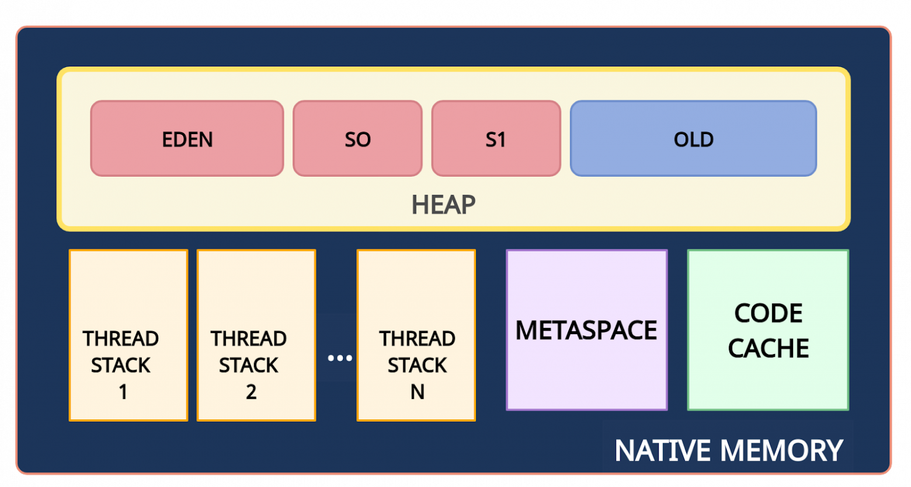
</p>

То есть JVM использует больше памяти, чем занимает только Heap.

3. Работа сборщика мусора

   Когда в куче становится мало свободного места, JVM запускает Garbage Collector, который:
   + находит объекты, на которые нет ссылок (unreachable),
   + удаляет их,
   + освобождает память,
   + при необходимости перемещает объекты для уменьшения фрагментации.
   
   <p align="center">
  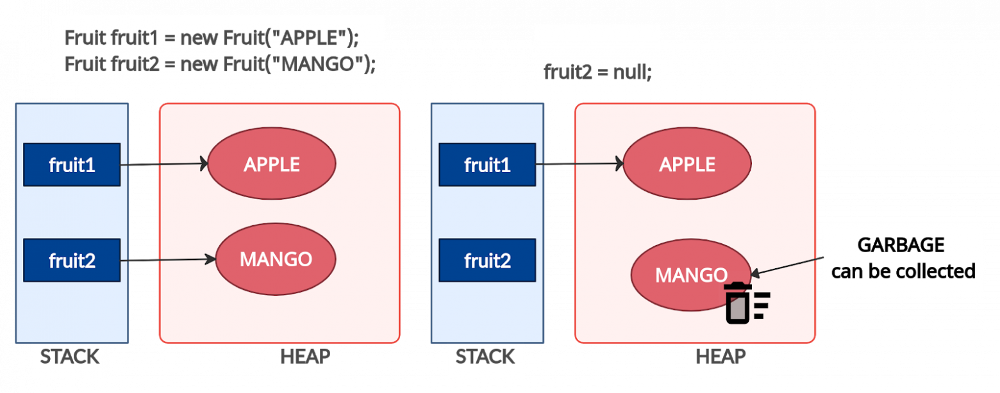
</p>

В современных JVM куча делится на поколения:

+ Young Generation
+ Old Generation
(большинство объектов живут недолго)
<p align="center">
  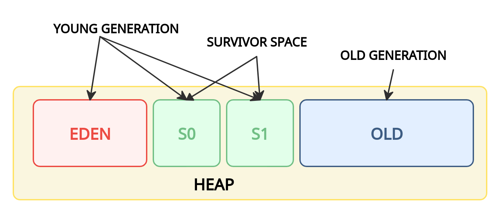
</p>
4. Автоматическая работа GC

Сборщик мусора:
+ работает автоматически,
+ запускается JVM при необходимости,
+ выполняется в отдельных потоках,
+ обычно не требует вмешательства программиста.

Однако разработчик может:
+ настраивать параметры GC,
+ выбирать алгоритм (G1, ZGC и др.),
+ анализировать паузы и использование памяти.

### 4. Опишите процесс работы сборщика мусора.

<p align="center">
  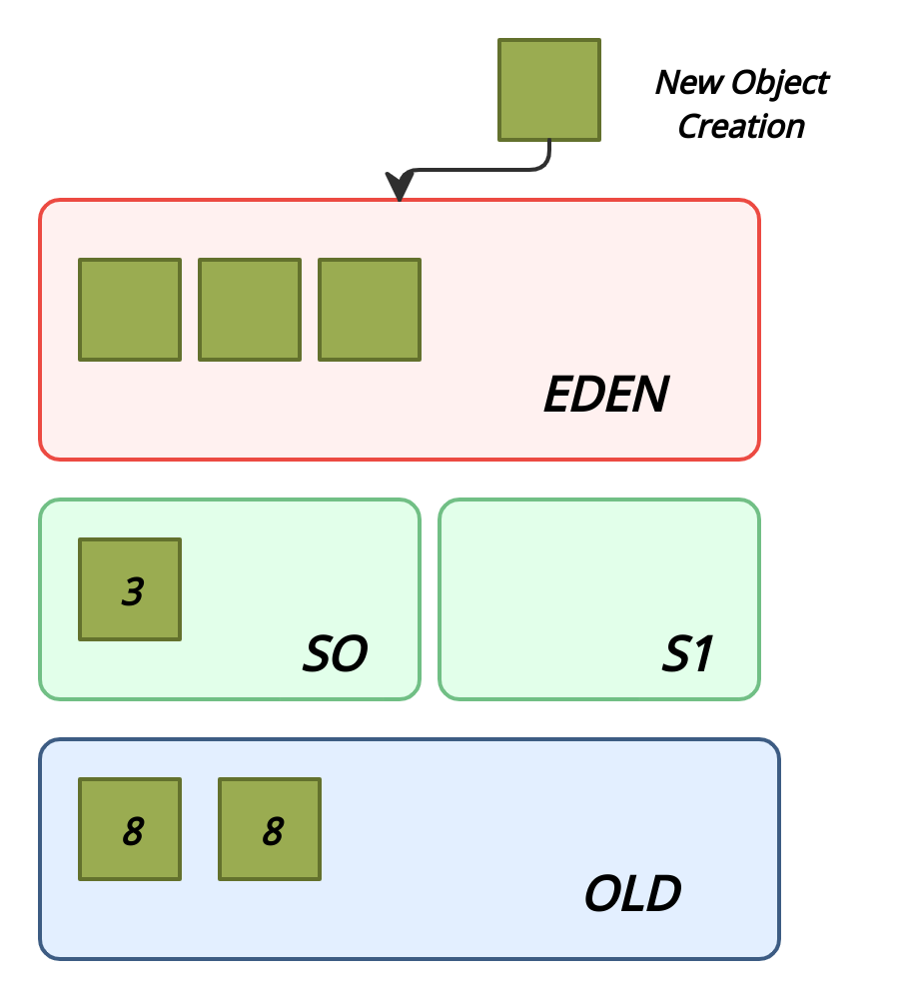
</p>

1. Новые объекты создаются в области Eden. Области Survivor (S0, S1) на данный момент пустые.
2. Когда область Eden заполняется, происходит минорная сборка мусора (Minor GC). Minor GC — это процесс, при котором операции mark и sweep выполняются для young generation (молодого поколения).
3. После Minor GC живые объекты перемещаются в одну из областей Survivor (например, S0). Мертвые объекты полностью удаляются.
4. По мере работы приложения пространство Eden заполняется новыми объектами. При очередном Minor GC области young generation и S0 очищаются. На этот раз выжившие объекты перемещаются в область S1, и их возраст увеличивается (отметка о том, что они пережили сборку мусора).
5. При следующем Minor GC процесс повторяется. Однако на этот раз области Survivor меняются местами. Живые объекты перемещаются в S0 и у них увеличивается возраст. Области Eden и S1 очищаются.
6. Объекты между областями Survivor копируются определенное количество раз (пока не переживут определенное количество Minor GC) или пока там достаточно места. Затем эти объекты копируются в область Old.
7. Major GC. При Major GC этапы mark и sweep выполняются для Old Generation. Major GC работает медленнее по сравнению с Minor GC, поскольку старое поколение в основном состоит из живых объектов.

```text
Minor GC (Eden S0 S1):
Eden заполнен →
STW (короткая пауза, помечает живые объекты)→
копирование живых объектов →
очистка Eden →
возврат к работе
```

```text
Major GC:
Old заполнен →
initial mark (STW короткая пауза ) →
concurrent mark (проходит по графу объектов - помечает все достижимые объекты - строит карту живых объектов) →
remark (STW вторая короткая остановка - учесть изменения, которые произошли во время Concurrent Mark - корректно домаркировать объекты) →
cleanup (определяет полностью пустые регионы - освобождает - их обновляет метаданные)→
compact (если нужно, объекты могут быть перемещены - освобождаются непрерывные блоки памяти)
```
### 5. Какие алгоритмы сборщика вы знаете?

Для сборки мусора используется алгоритм пометок (Mark & Sweep). Этот алгоритм состоит из трех этапов:
+ Mark (маркировка). На первом этапе GC сканирует все объекты и помечает живые (объекты, которые все еще используются). На этом шаге выполнение программы приостанавливается. Поэтому этот шаг также называется "Stop the World" .
  + Sweep (очистка). На этом шаге освобождается память, занятая объектами, не отмеченными на предыдущем шаге.
  + Compact (уплотнение). Объекты, пережившие очистку, перемещаются в единый  непрерывный блок памяти. Это уменьшает фрагментацию кучи и позволяет проще и быстрее размещать новые объекты.

<p align="center">
  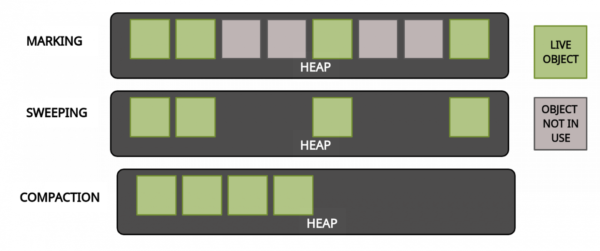
</p>

Когда запускается этап mark, работа приложения останавливается. После завершения mark приложение возобновляет свою работу. Любая сборка мусора — это "Stop the World".

Как уже упоминалось ранее, для оптимизации этапов mark и sweep используются поколения. Гипотеза о поколениях говорит о следующем:

+ Большинство объектов живут недолго.
+ Если объект выживает, то он, скорее всего, будет жить вечно.
+ Этапы mark и sweep занимают меньше времени при большом количестве мусора. То есть маркировка будет происходить быстрее, если анализируемая область небольшая и в ней много мертвых объектов.

### 6. Чем отличаются сборщики мусора?
Throughput (пропускная способность) — это количество полезной работы, которое система выполняет за единицу времени.

Latency (задержка) — это время, которое проходит от момента запроса до момента получения ответа.

| Сборщик                                | Как работает                               | Паузы                     | Преимущества                              | Когда использовать                           | Флаг для включения                                                |
| -------------------------------------- | ------------------------------------------ | ------------------------- | ----------------------------------------- | -------------------------------------------- | ----------------------------------------------------------------- |
| **Serial GC**                          | Один поток, GC полностью STW               | Длинные паузы             | Простота, низкие накладные расходы        | Малые приложения, ограниченные ресурсы       | `-XX:+UseSerialGC`                                                |
| **Parallel GC**                        | Многопоточный GC (STW)                     | Длинные STW               | Высокая throughput                        | Batch-задачи, высокая пропускная способность | `-XX:+UseParallelGC`                                              |
| **G1 GC**                              | Региональный, частично concurrent          | Короткие, регулируемые    | Баланс latency/throughput                 | Большие системы, средние требования к паузам | `-XX:+UseG1GC`                                                    |
| **ZGC**                                | Почти полностью concurrent, масштабируемый | Очень низкие (<1 – 10 мс) | Низкая задержка, масштаб до терабайт heap | Low-latency, крупные системы                 | `-XX:+UseZGC`                                                     |
| **Gen-ZGC (Generational ZGC)**         | ZGC + поддержка поколений                  | Очень низкие              | Улучшенная производительность             | Современные latency-критичные приложения     | `-XX:+UseZGC -XX:+ZGenerational`                                  |
| **Shenandoah GC**                      | Concurrent compaction                      | Очень низкие (<10 мс)     | Низкие паузы, хороший баланс              | latency-критичные, большие heaps             | `-XX:+UseShenandoahGC`                                            |
| **Gen-Shen (Generational Shenandoah)** | Shenandoah + поколения                     | Очень низкие              | Меньше пауз и overhead                    | Современные latency-критичные приложения     | `-XX:+UseShenandoahGC` *(без экспериментальных флагов в Java 25)* |
| **Epsilon GC**                         | *No-op* (не собирает мусор)                | —                         | Нулевые накладные расходы на GC           | Тестирование, замеры                         | `-XX:+UseEpsilonGC`                                               |

| Флаг                         | Описание                                                                                  |
| ---------------------------- | ----------------------------------------------------------------------------------------- |
| `-Xms`                       | Первоначальный размер кучи                                                                |
| `-Xmx`                       | Максимальный размер кучи                                                                  |
| `-XX:NewRatio=n`             | Отношение размера Old Generation к Young Generation                                       |
| `-XX:SurvivorRatio=n`        | Отношение размера Eden к Survivor                                                         |
| `-XX:MaxTenuringThreshold=n` | Возраст объекта, при котором он перемещается из области Survivor в область Old Generation |

Краткая таблица с главными различиями 

| GC         | Throughput           | Latency      | Подходит для                     |
| ---------- | -------------------- | ------------ | -------------------------------- |
| Serial     | Средний              | Очень плохая | Малые системы                    |
| Parallel   | Максимальный         | Плохая       | Batch / фоновые задачи           |
| G1         | Хороший              | Хорошая      | Большинство сервисов             |
| ZGC        | Чуть ниже throughput | Отличная     | Low-latency, high-load сервисы   |
| Gen-ZGC    | Хороший              | Отличная     | Low-latency с генерационным heap |
| Shenandoah | Хороший              | Отличная     | Low-latency, большие heaps       |
| Gen-Shen   | Хороший              | Отличная     | Low-latency с генерационным heap |
| Epsilon    | Максимальный*        | Не применимо | Тесты, измерения, без GC         |

*Epsilon GC не собирает мусор, поэтому throughput “максимальный”, но реальное приложение быстро вылетит при заполнении heap.
### 7. Расскажите про утилиты для анализа памяти?
jps

Прежде чем профилировать приложение, нужно узнать его pid (сокр. от proccess id)
<p align="center">
  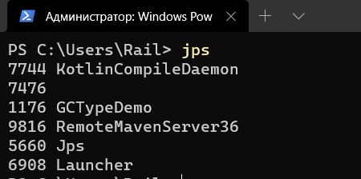
</p>
jmap

Эта утилита позволяет увидеть какие объекты созданы, какие ожидают удаления, т.е. объекты имеющие непосредственное отношение к памяти.
Также может сделать дамп памяти, т.е. сохранить ее состояние, как бы "сфоткать" ее.
<p align="center">
  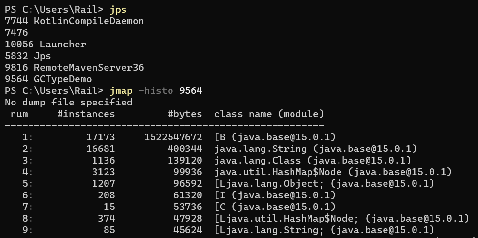
</p>


jstat

В отличии от предыдущих утилит, утилита jstat предоставляет сводную информацию о состоянии памяти программы.
Она делает сэмприлование, т.е. периодически получает данные о состоянии разных участков памяти и их обобщает.
картинка
В данном случае мы делаем сэмплинг каждую секунду в течении 10 секунд. Флаг -gc указывает на то, что мы хотим увидеть различные области памяти
<p align="center">
  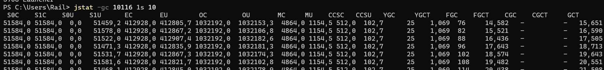
</p>

jconsole

<p align="center">
  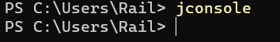
</p>

<p align="center">
  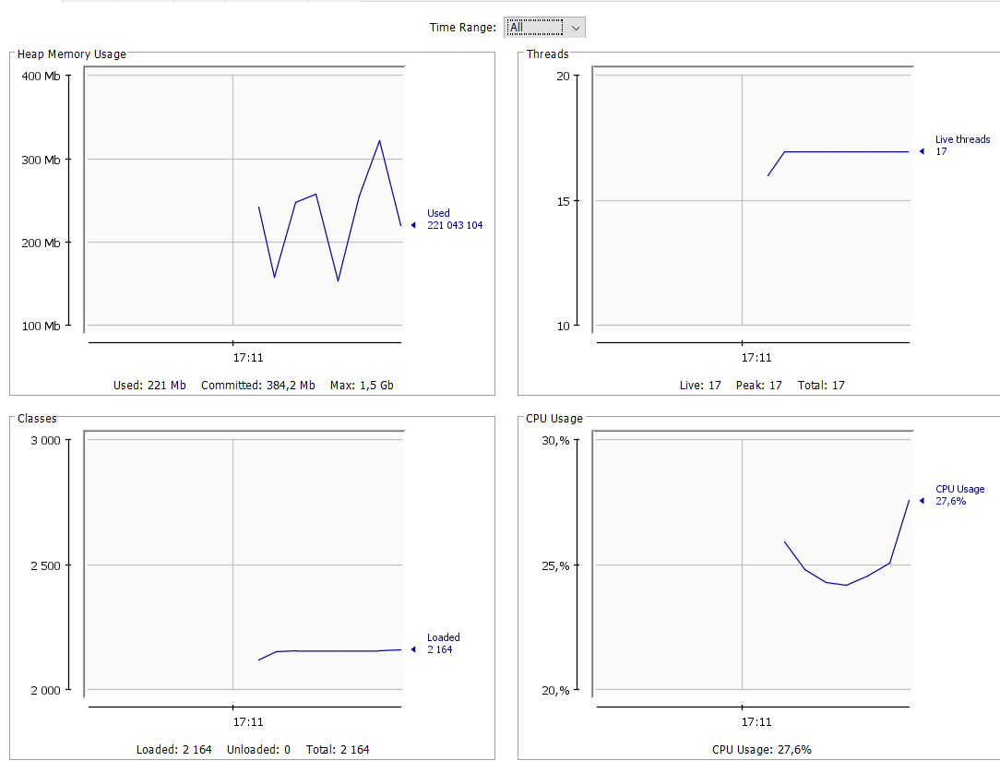
</p>

Примерный лог -  https://github.com/WhiteVax/job4j_tracker/commit/4c669111a0eeaa92e0a19a82ff47459785291846#diff-dbae9f68835feff019505e298839b54513312cbe9271550726513eee813e76da

GC time: 53.272 seconds on Copy (982 collections) - copy - Young
8 minutes on MarkSweepCompact (904 collections) - Old

Visual VM
<p align="center">
  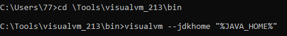
</p>

<p align="center">
  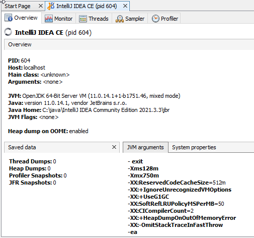
</p>
Java Visual VM - это инструмент, который предоставляет визуальный интерфейс для просмотра приложений на основе технологии Java (приложений Java), работающих на виртуальной машине Java (JVM). С его помощью можно анализировать производительность приложения, загрузку ЦП и памяти, снимать дампы памяти, а также хорошим преимуществом является возможность подключения плагинов для более гибкого профилирования.

<p align="center">
  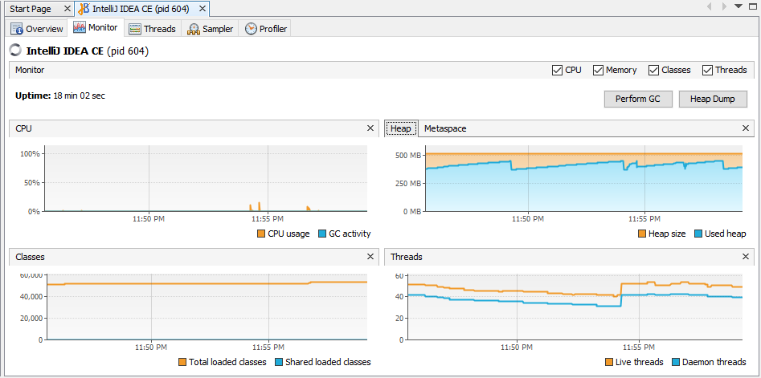
</p>

- Вкладка Threads.
  + В этой вкладке можно следить за состоянием нитей. Цвет обозначает состояние, в котором находится нить. Пока полоса идет по графику - нить жива. На картинке ниже верхняя нить уже закончила работу, вторая нить недавно завершила работу, и место окончания ее работы тоже видно на графике.
<p align="center">
  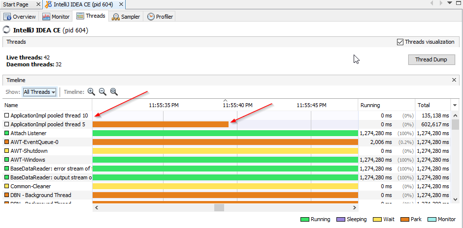
</p>

- Вкладка Sampler.
  + В этой вкладке можно отслеживать время выполнения методов процессором и загрузку памяти.
  + Здесь производится сэмплинг. Сэмплинг - это выборка. Запуск выборки работы процесса осуществляется нажатием на кнопку CPU. Сохранить данные можно кнопкой Snapshot. Выборка по загрузке памяти делается аналогично - нажать кнопку Memory, а после сохранить кнопкой Snapshot. Сохраненные снимки (Snapshot) можно отдельно проанализировать в дальнейшем.

<p align="center">
  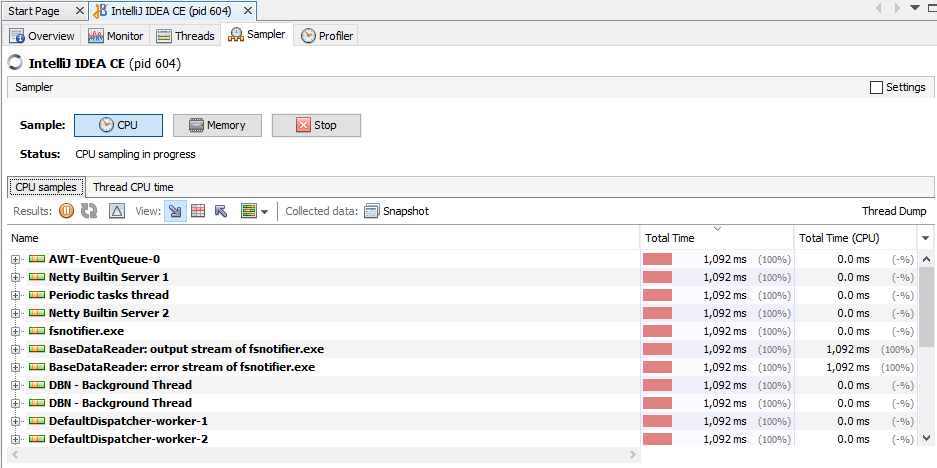
</p>

<p align="center">
  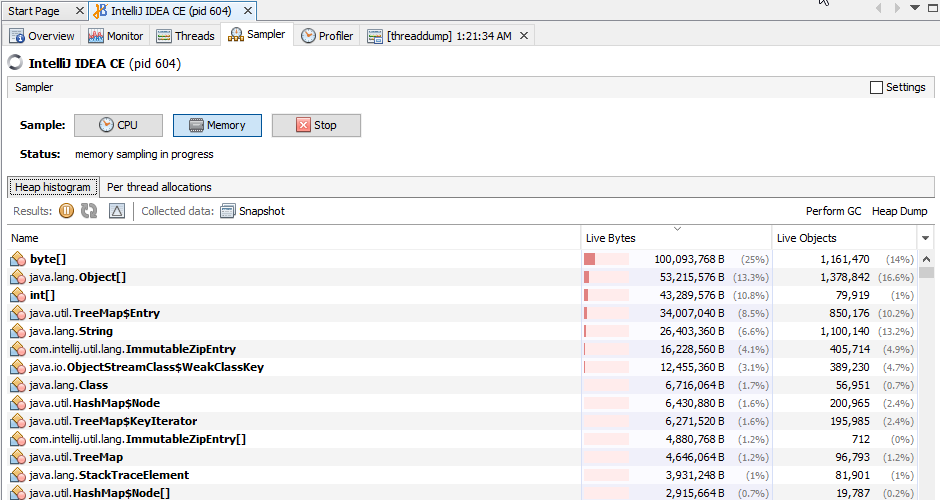
</p>

- Вкладка Profiler.
  + В этой вкладке можно делать более точное профилирование с помощью инструментирования. Инструментирование - это добавление байт-кодов в уже существующий байт-код для сбора дополнительной информации о работе методов и т.д. Похож на режим Sampling, но имеет возможность детальной настройки профилирования элементов приложения с помощью предоставленных Java инструментов.

<p align="center">
  
</p>

- Дамп кучи (Heap Dump) - это мгновенный снимок (snapshot) всех Java-объектов в приложении на текущий момент. Дампы помогают в анализе проблем, связанных с памятью. Например, частая сборка мусора или переполнение памяти.
  + Дамп кучи помогает узнать, сколько объектов создано, какого они типа, размера, живые или нет. То есть найти причины, например, какими объектами забилась память при ее переполнении и тд.
  + Создать дамп кучи можно на вкладке Monitor, нажав кнопку Heap Dump:

<p align="center">
  
</p>

### 8. Что такое ссылки?

Ссылка (reference) в Java — это переменная, указывающая на объект в Heap. Не прямой адрес, а абстракция JVM. Ссылки позволяют доступ к объекту без манипуляции памятью.

<p align="center">
  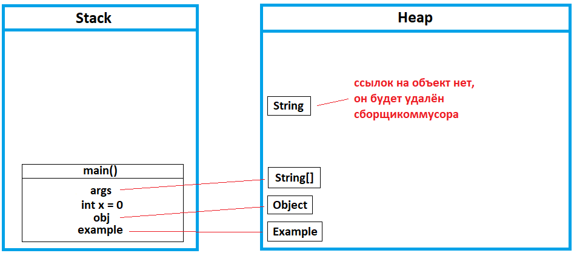
</p>

Strong Reference: Обычная ссылка (```Object o = new Object()```).

Ссылки могут быть `null`, вызывая `NullPointerException`.
### 9. Какие типы ссылок Вы знаете?

В Java существуют четыре типа ссылок, которые отличаются тем, как на них реагирует Garbage Collector.
1. Strong Reference (Сильная ссылка)
   + Обычная ссылка, используемая по умолчанию.
   

    User user = new User();

+ Объект не будет удалён, пока на него есть хотя бы одна strong-ссылка.
+ Удаляется только когда становится unreachable (нет цепочки strong-ссылок от GC Roots).

2. SoftReference (Мягкая ссылка)


    SoftReference<User> ref = new SoftReference<>(new User());

+ Объект удаляется только при нехватке памяти.

JVM гарантирует:

+ Все Soft-объекты будут очищены перед выбросом OutOfMemoryError.

Основное применение — memory-sensitive кэши.
3. WeakReference (Слабая ссылка)


    WeakReference<User> ref = new WeakReference<>(new User());

+ Если нет strong или soft-ссылок — объект удаляется при следующем GC.
+ Может стать null в любой момент после сборки.

Используется в:
+ WeakHashMap
+ кэшах
+ listener-ах и метаданных

В WeakHashMap:
+ ключ хранится как WeakReference
+ при удалении ключа — запись автоматически удаляется.

4. PhantomReference (Фантомная ссылка)
```java
PhantomReference<User> ref =
new PhantomReference<>(user, referenceQueue);
```
+ get() всегда возвращает null
+ Используется только с ReferenceQueue
+ Ссылка попадает в очередь после того, как объект стал недостижим и перед окончательным освобождением памяти
+ PhantomReference не предотвращает удаление - она только уведомляет, что объект скоро будет освобождён.

Используется для:
+ управления внешними ресурсами (off-heap, файлы, native)
+ замены устаревшего finalize()

| Стадия | Что происходит                                                                               |
| ------ |----------------------------------------------------------------------------------------------|
| 1      | Объект имеет **strong ссылки**                                                               |
| 2      | Strong, Soft, Weak ссылок больше нет                                                         |
| 3      | GC помечает объект как **phantom reachable**                                                 |
| 4      | Объект **удаляется из памяти**                                                               |
| 5      | `PhantomReference` помещается в **ReferenceQueue**, уведомление о том, что объект уже удалён |

### 10. Чем эти ссылки отличаются?

| Тип         | Когда GC удаляет                                                | Применение                                               | Пример                                                                       |
| ----------- | --------------------------------------------------------------- | -------------------------------------------------------- | ---------------------------------------------------------------------------- |
| **Strong**  | Никогда, пока ссылка жива                                       | Обычные объекты                                          | `Object o = new Object();`                                                   |
| **Soft**    | При нехватке памяти (перед OOM)                                 | Кэши (например изображения)                              | `SoftReference<Object> sr = new SoftReference<>(new Object());`              |
| **Weak**    | При любой сборке мусора, если нет strong-ссылок                 | `WeakHashMap`, хранение метаданных                       | `WeakReference<Object> wr = new WeakReference<>(new Object());`              |
| **Phantom** | После удаления объекта GC, ссылка помещается в `ReferenceQueue` | Контроль освобождения ресурсов, низкоуровневые механизмы | `PhantomReference<Object> pr = new PhantomReference<>(new Object(), queue);` |

### 11. Расскажите про String pool и Integer pool (Integer cache).

String Pool — это специальная область памяти в Heap, где JVM хранит уникальные строковые литералы.

+ строки immutable
+ одинаковые литералы хранятся в одном экземпляре
```java
String s1 = "Java";
String s2 = "Java";

System.out.println(s1 == s2); // true
```
Обе переменные ссылаются на один объект из пула.

Когда создаётся новый объект
```java
String s1 = new String("Java");
String s2 = "Java";

System.out.println(s1 == s2); // false
```
`new` всегда создаёт новый объект в куче.

Вычисляемые строки
```java
String s1 = new Integer(297).toString();
String s2 = "297";

System.out.println(s1 == s2); // false
```
Такие строки не попадают в пул автоматически.

В Java существует кэш объектов-обёрток для числовых типов.

Диапазон обёрток

| Тип     | Диапазон      |
| ------- | ------------- |
| byte    | весь диапазон |
| short   | -128…127      |
| int     | -128…127      |
| long    | -128…127      |
| char    | 0…127         |
| boolean | true / false  |

```Java
Integer a = 127;
Integer b = 127;
System.out.println(a == b); // true

Integer c = 128;
Integer d = 128;
System.out.println(c == d); // false
```
+ 127 — берётся из кэша
+ 128 — создаются новые объекты

Кэш используется:
+ при autoboxing
+ при вызове `Integer.valueOf()`

Но не используется при `new`:
```java
Integer a = new Integer(10);
Integer b = new Integer(10);
System.out.println(a == b); // false
```
Для расширение кеша -XX:AutoBoxCacheMax=200 (-128...200)

| Тип                | Есть pool/cache       | Где хранится               |
| ------------------ | --------------------- | -------------------------- |
| `int` (примитив)   | нет                 | значение хранится напрямую |
| `Integer` (объект) | есть `IntegerCache` | объект в Heap              |

### 12. Расскажите о методе String.intern().

Метод String.intern()
```java
String s1 = new Integer(297).toString().intern();
String s2 = "297";

System.out.println(s1 == s2); // true
```
+ Если в пуле есть строка с таким содержимым → возвращается ссылка на неё
+ Если нет → строка добавляется в пул и возвращается её ссылка (После `intern()` одинаковые строки можно сравнивавать через `==`)

| Способ создания строки | Попадает в String Pool              | Пример                                     |
| ---------------------- | ----------------------------------- | ------------------------------------------ |
| Строковый литерал      | Да, автоматически                   | `String s = "hello";`                      |
| `new String()`         | Нет (создаётся новый объект в Heap) | `String s = new String("hello");`          |
| `intern()`             | Да, вручную помещается в pool       | `String s = new String("hello").intern();` |

+ intern() не создаёт новый объект, если строка уже есть в пуле.
+ Используется для экономии памяти и сравнения строк по ссылке.
+ Не существует аналогичного метода для Integer, Long или других wrapper-классов.

### 13. Расскажите, что такое профайлер.
Профайлер — это инструмент, который собирает и анализирует данные о работе приложения во время выполнения, чтобы выявить:
+ узкие места (bottlenecks)
+ высокую нагрузку на CPU
+ утечки памяти
+ частоту вызова методов
+ время выполнения операций

Профилирование — процесс сбора и анализа этих характеристик.

**Что анализируют профайлеры**

Основные виды профилирования:

CPU profiling
+ какие методы выполняются дольше всего
+ частота вызовов методов

Memory profiling
+ использование Heap
+ количество объектов
+ утечки памяти
+ частота сборки мусора

Thread profiling
+ состояние потоков
+ блокировки и deadlocks

Полноценные профайлеры
+ VisualVM — CPU и Memory profiling, heap dump, GC
+ Java Flight Recorder (JFR) — низкая нагрузка, продакшен
+ Java Mission Control (JMC) — анализ данных JFR
+ YourKit, JProfiler — коммерческие, часто на проектах
### 14. Расскажите, как использовать VisualVM.
1. Запуск VisualVM

+ Установить VisualVM.
+ Запустить: visualvm
+ или через IDE (например, из JDK или отдельно установленную версию).
+ В окне Local появятся все запущенные Java-процессы. jdk8 интегрирована по умолчанию, остальные версии должны быть установлены.

2. Подключение к приложению
+ В списке Local выбрать нужный процесс.
+ Двойной клик — откроется панель мониторинга.

Доступные вкладки:
+ Overview
+ Monitor
+ Threads
+ Sampler
+ Profiler

3. Мониторинг (Monitor)
   Вкладка Monitor показывает:
+ использование Heap
+ Metaspace
+ активность GC
+ загрузку CPU
+ количество потоков

Используется для:
+ проверки утечек памяти
+ анализа частых GC
+ наблюдения за ростом памяти

4. Анализ потоков (Threads)

Вкладка Threads:
+ состояние потоков (RUNNABLE, BLOCKED и т.д.)
+ поиск deadlock
+ анализ блокировок

5. Sampler (лёгкое профилирование)

Позволяет без большой нагрузки:
+ CPU Sampler — какие методы чаще всего выполняются
+ Memory Sampler — какие объекты создаются
+ Подходит для быстрой диагностики в работающем приложении.

6. Profiler (глубокое профилирование)

Вкладка Profiler:
+ точный анализ CPU
+ анализ выделения памяти
+ показывает время выполнения методов

Создаёт заметную нагрузку.

7. Heap Dump

Для поиска утечек памяти:
+ Вкладка Monitor → кнопка Heap Dump

Откроется снимок памяти:
+ количество объектов
+ их размеры
+ ссылки между объектами

Можно найти объекты, которые не освобождаются.
### 15. Расскажите, чем отличается sampling от profiling? (Это типы аудита. Режим работы в профайлере)
Sampling и Profiling — это два режима анализа производительности приложения в профайлерах (например, в VisualVM).

Они отличаются способом сбора информации о работе программы.

**Sampling**

Sampling — это статистический метод анализа.

Через определённые интервалы времени профайлер:
+ делает snapshot стека потоков (call stack)
+ сохраняет информацию
+ затем анализирует, какие методы чаще всего встречаются в стеке

На основе большого количества таких снимков строится статистика.

Особенности
+ очень маленькая нагрузка на приложение
+ не требует изменения байткода
+ безопасен для production
+ быстрый запуск анализа
+ данные приблизительные (статистические)

Когда используется
+ первоначальный анализ производительности
+ поиск CPU bottleneck
+ анализ "где программа проводит больше всего времени"

Profiling (Instrumentation)

Profiling — это инструментирование кода.

Профайлер изменяет байткод классов так, чтобы каждый метод сообщал о своём выполнении.

В методы добавляется дополнительный код:
```text
methodStart()
... выполнение метода ...
methodEnd()
```
Таким образом фиксируется каждый вызов метода.

Особенности
+ высокая точность
+ учитывается каждый вызов метода
+ высокая нагрузка на приложение
+ изменяется байткод
+ может ломать или замедлять программу
+ плохо подходит для production

На больших серверах приложений (например в JBoss или Oracle WebLogic Server) может вызвать серьёзное замедление или зависание.


| Sampling                        | Profiling                      |
| ------------------------------- | ------------------------------ |
| Статистический метод            | Полный учет вызовов            |
| Делает snapshot стека           | Инструментирует байткод        |
| Быстрый                         | Медленный                      |
| Минимальная нагрузка            | Высокая нагрузка               |
| Менее точный                    | Очень точный                   |
| Можно использовать в production | Обычно используют только в dev |

### 16. Расскажите о методе finalize().
finalize() — это метод класса Object, который вызывался сборщиком мусора перед удалением объекта.


		protected void finalize() throws Throwable


+ Java 9 — метод помечен как @Deprecated
+ Java 18 — финализация отключена по умолчанию (может быть удалена в будущем)

Как работал finalize()

1. GC обнаруживал объект.
2. Если метод finalize() переопределён:
   + объект помещался в специальную очередь финализации.
   + отдельный поток Finalizer вызывал finalize().
3. После выполнения метод больше никогда не вызывался.

Проблемы finalize()
1. Нет гарантии вызова

+ Метод может не вызваться.
+ При завершении JVM финализация может не выполниться.

2. Нет гарантии времени вызова

Невозможно предсказать:
+ когда именно будет вызван метод
+ сколько времени объект пробудет в очереди

3. Объект может "воскреснуть"

Внутри finalize() можно написать:


	someStaticRef = this;

+ Тогда объект снова станет достижимым.
+ Повторно finalize() уже вызван не будет.
+ Это делает поведение крайне опасным и трудноотлаживаемым.

4. Замедление GC

Объекты с finalize():
+ живут минимум на один GC-цикл дольше
+ создают дополнительную нагрузку
+ увеличивают паузы

5. Нужно вызывать super.finalize()

Если переопределяешь метод — обязан вызвать:


    super.finalize();

+ Иначе финализация родителя не произойдёт.

6. System.runFinalization()

Методы:
```java
System.runFinalization();
Runtime.getRuntime().runFinalization();
```
+ Они не гарантируют, что все финализаторы будут выполнены.
+ Они лишь просят JVM выполнить ожидающую финализацию.

Почему `finalize()` плохая идея
+ Непредсказуемость
+ Производительные потери
+ Сложности с безопасностью
+ Возможность resurrection (воскрешения объекта)

Поэтому его использование признано ошибкой дизайна JVM.

Чем заменили `finalize()`
1. `AutoCloseable` + `try-with-resources` (рекомендуется)
```java
try (Connection conn = dataSource.getConnection()) {
    ...
}
```
+ Это гарантированное освобождение ресурсов.

2. Cleaner (Java 9+)

Класс:


    Oracle Corporation добавил API java.lang.ref.Cleaner

`Cleaner`:
+ безопасная альтернатива `finalize`
+ не позволяет воскресить объект
+ более контролируемый механизм

### 17. Расскажите о методе clone(). Что такое Deep clone and Shallow clone?
Метод clone() в Java

Метод clone() определён в классе Object:

Metaspace — это область памяти JVM, в которой хранится метаинформация о классах (class metadata).

Она появилась начиная с Java 8, заменив область памяти PermGen (Permanent Generation).

Зачем появился Metaspace

До Java 8 метаданные классов хранились в PermGen.

Проблемы PermGen:

фиксированный размер

частые ошибки
OutOfMemoryError: PermGen space

сложная настройка

Поэтому в Java 8 PermGen был удалён и заменён Metaspace.

Что хранится в Metaspace

Metaspace содержит метаданные классов, например:

структура класса

информация о методах

информация о полях

constant pool

аннотации

информация о classloader

байткод методов

Важно:

Сами объекты НЕ хранятся в Metaspace.

Объекты находятся в Heap.
	protected Object clone() throws CloneNotSupportedException

Особенности:
+ Возвращает Object → требуется приведение типов
+ Класс должен реализовывать интерфейс Cloneable
+ Иначе будет выброшено CloneNotSupportedException
+ По умолчанию выполняет поверхностное копирование (shallow copy)
+ Cloneable — это маркерный интерфейс (без методов).

Способы клонирования объекта

1. Переопределение clone() + Cloneable
2. Конструктор копирования
3. Сериализация (глубокое копирование)

**Shallow Copy (поверхностное копирование)**

+ Создаётся новый объект,
+ но все ссылочные поля копируются как ссылки, а не как новые объекты.

То есть:

+ примитивы копируются
+ ссылки копируются (объекты остаются общими)
```java
class Address {
    String city;

    Address(String city) {
        this.city = city;
    }
}

class Person implements Cloneable {
    String name;
    Address address;

    Person(String name, Address address) {
        this.name = name;
        this.address = address;
    }

    @Override
    protected Object clone() throws CloneNotSupportedException {
        return super.clone(); // shallow copy
    }
}
```
Использование:
```java
Address address = new Address("Lav");
Person p1 = new Person("Vova", address);
Person p2 = (Person) p1.clone();

p2.address.city = "Val";

System.out.println(p1.address.city); // Val !!!
```
Изменился и оригинал — потому что address общий.

**Deep Copy (глубокое копирование)**

+ Создаются новые объекты для всех вложенных ссылочных полей.
+ Изменение одного объекта не влияет на другой.
```java
class Address implements Cloneable {
    String city;

    Address(String city) {
        this.city = city;
    }

    @Override
    protected Object clone() throws CloneNotSupportedException {
        return super.clone();
    }
}

class Person implements Cloneable {
    String name;
    Address address;

    Person(String name, Address address) {
        this.name = name;
        this.address = address;
    }

    @Override
    protected Object clone() throws CloneNotSupportedException {
        Person cloned = (Person) super.clone();
        cloned.address = (Address) address.clone(); // deep copy
        return cloned;
    }
}

p2.address.city = "Val";
System.out.println(p1.address.city); // Mav
```
Объекты полностью независимы.

**Конструктор копирования (рекомендуемый способ)**

Более безопасный и читаемый способ.
```java
class Person {
    String name;
    Address address;

    Person(Person other) {
        this.name = other.name;
        this.address = new Address(other.address.city);
    }
}
```
Плюсы:
+ Нет Cloneable
+ Нет CloneNotSupportedException
+ Явный контроль копирования
+ На практике используется чаще, чем clone().

**Deep Copy через сериализацию**

Работает если все классы реализуют Serializable.
```java
public static <T extends Serializable> T deepCopy(T object) throws Exception {
    ByteArrayOutputStream bos = new ByteArrayOutputStream();
    ObjectOutputStream out = new ObjectOutputStream(bos);
    out.writeObject(object);

    ByteArrayInputStream bis = new ByteArrayInputStream(bos.toByteArray());
    ObjectInputStream in = new ObjectInputStream(bis);

    return (T) in.readObject();
}
```
Минусы:
+ Медленно
+ Требует Serializable
+ Используется редко

Важные проблемы clone()

1. Нарушает инкапсуляцию
2. Сложно правильно реализовать в иерархии наследования
3. Нужно вручную реализовывать deep copy
4. Считается устаревшим подходом

Автор Java (James Gosling) критиковал дизайн Cloneable.

### 18. Расскажите о Stack, Heap и Metaspace.
<p align="center">
  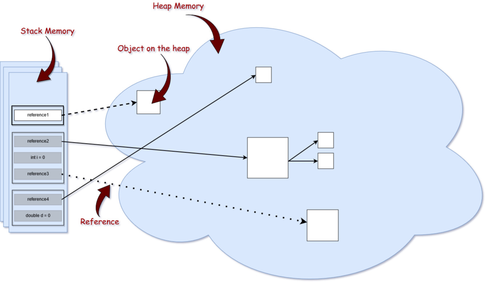
</p>

Heap (Куча)

Heap — область памяти JVM, где хранятся объекты и массивы.

Основные характеристики:

1. Все объекты создаются в heap

   User user = new User(); // объект в heap

2. Управляется Garbage Collector
3. Делится на поколения:

+ Young Generation
+ Old Generation
+ (в современных GC может быть дополнительная структура регионов, например в G1)

4. Общая для всех потоков
5. Медленнее stack (из-за GC и более сложного управления памятью)
6. При нехватке памяти:
   `java.lang.OutOfMemoryError`

Stack (Стек)

Stack — область памяти, связанная с потоком выполнения.

Каждый поток имеет свой собственный stack.

Что хранится в stack:
+ локальные переменные
+ параметры метода
+ ссылки на объекты
+ фреймы вызовов методов

```java
public void method() {
    int x = 10;              // хранится в stack
    User user = new User();  // ссылка в stack, объект в heap
}
```
Как работает стек

+ Работает по принципу LIFO (Last In — First Out).
+ Вызвали метод → создаётся stack frame
+ Внутри вызвали другой метод → новый frame кладётся сверху
+ Метод завершился → его frame удаляется
+ Стек очищается автоматически при выходе из метода.

Основные характеристики Stack

1. Быстрая работа (простое выделение/освобождение памяти)
2. Размер меньше heap
3. Не управляется GC
4. Потокобезопасен (каждый поток имеет свой стек)
5. При переполнении:
   `java.lang.StackOverflowError`

| Stack                       | Heap             |
| --------------------------- | ---------------- |
| Память потока               | Общая память JVM |
| Хранит локальные переменные | Хранит объекты   |
| Управляется автоматически   | Управляется GC   |
| Быстрее                     | Медленнее        |
| Маленький размер            | Большой размер   |
| StackOverflowError          | OutOfMemoryError |

Metaspace — это область памяти JVM, в которой хранится метаинформация о классах (class metadata).

Она появилась начиная с Java 8, заменив область памяти PermGen (Permanent Generation).

До Java 8 метаданные классов хранились в PermGen.

Проблемы PermGen:
+ фиксированный размер
+ частые ошибки
+ OutOfMemoryError: PermGen space
+ сложная настройка

Поэтому в Java 8 PermGen был удалён и заменён Metaspace.

Metaspace содержит метаданные классов, например:
+ структура класса
+ информация о методах
+ информация о полях
+ `constant pool`
+ аннотации
+ информация о `classloader`
+ байткод методов


Сами объекты НЕ хранятся в Metaspace.
+ Объекты находятся в Heap.

Очистка происходит, когда:

1. ClassLoader становится недостижимым
2. GC удаляет ClassLoader
3. удаляются все классы, загруженные этим ClassLoader

Это называется `class unloading`.

Если метаданных классов становится слишком много:
`java.lang.OutOfMemoryError: Metaspace`

Это может происходить, например:
+ при динамической генерации классов
+ при утечках ClassLoader
+ при использовании прокси (Hibernate, Spring)

Размер можно контролировать параметрами JVM:

начальный размер
`-XX:MetaspaceSize=256m`

максимальный размер
`-XX:MaxMetaspaceSize=512m`

Если MaxMetaspaceSize не задан — Metaspace может расти почти до лимита памяти системы.

Частые причины переполнения Metaspace

1. ClassLoader memory leak

Класс-лоадер не освобождается → классы остаются в памяти.

Часто встречается в:
+ сервере приложений
+ hot deploy
+ Например в Apache Tomcat.

2. Динамическая генерация классов

Например:
+ proxy классы
+ bytecode generation
+ ORM фреймворки


| Характеристика             | **Heap**                            | **Stack**                                                  | **Metaspace**                                      |
| -------------------------- | ----------------------------------- | ---------------------------------------------------------- | -------------------------------------------------- |
| Назначение                 | Хранение **объектов и массивов**    | Хранение **локальных переменных и вызовов методов**        | Хранение **метаданных классов**                    |
| Что хранится               | объекты, массивы, поля объектов     | локальные переменные, параметры методов, ссылки на объекты | структура классов, методы, поля, constant pool     |
| Где находится              | В памяти JVM (Heap memory)          | В памяти потока (Thread Stack)                             | В **native memory** (вне heap)                     |
| Общий или нет              | **Общий для всех потоков**          | **Отдельный для каждого потока**                           | Общий для JVM                                      |
| Управление памятью         | Управляется **Garbage Collector**   | Очищается автоматически при выходе из метода               | Частично управляется GC (при удалении ClassLoader) |
| Скорость доступа           | Медленнее                           | Быстрее                                                    | Средняя                                            |
| Размер                     | Обычно самый большой                | Ограниченный                                               | Может динамически расти                            |
| Ошибка при переполнении    | `OutOfMemoryError: Java heap space` | `StackOverflowError`                                       | `OutOfMemoryError: Metaspace`                      |
| Когда очищается            | Когда GC удаляет объекты            | Когда метод завершает работу                               | Когда удаляется ClassLoader                        |
| Что появилось / изменилось | Есть с первых версий Java           | Есть с первых версий Java                                  | Появился в **Java 8**, заменил PermGen             |

### 19. Что такое ClassLoader? Перечислите основные реализации ClassLoader.
ClassLoader — это компонент JVM, который отвечает за:

1. Загрузку байткода (.class)
2. Linking (проверка, подготовка, разрешение ссылок)
3. Инициализацию класса

Процесс загрузки класса включает три этапа:
+ Loading (загрузка)— поиск, импорт, чтение байткода и создание объекта Class
+ Linking (связывание, линковка)
    + Verification (проверка байткода, корректности импортируемого типа)
    + Preparation (выделение памяти под static-поля  и инициализация памяти значениями по умолчанию)
    + Resolution (преобразование символьных ссылок типов в прямые ссылки. )
+ Initialization — вызов Java-кода, который инициализирует переменные класса их правильными начальными значениями

Важный принцип
+ Класс в JVM однозначно определяется парой:
+ (полное имя класса + ClassLoader)

То есть: `com.example.User`
+ загруженный двумя разными ClassLoader'ами — это два разных типа.

Это основа:
+ безопасности
+ изоляции
+ работы контейнеров (Tomcat, OSGi и т.д.)

Встроенные ClassLoader (Java 9+)
1️. Bootstrap ClassLoader
+ Родитель: отсутствует
+ В коде возвращается null
+ Загружает базовые классы JDK:
    + java.lang.*
    + java.util.*
    + модуль java.base
+ Реализован нативно (C/C++), не на Java.
+ Раньше (до Java 9) загружал rt.jar.

2️. Platform ClassLoader


		ClassLoader.getPlatformClassLoader();

+ Родитель: Bootstrap
+ Загружает стандартные модули JDK (кроме java.base)
+ Заменил Extension ClassLoader (Java 8 и ниже)

3️. System / Application ClassLoader

`ClassLoader.getSystemClassLoader();`
или
`MyClass.class.getClassLoader();`

+ Родитель: Platform
+ Загружает:
    + классы приложения
    + classpath
    + module-path
    + JAR-файлы
    + указанные через -cp

Это основной загрузчик приложения.

Иерархия (Delegation Model)

Модель делегирования — ключевой механизм безопасности.
```text
Bootstrap
    ↑
Platform
    ↑
System (Application)
    ↑
Custom ClassLoader
```
Когда нужно загрузить класс:
+ ClassLoader сначала делегирует родителю
+ Родитель пытается загрузить класс
+ Если не найден — загрузчик загружает сам
+ Это называется Parent Delegation Model.

Почему это важно?

+ Чтобы нельзя было подменить, например:
+ java.lang.String
+ своей реализацией.
+ Bootstrap всегда имеет приоритет.

Популярные кастомные загрузчики

URLClassLoader

+ Загружает классы из:
    + файловой системы
    + JAR
    + сети

SecureClassLoader
+ Базовый класс с поддержкой проверки прав доступа.

+ WebAppClassLoader (Tomcat)
+ Используется в Apache Tomcat
+ Позволяет изолировать веб-приложения друг от друга.

OSGi
+ Модульная система с динамической загрузкой.

Spring Boot DevTools
+ Перезагружает классы без рестарта JVM.

Что будет, если загрузить один и тот же класс двумя ClassLoader'ами?
+ Это будут два разных типа.
+ Приведение типов вызовет ClassCastException.

Можно ли сломать delegation?
+ Да.
+ Если переопределить loadClass() и убрать делегирование — получится child-first модель (используется в некоторых контейнерах).

Где хранится ClassLoader?
+ Каждый объект Class содержит ссылку на свой ClassLoader:
+ MyClass.class.getClassLoader();

Коротко

+ ClassLoader — механизм JVM для динамической загрузки классов.
+ Класс определяется парой (имя + загрузчик).
+ Работает по модели родительского делегирования.
+ Основные встроенные загрузчики: Bootstrap, Platform и System.

### 20. Расскажите иерархию штатных загрузчиков классов в Java. Какой загрузчик находится в корне иерархии?
Актуально для Java 11, 17, 21, 23, 24 и современных версий.
```text
Bootstrap ClassLoader
        ↑
Platform ClassLoader
        ↑
Application / System ClassLoader
        ↑
Custom ClassLoader-ы
```

| Уровень                  | Как получить в коде                    | Родитель  | Что загружает                                                                                     | Реализация               | Примечание                    |
| ------------------------ | -------------------------------------- | --------- | ------------------------------------------------------------------------------------------------- | ------------------------ | ----------------------------- |
| **Bootstrap**            | `null`                                 | нет       | Базовые классы JDK (модуль `java.base`: `java.lang`, `java.util` и др.)                           | Нативный код (C/C++)     | Корень всей иерархии          |
| **Platform**             | `ClassLoader.getPlatformClassLoader()` | Bootstrap | Остальные стандартные модули JDK (`java.sql`, `java.xml`, `java.desktop`, `jdk.httpserver` и др.) | Внутренний загрузчик JVM | Заменил Extension CL (Java 9) |
| **Application / System** | `ClassLoader.getSystemClassLoader()`   | Platform  | Классы приложения (classpath, module-path, JAR)                                                   | Внутренний загрузчик     | Загрузчик по умолчанию        |


1. Bootstrap — корневой загрузчик
+ Не имеет родителя
+ Реализован нативно
+ В Java-коде представлен как null
```java
System.out.println(String.class.getClassLoader()); // null
String загружается Bootstrap-загрузчиком.
```
2. Parent Delegation Model (Parent-First)

Алгоритм загрузки:
+ ClassLoader получает запрос
+ Делегирует родителю
+ Родитель делегирует выше
+ Доходит до Bootstrap
+ Если никто не нашёл класс — загрузчик загружает его сам
+ Это гарантирует безопасность и предотвращает подмену базовых классов (например java.lang.String).

3. Изменения после Java 9

До Java 9:
```text
Bootstrap
   ↑
Extension
   ↑
Application
```
После появления модульной системы в рамках Project Jigsaw:
+ Extension ClassLoader удалён
+ Появился Platform ClassLoader
+ Загрузка интегрирована с модульной системой

Кастомные загрузчики

Можно создавать собственные ClassLoader'ы для:
+ изоляции веб-приложений (например в Apache Tomcat)
+ плагинных систем
+ hot-reload
+ Java-агентов
+ модульных контейнеров (OSGi)

### 21. Какой загрузчик классов нельзя получить методом getClassLoader()? Почему?
Методом
`getClassLoader()`

нельзя получить Bootstrap ClassLoader.

Bootstrap ClassLoader:
+ реализован не на Java, а на нативном коде JVM (C/C++)
+ не является объектом класса ClassLoader
+ поэтому у него нет Java-объекта, который можно вернуть
+ Из-за этого JVM возвращает null.

Пример
`System.out.println(String.class.getClassLoader());`

Результат:
`null`

Это означает, что класс String был загружен Bootstrap ClassLoader.

Для сравнения
```java
System.out.println(Object.class.getClassLoader());   // null
System.out.println(ArrayList.class.getClassLoader()); // null
```
Эти классы тоже загружены Bootstrap.

А вот классы приложения:
`System.out.println(MyClass.class.getClassLoader());`

Результат:
`jdk.internal.loader.ClassLoaders$AppClassLoader`
### 22. Расскажите алгоритм поиска и загрузки класса в JVM.
Жизненный цикл класса состоит из трёх основных фаз:
+ Loading (загрузка)
+ Linking (связывание)
+ Initialization (инициализация)

1. Loading (Загрузка класса)

Загрузка — это процесс:
+ JVM получает имя класса.
+ ClassLoader ищет бинарное представление класса (.class).
+ JVM создаёт внутреннее представление класса в runtime.

Формально:
+ Loading — это процесс нахождения бинарного представления класса и создания класса из этого представления.

Что происходит:

1. ClassLoader ищет .class файл
2. читает массив байтов
3. вызывает


		ClassLoader.defineClass()

4. JVM создаёт объект Class

Этот объект помещается во внутренние структуры JVM (Method Area / Metaspace).

2. Linking (Связывание)
+ После загрузки класс должен быть связан с JVM.
+ Linking состоит из трёх подэтапов.

2.1 Verification (Проверка)
JVM проверяет корректность байткода:
+ правильный формат class-файла
+ корректность инструкций
+ безопасность типов
+ отсутствие нарушений JVM spec
+ Если ошибка → VerifyError.

2.2 Preparation (Подготовка)

На этом этапе:
+ выделяется память для static полей
+ им присваиваются значения по умолчанию

Пример
`static int x = 10;`

После preparation:
`x = 0`

2.3 Resolution (Разрешение ссылок)
В class-файле все ссылки символьные.

Например:
`java/lang/String`

JVM заменяет их на прямые ссылки на реальные классы и методы.

Важно:
+ спецификация допускает, что resolution может происходить позже, даже после `initialization`.

3. Initialization (Инициализация)

Инициализация — это выполнение метода `<clinit>`.

Этот метод создаётся компилятором и включает:
+ static-инициализацию
+ static-блоки

```java
static int x = 10;

static {
    System.out.println("init");
}

В <clinit> будет:

x = 10
System.out.println(...)
```

Согласно спецификации JVM, инициализация запускается при:
+ new
+ getstatic
+ putstatic
+ invokestatic

Также при:
+ использовании reflection
+ инициализации подкласса
+ запуске JVM для главного класса.

Итоговый алгоритм

По спецификации JVM:

1. Loading
    - поиск бинарного представления
    - создание Class

2. Linking
    - Verification
    - Preparation
    - Resolution

3. Initialization
    - выполнение `<clinit>`

`<clinit>` — это специальный метод класса, который создаёт JVM для инициализации статических полей и выполнения static-блоков.