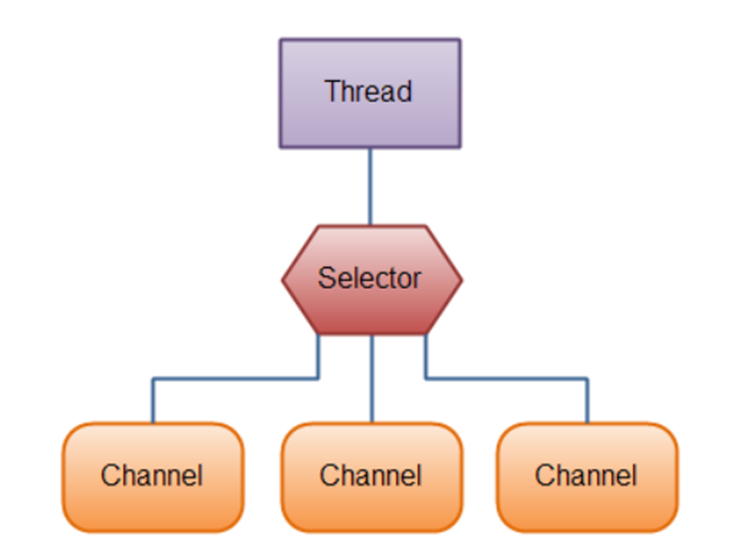

## *Ввод-вывод*

- [Что такое поток ввода-вывода?](#1-что-такое-поток-ввода-вывода)
- [Что такое Java IO?](#2-что-такое-java-io)
- [Что такое Java NIO?](#3-что-такое-java-nio)
- [Что такое NIO.2?](#4-что-такое-nio2)
- [Что такое Scanner? ](#5-что-такое-scanner)
- [Как работает Scanner внутри?](#6-как-работает-scanner-внутри)
- [Какие базовые методы существуют в Scanner?](#7-какие-базовые-методы-существуют-в-scanner)
- [Что такое байтовый поток? Как он реализован внутри?](#8-что-такое-байтовый-поток-как-он-реализован-внутри)
- [Что такое символьный поток? Как он реализован внутри?](#9-что-такое-символьный-поток-как-он-реализован-внутри)
- [Что такое буферизированный поток? ](#10-что-такое-буферизированный-поток)
- [Какие классы-обёртки позволяют ускорить чтение/запись за счет использования буфера?](#11-какие-классы-обёртки-позволяют-ускорить-чтениезапись-за-счет-использования-буфера)
- [Как осуществляется ввод и вывод из командной строки?](#12-как-осуществляется-ввод-и-вывод-из-командной-строки)
- [Что такое класс Console? Расскажите его АПИ.](#13-что-такое-класс-console-расскажите-его-апи)
- [Что такое поток данных? Data stream.](#14-что-такое-поток-данных-data-stream)
- [Что такое поток объектов, Object stream.](#15-что-такое-поток-объектов-object-stream)
- [Что такое Path? Как он реализуется на разных ОС?](#16-что-такое-path-как-он-реализуется-на-разных-ос)
- [Как получить список файлов?](#17-как-получить-список-файлов)
- [Как проверить что файловая сущность является файлом или папкой?](#18-как-проверить-что-файловая-сущность-является-файлом-или-папкой)
- [Как удалить файл?](#19-как-удалить-файл)
- [Как переместить файл?](#20-как-переместить-файл)
- [Как управлять атрибутами файла?](#21-как-управлять-атрибутами-файла)
- [Как создать файл? ](#22-как-создать-файл)
- [Как создать директорию?](#23-как-создать-директорию)
- [Как записать в файл?](#24-как-записать-в-файл)
- [Как прочитать данные из файла?](#25-как-прочитать-данные-из-файла)
- [Для чего нужны классы PrintStream и PrintWriter? В чем их различие?](#26-для-чего-нужны-классы-printstream-и-printwriter-в-чем-их-различие)
- [Что такое потоки байтовых массивов? Как они устроены?](#27-что-такое-потоки-байтовых-массивов-как-они-устроены)
- [Зачем нужен класс RandomAccessFile? ](#28-зачем-нужен-класс-randomaccessfile)
- [Данные в каком виде можно считывать байтовыми и символьными потоками?](#29-данные-в-каком-виде-можно-считывать-байтовыми-и-символьными-потоками)
- [Что такое сокет?](#30-что-такое-сокет)
- [Какие виды сокетов есть в Java? С каким протоколом они работают?](#31-какие-виды-сокетов-есть-в-java-с-каким-протоколом-они-работают)
- [Как отправить через сокет сообщение?](#32-как-отправить-через-сокет-сообщение)
- [Что такое логирование?](#33-что-такое-логирование)
- [Какие уровни логирования вы знаете?](#34-какие-уровни-логирования-вы-знаете)
- [Какая библиотека для логирования используется в курсе? Как ее настроить?](#35-какая-библиотека-для-логирования-используется-в-курсе-как-ее-настроить)
- [Опишите из каких элементов состоит формат JSON ](#36-опишите-из-каких-элементов-состоит-формат-json)
- [Как преобразовать POJO в/из json?](#37-как-преобразовать-pojo-виз-json)
- [Опишите из каких элементов состоит формат XML](#38-опишите-из-каких-элементов-состоит-формат-xml)
- [Как преобразовать POJO в/из xml?](#39-как-преобразовать-pojo-виз-xml)
- [Что такое сериализация / десериализация?](#40-что-такое-сериализация--десериализация)
- [Что такое регулярные выражения? Зачем они нужны?](#41-что-такое-регулярные-выражения-зачем-они-нужны)
- [Как создать регулярное выражение в Java?](#42-как-создать-регулярное-выражение-в-java)
- [Что такое метасимволы? Для чего они применяются в регулярных выражениях?](#43-что-такое-метасимволы-для-чего-они-применяются-в-регулярных-выражениях)
- [Какие аннотации Jackson знаете (json)?](#44-какие-аннотации-jackson-знаете-json)

---

### 1. Что такое поток ввода-вывода?
Поток ввода-вывода (I/O stream) — это абстракция, представляющая последовательность данных, которую можно читать (ввод) или записывать (вывод). В Java потоки — основа всех операций ввода-вывода и позволяют работать с данными одинаково, независимо от источника или назначения.

В основе всех классов, управляющих потоками байтов, находятся два абстрактных класса: InputStream (представляющий потоки ввода) и OutputStream (представляющий потоки вывода).

Но поскольку работать с байтами не очень удобно, то для работы с потоками символов были добавлены абстрактные классы Reader (для чтения потоков символов) и Writer (для записи потоков символов).

Все остальные классы, работающие с потоками, являются наследниками этих абстрактных классов.

<p align="center">
  
</p>

### 2. Что такое Java IO?
Java IO (Input/Output) — это пакет java.io, предоставляющий API для работы с потоками ввода-вывода. Он включает классы для чтения/записи данных из/в файлы, консоль, сеть и другие источники. Java IO основан на декоратор-паттерне, где потоки можно оборачивать для добавления функциональности (например, буферизация, фильтрация).

Нюансы:
+ Классы делятся на байтовые (InputStream, OutputStream) и символьные (Reader, Writer).
+ Поддерживает сериализацию объектов, случайный доступ к файлам (RandomAccessFile).

Блокирующий I/O (операции ждут завершения), что неэффективно для высоконагруженных систем.

### 3. Что такое Java NIO?
Java NIO (New Input/Output) — это API из пакета java.nio, введённый в Java 1.4, который предоставляет более производительную и масштабируемую модель ввода-вывода по сравнению с java.io.

Основные особенности:
+	Работа через каналы (Channel)
+	Использование буферов (Buffer)
+	Поддержка неблокирующего режима
+	Возможность обслуживать несколько соединений одним потоком (через Selector)

Основные компоненты:
1. Buffer
   Контейнер для данных.
Примеры:
   + ByteBuffer
   + CharBuffer
   + IntBuffer

Буфер имеет состояние:
+	position
+	limit
+	capacity

При чтении данных:
 + Заполняем буфер
 + Вызываем ```flip()```
 + Читаем данные
 + Вызываем ```clear()``` или ```compact()```


2. Channel (объект NIO, представляющий соединение с источником данных (файл, сокет и т.д.), который передаёт данные через Buffer)
   
Двунаправленный объект для передачи данных.

Примеры:
   +	FileChannel
   +	SocketChannel
   +	ServerSocketChannel
   
В отличие от Stream в IO, Channel может:
   +	читать
   +	писать
   +	работать в неблокирующем режиме
3.  Selector (это объект из пакета java.nio.channels, который позволяет одному потоку отслеживать несколько каналов и определять, какие из них готовы к операциям чтения или записи.)

<p align="center">
  
</p>

Позволяет одному потоку отслеживать несколько каналов.

Используется в сетевых серверах для:
+	обработки множества соединений
+	масштабируемости

По умолчанию каналы блокирующие.

Неблокирующий режим включается явно:
        
    channel.configureBlocking(false);
В неблокирующем режиме:
+	метод read() возвращает 0, если данных нет
+	поток не блокируется

Различия IO/NIO

| IO                           | NIO                           |
| ---------------------------- | ----------------------------- |
| Потокоориентированный        | Буфер-ориентированный         |
| Всегда блокирующий           | Может быть неблокирующим      |
| Один поток = одно соединение | Один поток = много соединений |
| Stream                       | Channel + Buffer              |

### 4. Что такое NIO.2?
NIO.2 (введено в Java 7) — расширение NIO для работы с файловой системой (пакет java.nio.file). Оно предоставляет Path, Files, FileSystem для манипуляции файлами, директориями, атрибутами. NIO.2 делает файловый I/O более удобным и платформо-независимым.
+ Path: Абстрактный путь к файлу/директории.
+ Files: Утилитный класс с методами createFile, copy, move, readAllLines и т.д.
+ Поддержка символических ссылок, атрибутов (POSIX, DOS).
+ Асинхронный I/O через AsynchronousFileChannel.
+ WatchService для мониторинга изменений в файловой системе.

```java
import java.nio.file.*;
import java.util.*;

public class NIO2Example {
    public static void main(String[] args) throws Exception {
        Path path = Paths.get("file.txt");
        Files.write(path, "Hello NIO.2".getBytes());
        List<String> lines = Files.readAllLines(path);
        System.out.println(lines);
    }
}
```

| Характеристика                | **Java IO (1.0–1.4)**                                                   | **Java NIO (1.4)**                                                                                           | **Java NIO.2 (7+)**                                                                                                            |
| ----------------------------- | ----------------------------------------------------------------------- | ------------------------------------------------------------------------------------------------------------ | ------------------------------------------------------------------------------------------------------------------------------ |
| **Модель работы**             | Потокоориентированный (Stream)                                          | Буфер-ориентированный (Channel + Buffer)                                                                     | Расширение NIO с фокусом на файловую систему и асинхронный I/O                                                                 |
| **Блокировка**                | Всегда блокирующий                                                      | Может быть блокирующим или неблокирующим (для сетевых каналов)                                               | Асинхронные операции через `AsynchronousFileChannel`, WatchService; файловые операции могут быть блокирующими или асинхронными |
| **Работа с файлами**          | Через `File`, `FileInputStream`, `FileOutputStream`, `Reader`, `Writer` | Через `FileChannel` + `Buffer`                                                                               | Через `Path`, `Files`, `FileSystem`, поддержка символических ссылок, атрибутов и WatchService                                  |
| **Работа с сетью**            | Через `Socket`, `ServerSocket` (блокирующие)                            | Через `SocketChannel`, `ServerSocketChannel`, `DatagramChannel` (поддержка неблокирующего режима + Selector) | Использует те же каналы, но добавлены асинхронные файловые операции; Selector остаётся из NIO                                  |
| **Буферизация**               | Через `BufferedReader`, `BufferedInputStream` (опционально)             | Через `ByteBuffer`, `CharBuffer` (обязательна для каналов)                                                   | Та же, плюс можно использовать для асинхронных файловых операций                                                               |
| **Масштабируемость**          | Низкая — 1 поток = 1 соединение                                         | Высокая — Selector позволяет одному потоку обслуживать несколько соединений                                  | Высокая, плюс удобная работа с файловой системой и асинхронный I/O                                                             |
| **Zero-copy / эффективность** | Нет                                                                     | Есть (`transferTo`, `transferFrom`)                                                                          | Есть, плюс эффективная работа с файлами и WatchService                                                                         |
| **Поддержка асинхронности**   | Нет                                                                     | Неблокирующий режим для каналов                                                                              | Асинхронный I/O через `AsynchronousFileChannel`, события файловой системы через WatchService                                   |
| **Пример классов**            | `InputStream`, `OutputStream`, `Reader`, `Writer`, `File`               | `FileChannel`, `SocketChannel`, `ServerSocketChannel`, `DatagramChannel`, `ByteBuffer`                       | `Path`, `Files`, `FileSystem`, `WatchService`, `AsynchronousFileChannel`                                                       |

### 5. Что такое Scanner?
Scanner — класс в java.util для парсинга входных данных из различных источников (InputStream, File, String). Он разбивает данные на токены по разделителям (по умолчанию — пробелы) и предоставляет методы для чтения примитивов (int, double) или строк.

+ Удобен для чтения из консоли или файлов.
+ Поддерживает регулярные выражения для поиска.
+ Не закрывает источник автоматически; нужно закрывать Scanner.
+ Может бросать InputMismatchException если тип не совпадает.
+ Локализация: Учитывает Locale для чисел (точка/запятая).

```java
import java.util.Scanner;

public class ScannerExample {
    public static void main(String[] args) {
        Scanner scanner = new Scanner(System.in);
        System.out.print("Введите число: ");
        int num = scanner.nextInt();
        System.out.print("Введите строку: ");
        String str = scanner.next();
        System.out.println("Число: " + num + ", Строка: " + str);
        scanner.close();
    }
}
```
### 6. Как работает Scanner внутри?
Scanner (парсер) работает на основе буферизированного чтения и парсинга. Он использует BufferedReader (для символьных источников) или InputStream, разбивает данные на токены с помощью Pattern (регулярные выражения).

Внутри:
+ читает данные из источника;
+ буферизует их;
+ разбивает на токены;
+ преобразует токены в типы.

```xml
Архитектура внутри
InputStream / Readable
↓
InputStreamReader (если байты)
↓
CharBuffer
↓
Pattern (delimiter)
↓
Matcher
↓
Tokenizer → nextInt()/next()
```
1. Источник данных

Scanner работает с интерфейсом: Readable

Поэтому он принимает:
+ InputStream
+ File
+ Path
+ String
+ ReadableByteChannel
+ Readable

Если источник байтовый:

    InputStream → InputStreamReader → chars

2. Буфер
   
Scanner использует внутренний:

    CharBuffer / char[]

Особенности:
читает блоками, а не по символу;
хранит непрочитанные данные;
поддерживает lookahead (hasNext()).

3. Delimiter (разделитель)


    \p{javaWhitespace}+ //по умолчанию пробелы, табы, переносы строк

Можно изменить:

    scanner.useDelimiter(",");

4. Tokenizer

Scanner НЕ читает числа напрямую.

Он:
+ ищет токен regex-ом
+ выделяет строку
+ парсит её

Пример ```nextInt()```:

                        "123 abc"
                            ↑
                     regex delimiter

Внутри:

    Pattern.compile(delimiter).matcher(buffer)
5.  Парсинг типов


    nextInt()
    внутри:
    String token → Integer.parseInt(token)
6.  Lookahead механизм

Методы:
+ ```hasNext()```
+ ```hasNextInt()```

НЕ двигают курсор.

Scanner:
+ кэширует найденный токен
+ потом отдаёт его ```next()```.

    nextInt(); / nextLine();
    nextInt() не съедает \n.

Поэтому:
+ scanner.nextInt();
+ scanner.nextLine(); // очистка

Scanner НЕ thread-safe.

Производительность Scanner:

+ использует regex
+ делает parsing
+ создаёт объекты
+ поэтому он медленный.

### 7. Какие базовые методы существуют в Scanner?
Базовые методы:

+ ```next()```: Читает следующий токен как String.
+ ```nextInt()```, nextDouble(), nextLong() и т.д.: Читает токен как примитив.
+ ```nextLine()```: Читает строку до \n (после next() может потребоваться для очистки).
+ ```hasNext()```, hasNextInt() и т.д.: Проверяет наличие следующего токена/типа.
+ ```useDelimiter(Pattern/String)```: Устанавливает разделитель.
+ ```findInLine(String)```: Ищет по regex в текущей строке.
+ ```skip(Pattern)```: Пропускает токены по regex.
+ ```close()```: Закрывает сканер.

Нюансы: ```nextLine()``` после ```nextInt()``` читает пустую строку из-за оставшегося ```\n``` — фикс: добавить ```nextLine()``` для очистки.

```java
Scanner sc = new Scanner("1 2.5 hello");
int i = sc.nextInt(); // 1
double d = sc.nextDouble(); // 2.5
String s = sc.next(); // hello
```
### 8. Что такое байтовый поток? Как он реализован внутри?
Байтовый поток — это поток для работы с сырыми байтами (8-битными данными), без учета кодировок. Базовые классы: InputStream (ввод), OutputStream (вывод). Реализация:

```java
Java API
   ↓
FileDescriptor
   ↓
Native OS call (read/write)

FileInputStream.readBytes() → native  методы для взаимодействия с ОС
```

Основные реализации
+ FileInputStream
+ ByteArrayInputStream
+ BufferedInputStream
+ FilterInputStream

```text
read() возвращает int
0..255  → byte
-1      → EOF
```

Применение:
+ изображения;
+ архивы;
+ бинарные протоколы.

```java
byte[] bytes = new byte[1024];
int len;
while ((len = inputStream.read(bytes)) != -1) {
    // обработка
}
```
### 9. Что такое символьный поток? Как он реализован внутри?
Символьный поток — для работы с символами (16-бит Unicode), учитывая кодировки. Базовые: Reader (ввод), Writer (вывод).

    bytes → CharsetDecoder → chars

Внутри:
+ читает байты
+ декодирует Charset (преобразует байты в символы с помощью Charset (InputStreamReader использует StreamDecoder))
+ выдаёт ```char[]```

Реализация:
+ FileReader
+ BufferedReader
+ CharArrayReader

Кодировка по умолчанию — платформенная, лучше указывать (new InputStreamReader(is, "UTF-8"))

```java
try (BufferedReader reader =
         new BufferedReader(
             new InputStreamReader(
                 new FileInputStream("file.txt"),
                 StandardCharsets.UTF_8))) {

    char[] buffer = new char[1024];
    int len;

    while ((len = reader.read(buffer)) != -1) {
        System.out.print(new String(buffer, 0, len));
    }
}

String text = Files.readString(
        Path.of("file.txt"),
        StandardCharsets.UTF_8
);
```
### 10. Что такое буферизированный поток?
Буферизированный поток — обертка над потоком, которая использует буфер (массив) для накопления данных перед чтением/записью. Это снижает количество вызовов ОС, повышая производительность для частых мелких операций.

    read() → syscall → read() → syscall

С буфером

    read 8192 bytes once (по умолчанию)
    работаем из RAM

Байтовые
+ BufferedInputStream
+ BufferedOutputStream

Символьные
+ BufferedReader
+ BufferedWriter

Нюансы
+ Автоматический flush при close() или заполнении.
+ Для ввода: Читает большими блоками.
+ Для вывода: Записывает большими блоками.


### 11. Какие классы-обёртки позволяют ускорить чтение/запись за счет использования буфера?
+ BufferedInputStream: Для байтового ввода.
+ BufferedOutputStream: Для байтового вывода.
+ BufferedReader: Для символьного ввода (добавляет readLine()).
+ BufferedWriter: Для символьного вывода.

Можно указать размер буфера/кодировку в конструкторе.

```java
try (BufferedReader br =
         new BufferedReader(
             new InputStreamReader(
                 new FileInputStream("file.txt"),
                 StandardCharsets.UTF_8),
             32 * 1024)) {

    String line;
    while ((line = br.readLine()) != null) {
        System.out.println(line);
    }
}


try (BufferedReader br =
         Files.newBufferedReader(
             Path.of("file.txt"),
             StandardCharsets.UTF_8)) {

    br.lines().forEach(System.out::println);
}
```
### 12. Как осуществляется ввод и вывод из командной строки?
Ввод: Через System.in (InputStream), часто оборачивают в Scanner или BufferedReader. Вывод: Через System.out (PrintStream) или System.err для ошибок.

```java
System.in
        ↓
InputStreamReader
        ↓
BufferedReader / Scanner
```

+	System.in — байтовый, для текста — InputStreamReader;
+	System.out — с auto-flush при println();
+	System.err - ошибок.
+ Для пароля — Console.readPassword().

```java
JavaBufferedReader br = new BufferedReader(new InputStreamReader(System.in));
String input = br.readLine();
System.out.println(input);
```
### 13. Что такое класс Console? Расскажите его АПИ.
Console — класс java.io.Console для интерактивного ввода/вывода в консоли (не работает в IDE, только в терминале), защищён для ввода паролей. Получается через System.console().API:

+ reader(): Возвращает Reader.
+ writer(): Возвращает PrintWriter.
+ readLine(String fmt, Object... args): Читает строку с prompt.
+ readPassword(String fmt, Object... args): Читает пароль без эха.
+ printf(String fmt, Object... args): Форматированный вывод.
+ flush(): Сброс.

Если null — консоль недоступна. Безопасен для паролей (массив char[]).

```java
JavaConsole console = System.console();
if (console != null) {
    String name = console.readLine("Имя: ");
    char[] pass = console.readPassword("Пароль: ");
    console.printf("Привет, %s\n", name);
}
```
### 14. Что такое поток данных? Data stream.
Data stream — это потоки для чтения/записи примитивных типов (int, double) и строк в бинарном формате. Классы: DataInputStream, DataOutputStream.
+	Оборачивают другие потоки.
+	Методы: readInt(), writeDouble(), readUTF() (модифицированный UTF-8).
+	Порядок байт: Big-endian.
+	Не для объектов, только примитивы.

```java
Javatry (DataOutputStream dos = new DataOutputStream(new FileOutputStream("data.bin"))) {
    dos.writeInt(42);
    dos.writeUTF("Hello");
}
```
### 15. Что такое поток объектов, Object stream.
Это поток, позволяющий записывать и читать объекты целиком.
В Java это реализовано через:
- `ObjectOutputStream` — запись объектов
- `ObjectInputStream` — чтение объектов
  Процесс преобразования объекта в поток байтов называется сериализация.  
  Обратный процесс — десериализация.

Сериализованный объект можно:
- сохранить в файл
- передать по сети
- сохранить в кэш
- отправить в очередь сообщений
- сохранить в БД (как BLOB)

Требования к объекту
Класс должен реализовывать интерфейс:

    implements Serializable

Запись объекта в файл (сериализация)
```java
FileOutputStream fos = new FileOutputStream("EmployeeObject.ser");
ObjectOutputStream oos = new ObjectOutputStream(fos);

oos.writeObject(emp);

oos.close();
fos.close();
```
Чтение объекта (десериализация)
```java
FileInputStream fis = new FileInputStream("EmployeeObject.ser");
ObjectInputStream ois = new ObjectInputStream(fis);

Employee emp = (Employee) ois.readObject();

ois.close();
fis.close();
```

*SerialVersionUID*

SerialVersionUID — это уникальный идентификатор версии класса.

Используется для проверки совместимости во время десериализации.

Если:
+ версия класса изменилась
+ SerialVersionUID не совпадает
  + → будет выброшено исключение:

      InvalidClassException

Рекомендуется объявлять явно: ```private static final long serialVersionUID = 1L;```

Если не объявить ```SerialVersionUID```, JVM сгенерирует его автоматически, но он зависит от:
+ количества полей
+ типов полей
+ модификаторов доступа
+ реализуемых интерфейсов
+ структуры класса

*transient*

Поля, которые не нужно сериализовать, помечаются как:

    transient String password;

Такие поля:
+ не записываются в поток
+ после десериализации получают значение по умолчанию

Статические поля:
+ не сериализуются
+ принадлежат классу, а не объекту

Если один из полей объекта не ```Serializable → NotSerializableException```

Сериализация рекурсивная (все вложенные объекты тоже должны быть Serializable)
### 16. Что такое Path? Как он реализуется на разных ОС?
`Path` — это интерфейс из NIO.2 (java 7 пакет java.nio.file), представляющий путь к файлу или каталогу.

Он абстрагирует различия файловых систем разных ОС и предоставляет удобные методы для работы с путями.

Хранит последовательность элементов файловой системы (каталоги + имя файла) и предоставляет методы для работы с ними.

Path используется вместе с классом `Files` для выполнения операций с файлами.

Возможности `Path`

- Получение имени файла: `getFileName()`
- Получение родительского каталога: `getParent()`
- Получение количества элементов пути: `getNameCount()`
- Доступ к элементу пути: `getName(int index)`
- Объединение путей: `resolve()`
- Нормализация пути: `normalize()`
- Преобразование в абсолютный путь: `toAbsolutePath()`
- Проверка существования через `Files.exists(path)`

Создание объекта `Path`

Через статический метод `of()` (современный вариант) или `Paths.get()`:
```java

Path path1 = Path.of("/home/user/testfile.txt");
Path path2 = Paths.get("/home/user/testfile.txt");
```

Различия ОС:
Windows: \ `C:\Users\User\file.txt`

Linux / macOS: / `/home/user/file.txt`

Path учитывает особенности файловой системы автоматически.

    Path windowsPath = Path.of("D:\\test\\testfile.txt");

Не нужно вручную писать разделители.

    Path path = Path.of("home", "user", "testfile.txt");

JVM сама подставит нужный разделитель:

Windows → `home\user\testfile.txt`

Linux/macOS → `home/user/testfile.txt`

Можно получить системный разделитель:

    String separator = File.separator;

| File (старый API)   | Path (NIO.2)                              |
| ------------------- | ----------------------------------------- |
| Устаревающий подход | Современный API                           |
| Меньше возможностей | Больше операций                           |
| Менее гибкий        | Лучше работает с ОС и файловыми системами |

```java
Path path = Path.of("data", "test.txt");

System.out.println(path.getFileName());      // test.txt
System.out.println(path.toAbsolutePath());   // абсолютный путь
System.out.println(Files.exists(path));      // проверка существования
```
### 17. Как получить список файлов?
В Java получить список файлов можно двумя способами:
- через старый API (`java.io.File`)
- через современный NIO.2 (`java.nio.file`)

1. Через File (без учета подпапок)

```java
File dir = new File("dir");

File[] filesArr = dir.listFiles();   // массив File
String[] fileNames = dir.list();     // только имена
```

+ Возвращает null, если каталог не существует или нет прав доступа
+ Работает только на одном уровне (без рекурсии)

Через File (с учетом подпапок — рекурсивно)

```java
public void listFilesForFolder(File folder) {
    File[] files = folder.listFiles();
    if (files == null) return;

    for (File fileEntry : files) {
        if (fileEntry.isDirectory()) {
            listFilesForFolder(fileEntry);
        } else {
            System.out.println(fileEntry.getAbsolutePath());
        }
    }
}

// Использование
File folder = new File("/home/you/Desktop");
listFilesForFolder(folder);
```

2. `Files.list()` — без подпапок

```java
try (Stream<Path> streamFiles = Files.list(Path.of("dir"))) {
    streamFiles.forEach(System.out::println);
}
```

+ Возвращает Stream<Path>
+ Только один уровень
+ Требует try-with-resources

3. `Files.walk()` — с учетом подпапок

```java
try (Stream<Path> paths = Files.walk(Path.of("/home/you/Desktop"))) {
    paths
        .filter(Files::isRegularFile)
        .forEach(System.out::println);
}
```        

+ Рекурсивный обход


Можно ограничить глубину:

```java
Files.walk(Path.of("dir"), 2); // глубина 2
```

4. `Files.walkFileTree()` — *полный контроль*

Используется, когда нужно:
+ обрабатывать ошибки
+ выполнять действия при входе/выходе из папки
+ управлять обходом

```java
Files.walkFileTree(Path.of("dir"), new SimpleFileVisitor<>() {

    @Override
    public FileVisitResult visitFile(Path file, BasicFileAttributes attrs) throws IOException {
        System.out.println(file);
        return FileVisitResult.CONTINUE;
    }

    @Override
    public FileVisitResult visitFileFailed(Path file, IOException exc) {
        // логирование ошибки
        return FileVisitResult.CONTINUE;
    }
});
```

Можно ограничить глубину:

```java
Files.walkFileTree(
    Path.of("dir"),
    Collections.emptySet(),
    1,
    new SimpleFileVisitor<>() { ... }
);
```

| Метод              | Возвращает   | Когда использовать                         |
| ------------------ | ------------ | ------------------------------------------ |
| Files.walk         | Stream<Path> | Простые операции                           |
| Files.walkFileTree | FileVisitor  | Сложная логика, контроль, обработка ошибок |

+ File.listFiles() — старый API
+ Files.list() — без подпапок
+ Files.walk() — рекурсивно
+ Files.walkFileTree() — полный контроль обхода
### 18. Как проверить что файловая сущность является файлом или папкой?
В Java это можно сделать двумя способами:
- через старый API `java.io.File`
- через современный NIO.2 (`Path` и `Files`)

---

1. Через File

```java
File file = new File("/Users/pankaj/source.txt");
File dir = new File("/Users/pankaj");
File notExists = new File("/Users/pankaj/notafile");

System.out.println("source.txt is file? " + file.isFile());
System.out.println("source.txt is directory? " + file.isDirectory());

System.out.println("pankaj is file? " + dir.isFile());
System.out.println("pankaj is directory? " + dir.isDirectory());

System.out.println("notafile is file? " + notExists.isFile());
System.out.println("notafile is directory? " + notExists.isDirectory());
```

+ isFile() → true, если существует и это файл
+ isDirectory() → true, если существует и это каталог
+ Если путь не существует → оба метода возвращают false

Дополнительно можно проверить существование:

	file.exists();

2. Через Path и Files (NIO.2) — рекомендуемый способ
```java
Path path = Path.of("/Users/pankaj/source.txt");

boolean exists = Files.exists(path);           // существует ли
boolean isDirectory = Files.isDirectory(path); // это папка
boolean isFile = Files.isRegularFile(path);    // это обычный файл
```

Дополнительные проверки в Files

```java
Files.notExists(path);        // не существует
Files.isReadable(path);       // доступен для чтения
Files.isWritable(path);       // доступен для записи
Files.isExecutable(path);     // исполняемый
Files.isSymbolicLink(path);   // символическая ссылка
```

| Метод                  | Что проверяет        |
| ---------------------- | -------------------- |
| Files.exists()         | Существует ли путь   |
| Files.isRegularFile()  | Обычный файл         |
| Files.isDirectory()    | Каталог              |
| Files.isSymbolicLink() | Символическая ссылка |

isRegularFile() и isDirectory() возвращают false, если файл не существует.


+ File.isFile() / File.isDirectory() — старый API
+ Files.isRegularFile() / Files.isDirectory() — современный способ через NIO.2
+ Files.exists() — проверка существования
### 19. Как удалить файл?
1. Через `File.delete()` (старый API)

```java
File file = new File("/Users/pankaj/file.txt");

if (file.delete()) {
    System.out.println("File deleted");
} else {
    System.out.println("File not found or cannot be deleted");
}
```

+ Возвращает `true`, если файл успешно удалён
+ Возвращает `false`, если:
    + файл не существует
    + нет прав доступа
    + файл занят
      Исключения не выбрасываются (ошибку нужно проверять вручную)

2. Через `Files.delete()` (NIO.2) — рекомендуемый способ
```java
Path path = Path.of("/Users/pankaj/file.txt");
Files.delete(path);
```
+ Если файл не существует → выбрасывается NoSuchFileException
+ Если нет прав доступа → AccessDeniedException
+ Более информативная обработка ошибок

3. Безопасное удаление — ``deleteIfExists()``
```java
Path path = Path.of("C:\\Users\\Mayank\\Desktop\\445.txt");
Files.deleteIfExists(path);
```

+ Удаляет файл, если он существует
+ Возвращает `true`, если файл был удалён
+ Возвращает false, если файла не было
+ Не выбрасывает исключение при отсутствии файла

4. Удаление каталога

Каталог можно удалить только если он пустой
```java
Files.delete(Path.of("dir"));
```
Если каталог не пуст — будет `DirectoryNotEmptyException`.

Для удаления непустой папки используют:
+ `Files.walk()`
+ `Files.walkFileTree()`

Кратко
+ `File.delete()` — старый API, возвращает boolean
+ `Files.delete()` — современный способ, выбрасывает исключения
+ `Files.deleteIfExists()` — безопасное удаление без ошибки, если файла нет
### 20. Как переместить файл?
1. `File.renameTo()` (старый API)

```java
File source = new File("foo.txt");
File target = new File("bar.txt");

boolean success = source.renameTo(target);

if (success) {
    System.out.println("File moved/renamed");
} else {
    System.out.println("Move failed");
}
```

Может использоваться для перемещения и переименования
+ Возвращает true/false
+ Может не работать, если:
  + разные файловые системы (например, разные диски)
  + файл занят
  + нет прав доступа
+ Не выбрасывает исключений → нужно проверять результат

2. Копирование + удаление (альтернатива)
   Используется, если renameTo() не работает
```java
Files.copy(Path.of("foo.txt"), Path.of("bar.txt"));
Files.delete(Path.of("foo.txt"));
```

3. `Files.move()` (Java 7+, NIO.2) — рекомендуемый способ
```java
Path source = Path.of("foo.txt");
Path target = Path.of("bar.txt");

Files.move(source, target);
```

С перезаписью существующего файла
```java
Files.move(
    Path.of("/foo.txt"),
    Path.of("bar.txt"),
    StandardCopyOption.REPLACE_EXISTING
);
// Допполнительные опции
StandardCopyOption.REPLACE_EXISTING   // заменить, если существует
StandardCopyOption.ATOMIC_MOVE        // атомарное перемещение (если поддерживается)
```

+ Работает между разными файловыми системами
+ Выбрасывает исключения:
    + NoSuchFileException
    + FileAlreadyExistsException
    + AccessDeniedException
+ Более надёжный способ по сравнению с File.renameTo()

Кратко
+ `File.renameTo()` — старый способ, ненадёжный
+ `Files.move()` — современный и рекомендуемый способ
### 21. Как управлять атрибутами файла?
В Java управление атрибутами файлов выполняется через NIO.2 (`java.nio.file`).

Атрибуты можно:
- читать
- изменять
- управлять правами доступа
- работать со специфичными атрибутами ОС

Базовые атрибуты (доступны на всех ОС)

- Тип файла (file / directory)
- Размер файла
- Время создания (creation time)
- Время последнего изменения (last modified)
- Время последнего доступа (last access)
- Владелец файла
- Обычный файл (`isRegularFile`)
- Каталог (`isDirectory`)
- Скрытый файл (`isHidden`)

Получение базовых атрибутов

```java
Path path = Path.of("c:/test/somefile.txt");

BasicFileAttributes attrs = Files.readAttributes(path, BasicFileAttributes.class);

System.out.println("Size: " + attrs.size());
System.out.println("Creation time: " + attrs.creationTime());
System.out.println("Last modified: " + attrs.lastModifiedTime());
System.out.println("Last access: " + attrs.lastAccessTime());
System.out.println("Is directory: " + attrs.isDirectory());
System.out.println("Is regular file: " + attrs.isRegularFile());
```
FileAttributeView — базовый интерфейс для работы с различными типами атрибутов.

| View                         | Назначение                |
| ---------------------------- | ------------------------- |
| BasicFileAttributeView       | Базовые атрибуты          |
| DosFileAttributeView         | DOS-атрибуты (Windows)    |
| PosixFileAttributeView       | POSIX-права (Linux/macOS) |
| UserDefinedFileAttributeView | Пользовательские атрибуты |
| AclFileAttributeView         | ACL-права доступа         |
| FileOwnerAttributeView       | Владелец файла            |

```java
// BasicFileAttributeView
Path path = Path.of("c:/test/somefile.txt");
BasicFileAttributeView basicView =
        Files.getFileAttributeView(path, BasicFileAttributeView.class);
BasicFileAttributes attrs = basicView.readAttributes();

long lastAccess = attrs.lastAccessTime().toMillis();
long lastModified = attrs.lastModifiedTime().toMillis();
long creationTime = attrs.creationTime().toMillis();

//DOS-атрибуты
DosFileAttributeView dosView =
        Files.getFileAttributeView(path, DosFileAttributeView.class);
dosView.setHidden(true);
dosView.setReadOnly(true);
dosView.setSystem(true);
dosView.setArchive(true);

//Владелец файла
UserPrincipal owner = Files.getOwner(path);
System.out.println(owner.getName());

//Изменение владельца
FileOwnerAttributeView ownerView =
        Files.getFileAttributeView(path, FileOwnerAttributeView.class);
ownerView.setOwner(owner);

//Быстрые методы Files
Files.size(path);
Files.isHidden(path);
Files.getLastModifiedTime(path);
Files.setLastModifiedTime(path, FileTime.fromMillis(System.currentTimeMillis()));
```

Files.readAttributes() — чтение
FileAttributeView — управление
### 22. Как создать файл?
1. Через `File.createNewFile()`

```java
File file = new File("name.txt");

try {
    boolean created = file.createNewFile();
    if (created) {
        System.out.println("File created");
    } else {
        System.out.println("File already exists");
    }
} catch (IOException e) {
    e.printStackTrace();
}
```
+ Создаёт файл, если его нет
+ Возвращает true, если файл создан
+ Возвращает false, если файл уже существует

2. Через FileOutputStream
```java
String fileData = "Hello";

try (FileOutputStream fos = new FileOutputStream("name.txt")) {
    fos.write(fileData.getBytes());
}
```
+ Создаёт файл
+ Перезаписывает существующий файл

Можно открыть в режиме добавления:

	new FileOutputStream("name.txt", true); // append

3. Через `Files.write()` (NIO.2)
```java
String fileData = "Hello";

Files.write(Path.of("name.txt"), fileData.getBytes());
```
+ Создаёт файл, если его нет
+ Перезаписывает, если существует

Добавление в конец:
```java
Files.write(
    Path.of("name.txt"),
    fileData.getBytes(),
    StandardOpenOption.CREATE,
    StandardOpenOption.APPEND
);
```

4. Через `Files.createFile()`
```java
Path path = Path.of("name.txt");
Files.createFile(path);
```
+ Создаёт пустой файл
+ Если файл существует → FileAlreadyExistsException

5. Создание файла вместе с каталогами
```java
Path path = Path.of("dir/subdir/name.txt");
Files.createDirectories(path.getParent());
Files.createFile(path);
```

+ `File.createNewFile()` — старый API
+ `FileOutputStream` — создаёт и записывает
+ `Files.write()` — современный способ записи
+ `Files.createFile()` — создание пустого файла
### 23. Как создать директорию?
1. Через File

Создание одной директории

```java
File dir = new File("/path/directory");
boolean created = dir.mkdir();

if (created) {
    System.out.println("Directory created");
} else {
    System.out.println("Directory not created");
}
```
+ Создаёт только последний каталог
+ Если родительская директория не существует → не создастся

Создание вложенных директорий

```java
File dir = new File("/path/to/directory");
boolean created = dir.mkdirs();
```

+ Создаёт всю структуру каталогов
+ Возвращает `true`, если создано
+ `false`, если:
    + каталог уже существует
    + нет прав доступа

2. Через `Files` (NIO.2) — рекомендуемый способ
```java
Path path = Path.of("/path/directory");
Files.createDirectory(path);
```
+ Если каталог уже существует → `FileAlreadyExistsException`
+ Если нет родительской папки → `NoSuchFileException`

Создание вложенных директорий
```java
Path path = Path.of("/path/to/directory");
Files.createDirectories(path);
```
+ Создаёт всю структуру каталогов
+ Не выбрасывает исключение, если каталог уже существует

3. Проверка существования
```java
if (Files.notExists(path)) {
    Files.createDirectories(path);
}
```

+ `File.mkdir()` — одна папка
+ `File.mkdirs()` — вся структура
+ `Files.createDirectory()` — одна папка (NIO.2)
+ `Files.createDirectories()` — вся структура (рекомендуется)
### 24. Как записать в файл?
1. BufferedWriter (текстовые данные)

```java
String fileContent = "Hello, world!";
try (BufferedWriter writer = new BufferedWriter(new FileWriter("c:/temp/samplefile1.txt"))) {
    writer.write(fileContent);
}
```

+ Буферизованная запись → быстрее для больших текстов
+ Используется try-with-resources → поток закрывается автоматически
+ Записывает текстовые данные

2. FileWriter / PrintWriter (текстовые данные)
```java
try (FileWriter fileWriter = new FileWriter("c:/temp/samplefile2.txt")) {
    fileWriter.write(fileContent);
}

try (PrintWriter printWriter = new PrintWriter("c:/temp/samplefile3.txt")) {
    printWriter.println(fileContent); // форматированный вывод
}
```
+ PrintWriter удобен для форматированного текста
+ FileWriter перезаписывает файл по умолчанию
+ Можно открыть в режиме добавления: new FileWriter("file.txt", true)

3. FileOutputStream (байтовые данные)
```java
try (FileOutputStream fos = new FileOutputStream("c:/temp/samplefile4.txt")) {
    byte[] strToBytes = fileContent.getBytes();
    fos.write(strToBytes);
}
```
+ Для записи бинарных данных
+ Не буферизован → для больших файлов лучше оборачивать в BufferedOutputStream

4. DataOutputStream (примитивные типы и UTF)
```java
try (DataOutputStream dataOutStream =
        new DataOutputStream(new BufferedOutputStream(new FileOutputStream("c:/temp/samplefile5.txt")))) {
    dataOutStream.writeUTF(fileContent);
}
```
+ Позволяет писать примитивные типы (int, double, boolean) и строки в формате UTF
+ Используется для сериализации простых данных

5. FileChannel (для больших файлов / NIO)
```java
try (RandomAccessFile stream = new RandomAccessFile("c:/temp/samplefile6.txt", "rw");
     FileChannel channel = stream.getChannel()) {

    byte[] strBytes = fileContent.getBytes();
    ByteBuffer buffer = ByteBuffer.allocate(strBytes.length);
    buffer.put(strBytes);
    buffer.flip();
    channel.write(buffer);
}
```
+ Подходит для больших файлов
+ Поддерживает позиционирование и многопоточный доступ
+ Использует ByteBuffer для записи

6. Java 7+ Path и Files (рекомендуемый способ)
```java
Path path = Paths.get("c:/temp/samplefile7.txt");
Files.write(path, fileContent.getBytes());
```
+ Создаёт файл автоматически, если его нет
+ Простая запись небольших файлов
+ Можно использовать опции:
    + StandardOpenOption.APPEND — добавление в конец
    + StandardOpenOption.CREATE — создать файл, если не существует
    + StandardOpenOption.CREATE_NEW — создать только если файла нет

```java
String content = "New line\n";
Files.write(
    Path.of("c:/temp/samplefile7.txt"),
    content.getBytes(),
    StandardOpenOption.CREATE,
    StandardOpenOption.APPEND
);
```
+ Добавляет текст в конец файла
+ Создаёт файл, если его нет
+ Подходит для логирования и накопительной записи

Коротко
+ При записи файла всегда закрывайте поток (лучше try-with-resources)
+ PrintWriter — удобен для форматированного текста
+ FileOutputStream — для бинарных данных
+ DataOutputStream — для примитивных типов
+ FileChannel — для больших файлов или сложных операций
+ Files.write() — современный и удобный способ
+ Если файл не существует, большинство методов создадут его автоматически
### 25. Как прочитать данные из файла?
1. BufferedReader (построчное чтение — самый популярный способ)

```java
public class Main {
    public static void main(String[] args) {
        String file = "test.txt";

        try (BufferedReader br = new BufferedReader(new FileReader(file))) {
            String line;
            while ((line = br.readLine()) != null) {
                System.out.println(line);
            }
        } catch (IOException e) {
            e.printStackTrace();
        }
    }
}
```
+ Для больших файлов
+ Читает по строкам

2. FileReader (посимвольное чтение)

```java
public class Main {
    public static void main(String[] args) {
        try (FileReader fr = new FileReader("test.txt")) {
            int ch;
            while ((ch = fr.read()) != -1) {
                System.out.print((char) ch);
            }
        } catch (IOException e) {
            e.printStackTrace();
        }
    }
}
```
Когда нужно читать символы по одному (например, парсинг)

3. Scanner (удобно для простого чтения)

```java
public class Main {
    public static void main(String[] args) {
        try (Scanner sc = new Scanner(new File("test.txt"))) {
            while (sc.hasNextLine()) {
                System.out.println(sc.nextLine());
            }
        } catch (FileNotFoundException e) {
            e.printStackTrace();
        }
    }
}
```

4. NIO — современный способ

```java
public class Main {
    public static void main(String[] args) {
        try {
            String content = Files.readString(Path.of("test.txt"));
            System.out.println(content);
        } catch (IOException e) {
            e.printStackTrace();
        }
    }
}

        try {
            List<String> lines = Files.readAllLines(Path.of("test.txt"));
            lines.forEach(System.out::println);
        } catch (IOException e) {
            e.printStackTrace();
        }
```

5. Чтение большого файла потоково (NIO Stream)

```java
public class Main {
    public static void main(String[] args) {
        try (Stream<String> lines = Files.lines(Path.of("test.txt"))) {
            lines.forEach(System.out::println);
        } catch (IOException e) {
            e.printStackTrace();
        }
    }
}
```

| Ситуация           | Лучший способ                        |
| ------------------ | ------------------------------------ |
| Большой файл       | `Files.lines()` или `BufferedReader` |
| Простой код        | `Files.readString()`                 |
| Нужен список строк | `Files.readAllLines()`               |
| Посимвольно        | `FileReader`                         |
| Быстро и просто    | `Scanner`                            |

### 26. Для чего нужны классы PrintStream и PrintWriter? В чем их различие?
Для чего нужны PrintStream и PrintWriter

Оба класса используются для удобного вывода данных в поток с методами:
+ `print()`
+ `println()`
+ `printf()`
+ `format()`

Они автоматически преобразуют примитивы и объекты в текст.

PrintStream

Назначение: вывод байтовых данных (работает с OutputStream).

+ Работает с байтовыми потоками
+ Используется в `System.out` и `System.err`
+ Не выбрасывает `IOException`

Ошибку можно проверить через:

	ps.checkError();

Может автоматически очищать буфер (autoFlush) при:
+ `println()`
+ `printf()`
+ записи `\n`

```java
public class Main {
    public static void main(String[] args) {
        try (PrintStream ps = new PrintStream(new FileOutputStream("file.txt"))) {
            ps.println("Hello");
            ps.printf("Number: %d%n", 10);
        } catch (IOException e) {
            e.printStackTrace();
        }
    }
}
```

PrintWriter

Назначение: вывод символьных данных (текста).

Работает с Writer или OutputStream

+ Поддерживает кодировку
+ Удобен для текстовых файлов

Тоже НЕ выбрасывает IOException (ошибка проверяется через checkError())

autoFlush работает для `println()`, `printf()`, `format()`

```java
public class Main {
    public static void main(String[] args) {
        try (PrintWriter pw = new PrintWriter("file.txt")) {
            pw.println("Hello");
            pw.printf("Value: %d%n", 100);
        } catch (IOException e) {
            e.printStackTrace();
        }
    }
}

// Пример с кодировкой

PrintWriter pw = new PrintWriter("file.txt", "UTF-8");
pw.println("Привет");
pw.close();
```

| Характеристика | PrintStream                             | PrintWriter     |
| -------------- | --------------------------------------- | --------------- |
| Тип            | Байтовый                                | Символьный      |
| Основа         | `OutputStream`                          | `Writer`        |
| Кодировка      | Ограниченная                            | Можно задать    |
| Исключения     | Не бросает                              | Не бросает      |
| Использование  | `System.out`, бинарные/смешанные данные | Текстовые файлы |

+ Текстовый файл → PrintWriter (лучший выбор)
+ Работа с `System.out` → PrintStream
+ Нужна кодировка → PrintWriter
+ Современная альтернатива → `Files.newBufferedWriter()`
### 27. Что такое потоки байтовых массивов? Как они устроены?
Потоки байтовых массивов

+ ByteArrayInputStream и ByteArrayOutputStream — это потоки для работы с данными в памяти, без файлов и сети.
+ Они используются, когда нужно читать/записывать байты в byte[] как в обычный поток.

ByteArrayInputStream

Назначение: чтение данных из массива `byte[]`.

Как устроен внутри

+ `byte[] buf` — источник данных
+ `int pos` — текущая позиция чтения
+ `int count` — количество доступных байтов
+ `int mark` — позиция для возврата (поддерживает mark/reset)
```java
public class Main {
    public static void main(String[] args) throws IOException {
        byte[] data = "Hello".getBytes();

        try (ByteArrayInputStream bais = new ByteArrayInputStream(data)) {
            int b;
            while ((b = bais.read()) != -1) {
                System.out.print((char) b);
            }
        }
    }
}
```
ByteArrayOutputStream

Назначение: запись данных в динамический массив байтов.

Как устроен внутри
+ `byte[] buf` — внутренний буфер
+ `int count` — количество записанных байтов

Буфер автоматически увеличивается при переполнении

Получение данных
+ `toByteArray()` — копия накопленных данных
+ `toString()` — строка (использует кодировку по умолчанию)
+ `writeTo(OutputStream out)` — записать в другой поток
```java
public class Main {
    public static void main(String[] args) throws IOException {
        try (ByteArrayOutputStream baos = new ByteArrayOutputStream()) {
            baos.write("Hello".getBytes());
            baos.write(" World".getBytes());

            byte[] bytes = baos.toByteArray();
            System.out.println(new String(bytes));
        }
    }
}
```
+ быстрые;
+ close() ничего не делает;

После закрытия поток можно продолжать использовать.

Полезные методы
```java
ByteArrayInputStream
bais.available();   // сколько байтов осталось
bais.mark(100);
bais.reset();
bais.skip(5);

ByteArrayOutputStream
baos.size();        // текущий размер
baos.reset();       // очистить буфер
baos.writeTo(out);  // записать в другой поток

public static byte[] readAll(InputStream in) throws Exception {
    ByteArrayOutputStream baos = new ByteArrayOutputStream();
    byte[] buffer = new byte[1024];
    int n;
    while ((n = in.read(buffer)) != -1) {
        baos.write(buffer, 0, n);
    }
    return baos.toByteArray();
}
```

+ Первый читает из byte[], второй накапливает данные во внутреннем динамическом буфере, который можно получить через toByteArray().
+ Используются для тестирования, промежуточной обработки данных и сериализации без работы с файлами.
### 28. Зачем нужен класс RandomAccessFile?
RandomAccessFile — это класс для произвольного (случайного) доступа к файлу: можно читать и записывать данные в любой позиции, не последовательно, как в обычных потоках.

Используется, когда нужно:
+ изменить часть файла без перезаписи всего
+ работать с большими файлами
+ реализовать базы данных, кэш, индексы, двоичные форматы

1. Переход к нужной позиции
   
    
    raf.seek(long pos);

Перемещает указатель файла на заданную позицию (в байтах).

2. Текущая позиция
   

    raf.getFilePointer();

3. Длина файла


    raf.length();

4. Изменение размера файла


    raf.setLength(long newLength);

| Режим   | Описание                                              |
| ------- | ----------------------------------------------------- |
| `"r"`   | только чтение                                         |
| `"rw"`  | чтение и запись                                       |
| `"rwd"` | чтение/запись + синхронная запись данных на диск      |
| `"rws"` | чтение/запись + синхронная запись данных и метаданных |


+ RandomAccessFile реализует интерфейсы:
+ DataInput
+ DataOutput

Поэтому можно читать/писать примитивы:
```java
raf.writeInt(42);
raf.writeDouble(3.14);

raf.seek(0);
int n = raf.readInt();


public class Main {
    public static void main(String[] args) {
        try (RandomAccessFile raf = new RandomAccessFile("file.dat", "rw")) {

            // Записать int в начало
            raf.writeInt(10);

            // Перейти на 10-й байт
            raf.seek(10);
            raf.writeInt(42);

            // Прочитать значение с позиции 10
            raf.seek(10);
            int value = raf.readInt();
            System.out.println("Value: " + value);
        } catch (IOException e) {
            e.printStackTrace();
        }
    }
}
```
Как устроен внутри
+ Файл открывается через файловый дескриптор
+ Есть внутренний указатель позиции
+ Все операции чтения/записи происходят с текущей позиции
+ После операции указатель автоматически смещается

+ Можно читать и писать в одном объекте
+ Подходит для двоичных файлов
+ Потокобезопасность не гарантируется

Когда использовать
+ Изменение части большого файла
+ Работа с фиксированными записями (record-based файлы)
+ Простые файловые базы данных
+ Индексы, логи, кэш
+ Двоичные форматы

### 29. Данные в каком виде можно считывать байтовыми и символьными потоками?

Байтовые потоки (InputStream / OutputStream)

Читают данные как:
+ byte
+ byte[]
+ последовательность сырых байтов (0–255)

Подходят для:
+ изображения (.jpg, .png)
+ видео, аудио
+ архивы (.zip)
+ PDF, DOC
+ исполняемые файлы (.exe, .class)
+ любые бинарные форматы
+ сетевые протоколы
```java
try (FileInputStream fis = new FileInputStream("image.png")) {
    byte[] buffer = new byte[1024];
    int bytesRead;
    while ((bytesRead = fis.read(buffer)) != -1) {
        // обработка байтов
    }
}
```

+ Байтовый поток не знает о кодировке
+ Если читать текст байтовым потоком и сразу приводить к char, возможны искажения
+ Для текста байтовый поток обычно оборачивают:


    InputStreamReader reader = new InputStreamReader(fis, "UTF-8");

Символьные потоки (Reader / Writer)

Читают данные как:
+ char
+ char[]
+ String

Подходят для:
+ текстовые файлы (.txt, .csv, .json, .xml)
+ конфигурации
+ логи
+ пользовательский ввод

```java
try (BufferedReader br = new BufferedReader(new FileReader("file.txt"))) {
    String line;
    while ((line = br.readLine()) != null) {
        System.out.println(line);
    }
}
```

+ Символьные потоки учитывают кодировку
+ По умолчанию используется системная кодировка

Указывать явно:

```java
BufferedReader br = new BufferedReader(
        new InputStreamReader(
                new FileInputStream("file.txt"),
                "UTF-8"
        )
);
```
Как это устроено внутри
```text
Файл (байты)
      ↓
InputStream (байты)
      ↓
InputStreamReader (декодирование)
      ↓
Reader (символы)
```

InputStreamReader использует CharsetDecoder, который преобразует байты → Unicode.

| Тип данных                     | Поток      |
| ------------------------------ | ---------- |
| Бинарные (изображения, архивы) | Байтовый   |
| Текст                          | Символьный |
| Неизвестный формат             | Байтовый   |
| Работа с кодировками           | Символьный |

### 30. Что такое сокет?
Сокет — это программная конечная точка сетевого соединения.

Он представляет собой комбинацию:
+ IP-адреса
+ порта

Сокет является одним концом двустороннего канала связи между двумя приложениями и позволяет передавать данные по сети.

Для работы с сетью используется пакет:

	java.net


Основные классы:
1. ServerSocket

+ Используется на стороне сервера
+ Ожидает подключения клиентов

После подключения создаёт объект Socket для общения с клиентом
```java
ServerSocket server = new ServerSocket(8080);
Socket client = server.accept(); // ожидание клиента
```
2. Socket

+ Используется на стороне клиента
+ Устанавливает соединение с сервером
+ Через него выполняется обмен данными

  Socket socket = new Socket("localhost", 8080);

Как происходит обмен данными

После установления соединения данные передаются через потоки:
```java
InputStream in = socket.getInputStream();
OutputStream out = socket.getOutputStream();
```

Пример отправки сообщения:
```java
PrintWriter writer = new PrintWriter(socket.getOutputStream(), true);
writer.println("Hello server");
```
Протоколы

TCP (основной)

Socket и ServerSocket работают через TCP:

Особенности TCP:
+ Надёжная доставка
+ Гарантия порядка пакетов
+ Контроль ошибок
+ Соединение устанавливается заранее

UDP

В Java также есть UDP-сокеты:
+ DatagramSocket
+ DatagramPacket

Особенности UDP:
+ Без соединения
+ Быстрее, но без гарантии доставки
+ Используется для стриминга, игр, DNS
```java
// сервер
import java.net.*;
import java.io.*;

public class Server {
    public static void main(String[] args) throws Exception {
        ServerSocket server = new ServerSocket(8080);
        Socket client = server.accept();

        BufferedReader reader =
                new BufferedReader(new InputStreamReader(client.getInputStream()));

        String message = reader.readLine();
        System.out.println("Client: " + message);

        client.close();
        server.close();
    }
}

// клиент
import java.net.*;
import java.io.*;

public class Client {
    public static void main(String[] args) throws Exception {
        Socket socket = new Socket("localhost", 8080);

        PrintWriter writer = new PrintWriter(socket.getOutputStream(), true);
        writer.println("Hello from client");

        socket.close();
    }
}
```
`accept()` — блокирующий метод

+ Один сервер может обслуживать много клиентов (обычно через потоки или пул)
+ Сокет нужно закрывать (`close()`)
+ После закрытия соединение разрывается
+ Порт — число от 0 до 65535
+ Порты до 1024 — системные
### 31. Какие виды сокетов есть в Java? С каким протоколом они работают?

| Вид сокета           | Классы                                 | Пакет               | Протокол      | Особенности                                                              |
| -------------------- | -------------------------------------- | ------------------- | ------------- | ------------------------------------------------------------------------ |
| TCP (блокирующие)    | `Socket`, `ServerSocket`               | `java.net`          | TCP           | Надёжное соединение, поток данных (stream), блокирующие операции         |
| UDP                  | `DatagramSocket`, `DatagramPacket`     | `java.net`          | UDP           | Без соединения, передача пакетами (datagram), нет гарантии доставки      |
| Защищённые (SSL/TLS) | `SSLSocket`, `SSLServerSocket`         | `javax.net.ssl`     | TCP + SSL/TLS | Шифрование, безопасная передача данных (HTTPS и др.)                     |
| NIO TCP              | `SocketChannel`, `ServerSocketChannel` | `java.nio.channels` | TCP           | Неблокирующий режим, работа через `Selector`, высокая производительность |
| NIO UDP              | `DatagramChannel`                      | `java.nio.channels` | UDP           | Неблокирующий UDP, работа с пакетами                                     |

### 32. Как отправить через сокет сообщение?
````java
public class TCPClient {
    public static void main(String[] args) {
        try (Socket socket = new Socket("localhost", 8080);
             OutputStream os = socket.getOutputStream()) {

            String message = "Hello, сервер!";
            os.write(message.getBytes()); // отправка в байтах
            os.flush(); // желательно для немедленной отправки
            System.out.println("Сообщение отправлено серверу.");

        } catch (Exception e) {
            e.printStackTrace();
        }
    }
}
````
+ Socket создаётся с IP/hostname и портом сервера.
+ OutputStream используется для записи байтов.
+ Лучше использовать BufferedOutputStream или PrintWriter для текста.
+ TCP гарантирует доставку и порядок байтов.
````java
public class TCPServer {
    public static void main(String[] args) {
        try (ServerSocket server = new ServerSocket(8080)) {
            System.out.println("Сервер ожидает подключения...");

            try (Socket client = server.accept();
                 InputStream is = client.getInputStream()) {

                byte[] buffer = new byte[1024];
                int len = is.read(buffer); // блокируется до получения данных
                String received = new String(buffer, 0, len);
                System.out.println("Сообщение от клиента: " + received);
            }

        } catch (Exception e) {
            e.printStackTrace();
        }
    }
}
````
+ accept() блокируется, пока клиент не подключится.
+ read() блокируется до получения данных.
+ Для многопоточного сервера каждый клиент обычно обрабатывается в отдельном потоке.
### 33. Что такое логирование?
Логирование — это процесс систематической записи информации о работе программы, событиях, ошибках и предупреждениях. Логи могут сохраняться в файл, выводиться в консоль или отправляться на удалённые серверы. Логирование важно для отладки, мониторинга, анализа производительности и аудита действий системы.

Формат логов — можно настраивать, например, включать дату, время, уровень, имя класса, поток.

```xml
//Зависимости
<dependencies>
    <dependency>
        <groupId>org.apache.logging.log4j</groupId>
        <artifactId>log4j-core</artifactId>
        <version>2.21.0</version>
    </dependency>
    <dependency>
        <groupId>org.apache.logging.log4j</groupId>
        <artifactId>log4j-api</artifactId>
        <version>2.21.0</version>
    </dependency>
</dependencies>
```

```xml
//Конфигурационный файл log4j2.xml (в resources)
<?xml version="1.0" encoding="UTF-8"?>
<Configuration status="WARN">
    <Appenders>
        <!-- Консольный аппендер -->
        <Console name="Console" target="SYSTEM_OUT">
            <PatternLayout pattern="%d{HH:mm:ss} [%t] %-5level %logger{36} - %msg%n"/>
        </Console>

        <!-- Файловый аппендер -->
        <File name="FileLogger" fileName="app.log">
            <PatternLayout pattern="%d{yyyy-MM-dd HH:mm:ss} %-5level %logger{36} - %msg%n"/>
        </File>
    </Appenders>

    <Loggers>
        <!-- Логгер по умолчанию -->
        <Root level="debug">
            <AppenderRef ref="Console"/>
            <AppenderRef ref="FileLogger"/>
        </Root>
    </Loggers>
</Configuration>
```

```java
import org.apache.logging.log4j.LogManager;
import org.apache.logging.log4j.Logger;

public class Log4jExample {
    private static final Logger logger = LogManager.getLogger(Log4jExample.class);

    public static void main(String[] args) {
        logger.trace("TRACE сообщение");
        logger.debug("DEBUG сообщение");
        logger.info("INFO сообщение");
        logger.warn("WARN сообщение");
        logger.error("ERROR сообщение");
        logger.fatal("FATAL сообщение");
    }
}
```
### 34. Какие уровни логирования вы знаете?
| Уровень | Назначение                                                     |
| ------- | -------------------------------------------------------------- |
| `TRACE` | Очень подробная информация, низкоуровневое логирование         |
| `DEBUG` | Отладочная информация, помогает при разработке                 |
| `INFO`  | Обычные сообщения о работе приложения                          |
| `WARN`  | Предупреждения о потенциальных проблемах                       |
| `ERROR` | Ошибки выполнения, которые могут повлиять на работу            |
| `FATAL` | Критические ошибки, после которых приложение может завершиться |

+ В Log4j уровни TRACE → DEBUG → INFO → WARN → ERROR → FATAL идут по возрастанию важности.
+ В java.util.logging есть больше уровней детализации (FINE, FINER, FINEST), но концептуально они аналогичны TRACE и DEBUG.
+ В большинстве проектов для логов ошибок используют WARN и выше, а DEBUG/TRACE — для разработки и диагностики.
### 35. Какая библиотека для логирования используется в курсе? Как ее настроить?
Log4j — библиотека для логирования процессов в приложении.
Позволяет настраивать уровни логирования, формат сообщений и вывод в файл/консоль.

SLF4J — абстрактный слой для логирования, который позволяет не привязываться к конкретной реализации (Log4j, Logback и др.) и придерживаться единого стиля логирования в проекте.

```xml
<dependency>
    <groupId>log4j</groupId>
    <artifactId>log4j</artifactId>
    <version>1.2.17</version>
</dependency>
<dependency>
    <groupId>org.slf4j</groupId>
    <artifactId>slf4j-log4j12</artifactId>
    <version>1.7.30</version>
</dependency>
```

```java
import org.slf4j.Logger;
import org.slf4j.LoggerFactory;

public class UsageLog4j {

    private static final Logger LOG = LoggerFactory.getLogger(UsageLog4j.class);

    public static void main(String[] args) {
        LOG.trace("trace message"); // очень подробная информация
        LOG.debug("debug message"); // информация для отладки
        LOG.info("info message");   // обычная информация о работе приложения
        LOG.warn("warn message");   // предупреждение
        LOG.error("error message"); // ошибка
    }
}
```
### 36. Опишите из каких элементов состоит формат JSON
JSON (JavaScript Object Notation) — текстовый формат для представления структурированных данных. Он состоит из примитивных и ссылочных типов данных.

Примитивные

| Тип         | Пример                   | Описание                          |
| ----------- | ------------------------ | --------------------------------- |
| **Число**   | `18`, `3.14`             | Целые или вещественные числа      |
| **Булевый** | `true`, `false`          | Логические значения               |
| **Null**    | `null`                   | Отсутствие значения               |
| **Строка**  | `"nameNew"`, `"surName"` | Юникод-символы в двойных кавычках |

Ссылочные

| Тип        | Синтаксис | Пример                                                 | Описание                                                                                           |
| ---------- | --------- | ------------------------------------------------------ | -------------------------------------------------------------------------------------------------- |
| **Объект** | `{ ... }` | `{ "zipCode": 2356, "phone": "+7(924)111-111-11-11" }` | Содержит пары `"ключ": значение`, разделённые запятыми. Ключи — строки, значения — любой JSON-тип. |
| **Массив** | `[ ... ]` | `[ "B", "C" ]`                                         | Упорядоченный список значений, разделённых запятыми. Значения могут быть любого JSON-типа.         |

```
{
  "name": "nameNew",
  "surname": "surName",
  "age": 18,
  "education": true,
  "contact": {
    "zipCode": 2356,
    "phone": "+7(924)111-111-11-11"
  },
  "driverCard": ["B", "C"]
}
```
+ { ... } — объект верхнего уровня.
+ "name": "nameNew" — ключ "name" с строковым значением.
+ "age": 18 — ключ "age" с числовым значением.
+ "education": true — ключ с булевым значением.
+ "contact": { ... } — вложенный объект (ссылочный тип).
+ "driverCard": ["B", "C"] — массив (ссылочный тип).
### 37. Как преобразовать POJO в/из json?
```java
//Устаревший 
import org.json.JSONObject;

public class Main {
    public static void main(String[] args) {
        // JSON -> POJO
        var jsonContact = new JSONObject("{\"zipCode\":3126,\"phone\":\"+7(759)1235-1235\"}");
        Contact contact = new Contact(
                jsonContact.getInt("zipCode"),
                jsonContact.getString("phone")
        );
        System.out.println(contact);

        // POJO -> JSON
        Person person = new Person("John", "Doe", 30, true, contact, new String[]{"B","C"});
        var jsonPerson = new JSONObject();
        jsonPerson.put("name", person.getName());
        jsonPerson.put("surname", person.getSurname());
        jsonPerson.put("age", person.getAge());
        jsonPerson.put("education", person.isEducation());
        jsonPerson.put("contact", new JSONObject()
                .put("zipCode", person.getContact().getZipCode())
                .put("phone", person.getContact().getPhone())
        );
        jsonPerson.put("driverCard", person.getDriverCard());

        System.out.println(jsonPerson.toString(2)); // красивый вывод
    }
}
```

Современный
```xml
<dependency>
    <groupId>com.fasterxml.jackson.core</groupId>
    <artifactId>jackson-databind</artifactId>
    <version>2.15.2</version>
</dependency>
```

```java
import com.fasterxml.jackson.databind.ObjectMapper;

public class Main {
    public static void main(String[] args) throws Exception {
        ObjectMapper mapper = new ObjectMapper();

        // JSON -> POJO
        String jsonString = """
                {
                  "name": "John",
                  "surname": "Doe",
                  "age": 30,
                  "education": true,
                  "contact": {"zipCode":3126,"phone":"+7(759)1235-1235"},
                  "driverCard": ["B", "C"]
                }
                """;

        Person person = mapper.readValue(jsonString, Person.class);
        System.out.println(person);

        // POJO -> JSON
        String jsonOutput = mapper.writerWithDefaultPrettyPrinter()
                                  .writeValueAsString(person);
        System.out.println(jsonOutput);
    }
}
```

### 38. Опишите из каких элементов состоит формат XML
| Элемент                     | Описание                               | Пример                                   |
| --------------------------- | -------------------------------------- | ---------------------------------------- |
| **XML-декларация**          | Определяет версию XML и кодировку      | `<?xml version="1.0" encoding="UTF-8"?>` |
| **Корневой элемент (Root)** | Единственный главный элемент документа | `<person>...</person>`                   |
| **Теги (Elements)**         | Основные структурные узлы              | `<status>Worker</status>`                |
| **Атрибуты (Attributes)**   | Дополнительные данные внутри тега      | `<person age="30">`                      |
| **Вложенные элементы**      | Элементы внутри других                 | `<statuses><status/></statuses>`         |
| **Пустые элементы**         | Самозакрывающиеся теги                 | `<contact phone="11-111"/>`              |
| **Текстовое содержимое**    | Данные между тегами                    | `Worker`                                 |
| **Комментарии**             | Не обрабатываются парсером             | `<!-- comment -->`                       |

```xml
<?xml version="1.1" encoding="UTF-8"?>

<person sex="false" age="30">
    <contact phone="11-111"/>
    
    <statuses>
        <status>Worker</status>
        <status>Married</status>
    </statuses>

</person>
```
+ XML-декларация
+ корневой элемент person
+ атрибуты sex, age
+ пустой элемент contact
+ вложенные элементы
+ текстовые значения

```xml
<?xml version="1.0" encoding="UTF-8"?>

<person name="name"
        surname="surname"
        sex="false"
        age="30"
        education="true"
        driverCard="66 67">

    <contact zipCode="134"
             phone="+7(924)111-111-11-11"/>

    <statuses>
        <status>Worker</status>
        <status>Married</status>
    </statuses>

</person>
```
### 39. Как преобразовать POJO в/из xml?
Подготовка класса POJO
```java
import jakarta.xml.bind.annotation.XmlRootElement;
import jakarta.xml.bind.annotation.XmlElement;
import jakarta.xml.bind.annotation.XmlAttribute;
import java.util.List;

@XmlRootElement(name = "person")
public class Person {
    
    @XmlElement
    private String name;
    
    @XmlElement
    private String surname;
    
    @XmlAttribute
    private int age;
    
    @XmlElement
    private boolean education;
    
    @XmlElement
    private Contact contact;
    
    @XmlElement
    private List<String> driverCard;

    // Конструкторы, геттеры, сеттеры
    public Person() {}
    
    public Person(String name, String surname, int age, boolean education, Contact contact, List<String> driverCard) {
        this.name = name;
        this.surname = surname;
        this.age = age;
        this.education = education;
        this.contact = contact;
        this.driverCard = driverCard;
    }
}
```
Класс Contact тоже аннотируем:
```java
import jakarta.xml.bind.annotation.XmlRootElement;
import jakarta.xml.bind.annotation.XmlAttribute;

@XmlRootElement
public class Contact {
    
    @XmlAttribute
    private int zipCode;
    
    @XmlAttribute
    private String phone;

    public Contact() {}
    
    public Contact(int zipCode, String phone) {
        this.zipCode = zipCode;
        this.phone = phone;
    }
}
```
Преобразование POJO в XML (Marshaller)
```java
import jakarta.xml.bind.*;

public class Main {
    public static void main(String[] args) throws JAXBException {

        Contact contact = new Contact(3126, "+7(759)1235-1235");
        Person person = new Person("Ivan", "Ivanov", 30, true, contact, List.of("B", "C"));

        JAXBContext context = JAXBContext.newInstance(Person.class);
        Marshaller marshaller = context.createMarshaller();

        marshaller.setProperty(Marshaller.JAXB_FORMATTED_OUTPUT, Boolean.TRUE); // красивое форматирование
        marshaller.marshal(person, System.out); // вывод в консоль
        marshaller.marshal(person, new File("person.xml")); // в файл
    }
}
```
Результат XML:
```xml
<?xml version="1.0" encoding="UTF-8" standalone="yes"?>
<person age="30">
    <name>Ivan</name>
    <surname>Ivanov</surname>
    <education>true</education>
    <contact zipCode="3126" phone="+7(759)1235-1235"/>
    <driverCard>B</driverCard>
    <driverCard>C</driverCard>
</person>
```
Преобразование XML в POJO (Unmarshaller)
```java
JAXBContext context = JAXBContext.newInstance(Person.class);
Unmarshaller unmarshaller = context.createUnmarshaller();

Person personFromXml = (Person) unmarshaller.unmarshal(new File("person.xml"));
System.out.println(personFromXml.getName()); // Ivan
```
Аннотации:
+ `@XmlRootElement` — корневой элемент.
+ `@XmlElement` — дочерний элемент.
+ `@XmlAttribute` — атрибут элемента.
+ JAXB автоматически обрабатывает вложенные объекты и списки.
+ JAXB поддерживает Java 8+ (с Jakarta XML Binding для последних версий Java).
+ Для массивов и списков элементы повторяются в XML (`<driverCard>B</driverCard>`).

### 40. Что такое сериализация / десериализация?
Сериализация — это преобразование объекта (POJO) в формат для хранения или передачи:
+ JSON
+ XML
+ бинарный формат
+ файл или сетевой поток

Десериализация — обратный процесс: восстановление объекта из этого формата.

В контексте JSON:

+ Сериализация: Java объект → JSON строка
+ Десериализация: JSON строка → Java объект

Современный способ — библиотека Jackson
1. Зависимость (Maven)
```xml
<dependency>
    <groupId>com.fasterxml.jackson.core</groupId>
    <artifactId>jackson-databind</artifactId>
    <version>2.17.0</version>
</dependency>
```
2. POJO класс
```java
public class Person {
    private String name;
    private int age;

    public Person() {} // нужен для десериализации

    public Person(String name, int age) {
        this.name = name;
        this.age = age;
    }

    public String getName() { return name; }
    public void setName(String name) { this.name = name; }

    public int getAge() { return age; }
    public void setAge(int age) { this.age = age; }
}
```
3. Сериализация (объект → JSON)
```java
import com.fasterxml.jackson.databind.ObjectMapper;

public class JsonExample {
    public static void main(String[] args) throws Exception {
        ObjectMapper mapper = new ObjectMapper();

        Person person = new Person("Vlad", 25);

        // сериализация в строку
        String json = mapper.writeValueAsString(person);
        System.out.println(json);

        // сериализация в файл
        mapper.writeValue(new File("person.json"), person);
    }
}
```

Вывод: `{"name":"Vlad","age":25}`

4. Десериализация (JSON → объект)
```java
ObjectMapper mapper = new ObjectMapper();

// из строки
String json = "{\"name\":\"Vlad\",\"age\":25}";
Person person = mapper.readValue(json, Person.class);

System.out.println(person.getName());

// из файла
Person personFromFile = mapper.readValue(
        new File("person.json"),
        Person.class
);
```

+ У класса должен быть пустой конструктор.
+ Поля должны иметь геттеры/сеттеры (или использовать аннотации).

Можно управлять JSON через аннотации:

+ `@JsonProperty("full_name")`
+ `private String name;`


Поддерживает:
+ списки (`List<Person>`)
+ вложенные объекты
+ даты, enums
### 41. Что такое регулярные выражения? Зачем они нужны?
Регулярное выражение — это шаблон, описывающий набор строк. С его помощью можно искать, проверять, извлекать или заменять текст по определённым правилам.

Примеры применения:
+ Проверка корректности email, телефона, пароля.
+ Извлечение данных из логов или файлов.
+ Замена/форматирование текста (например, удаление лишних пробелов).


Универсальный инструмент для работы с текстом.

Позволяет описывать сложные шаблоны в компактной форме.

Замена или поиск без написания громоздкого кода на обычных методах String.

Регулярные выражения в Java

В Java для работы с regex используют пакеты java.util.regex:
+ Pattern — компилирует строку регулярного выражения.
+ Matcher — проверяет строки по шаблону, ищет совпадения.
```java
import java.util.regex.*;

public class RegexExample {
    public static void main(String[] args) {
        String text = "My email is test@example.com";
        String regex = "[a-zA-Z0-9._%+-]+@[a-zA-Z0-9.-]+\\.[a-z]{2,}";

        Pattern pattern = Pattern.compile(regex);
        Matcher matcher = pattern.matcher(text);

        if (matcher.find()) {
            System.out.println("Найден email: " + matcher.group());
        }
    }
}
```

Вывод: `Найден email: test@example.com`

+ Экранирование: в Java \ нужно писать как \\, потому что это спецсимвол в строках.
+ Пример: `\d+ → "\\d+"`.
+ Методы Matcher: `find()`, `matches()`, `replaceAll()`, `group()`.
+ Методы String: для простых случаев можно использовать `matches()`, `replaceAll()`, `split()` с regex.

### 42. Как создать регулярное выражение в Java?
В Java регулярное выражение создается через класс Pattern, а проверка строк — через Matcher:
```java
import java.util.regex.*;

public class RegexDemo {
    public static void main(String[] args) {
        // 1. Создаем регулярное выражение (Pattern)
        Pattern pattern = Pattern.compile("\\d+"); // \d+ — одна или более цифр

        // 2. Применяем шаблон к строке (Matcher)
        Matcher matcher = pattern.matcher("abc123def456");

        // 3. Ищем совпадения
        while (matcher.find()) {
            System.out.println("Найдено: " + matcher.group());
        }
    }
}
```

Вывод:
+ Найдено: 123
+ Найдено: 456


Экранирование символов:
В Java символ `\` нужно писать как `\\`. Например: `\d → "\\d", \s → "\\s".`

Методы Matcher:
+ `find()` — ищет следующее совпадение.
+ `matches()` — проверяет, соответствует ли вся строка шаблону.
+ `group()` — возвращает найденное совпадение.
+ `replaceAll(String replacement)` — заменяет все совпадения.

Pattern флаги:
+ Pattern.CASE_INSENSITIVE — игнорировать регистр.
+ Pattern.MULTILINE — многострочный режим.

### 43. Что такое метасимволы? Для чего они применяются в регулярных выражениях?
Метасимволы — специальные символы в регулярных выражениях, которые имеют особое значение и позволяют задавать сложные шаблоны для поиска/валидации

| Метасимвол | Значение                                          | Пример           | Результат                                     |      |                             |
| ---------- | ------------------------------------------------- | ---------------- | --------------------------------------------- | ---- | --------------------------- |
| `.`        | Любой символ (кроме `\n`, если не включен DOTALL) | `a.c`            | совпадет с `abc`, `a1c`                       |      |                             |
| `^`        | Начало строки                                     | `^Hello`         | совпадает, если строка начинается с `Hello`   |      |                             |
| `$`        | Конец строки                                      | `end$`           | совпадает, если строка заканчивается на `end` |      |                             |
| `\d`       | Любая цифра `[0-9]`                               | `\d+`            | `123`, `42`                                   |      |                             |
| `\D`       | Не цифра                                          | `\D+`            | `abc`, `@!#`                                  |      |                             |
| `\s`       | Любой пробельный символ `[ \t\n\r\f]`             | `\s+`            | пробел, таб, новая строка                     |      |                             |
| `\S`       | Не пробельный символ                              | `\S+`            | `abc`, `123`                                  |      |                             |
| `\w`       | Любой символ слова `[a-zA-Z0-9_]`                 | `\w+`            | `word123`, `_abc`                             |      |                             |
| `\W`       | Не символ слова                                   | `\W+`            | `!@#`, ` `                                    |      |                             |
| `[abc]`    | Один из символов a, b или c                       | `[abc]+`         | `a`, `b`, `cab`                               |      |                             |
| `[^abc]`   | Любой символ, кроме a, b, c                       | `[^abc]+`        | `def`, `xyz`                                  |      |                             |
| `a         | b`                                                | Логическое "или" | `cat                                          | dog` | совпадает с `cat` или `dog` |
| `(group)`  | Группа для захвата                                | `(ab)+`          | `ab`, `abab`                                  |      |                             |
| `\1`, `\2` | Обратная ссылка на группу 1 или 2                 | `(ab)\1`         | `abab`                                        |      |                             |
| `?`        | 0 или 1 раз                                       | `colou?r`        | `color`, `colour`                             |      |                             |
| `*`        | 0 или больше раз                                  | `a*`             | ``, `a`, `aaaa`                               |      |                             |
| `+`        | 1 или больше раз                                  | `a+`             | `a`, `aa`, `aaa`                              |      |                             |
| `{n}`      | Ровно n повторений                                | `a{3}`           | `aaa`                                         |      |                             |
| `{n,m}`    | От n до m повторений                              | `a{2,4}`         | `aa`, `aaa`, `aaaa`                           |      |                             |
| `\b`       | Граница слова                                     | `\bword\b`       | совпадет только с отдельным словом `word`     |      |                             |


Применение:
+ Валидация данных: email, телефон, пароль.
+ Парсинг текста: извлечение чисел, тегов, слов.
+ Замена/очистка текста: replaceAll() с шаблоном.
+ Поиск по сложным шаблонам: log-файлы, HTML, CSV.
```java
import java.util.regex.*;

public class EmailValidator {
    public static void main(String[] args) {
        String email = "user@example.com";
        String regex = "^[a-zA-Z0-9._%+-]+@[a-zA-Z0-9.-]+\\.[a-zA-Z]{2,}$";

        Pattern pattern = Pattern.compile(regex);
        Matcher matcher = pattern.matcher(email);

        System.out.println("Email корректный? " + matcher.matches());
    }
}
```

### 44. Какие аннотации Jackson знаете (json)?
| Аннотация       | Назначение                 |
| --------------- | -------------------------- |
| `@JsonProperty` | имя поля в JSON            |
| `@JsonIgnore`   | исключить поле             |
| `@JsonInclude`  | не писать null             |
| `@JsonCreator`  | конструктор десериализации |
| `@JsonFormat`   | формат даты                |
| `@JsonAlias`    | альтернативные имена       |

```java
import com.fasterxml.jackson.annotation.*;

@JsonInclude(JsonInclude.Include.NON_NULL)
public class Person {

    @JsonProperty("full_name")
    private String name;

    private int age;

    @JsonIgnore
    private String password;

    public Person() {}
}
```