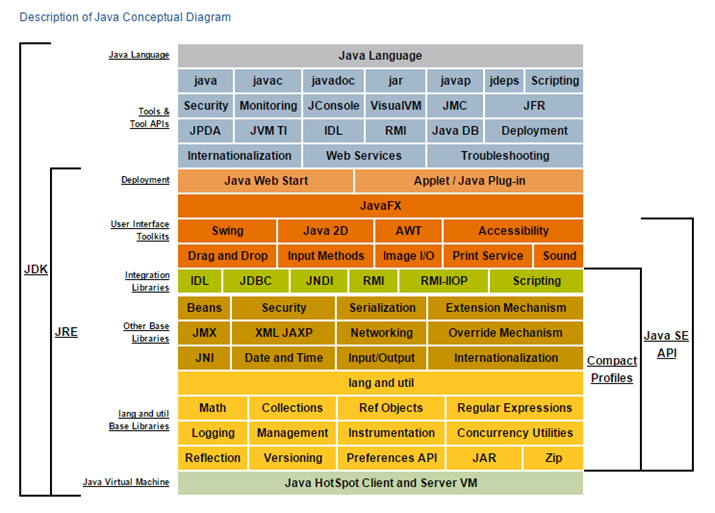
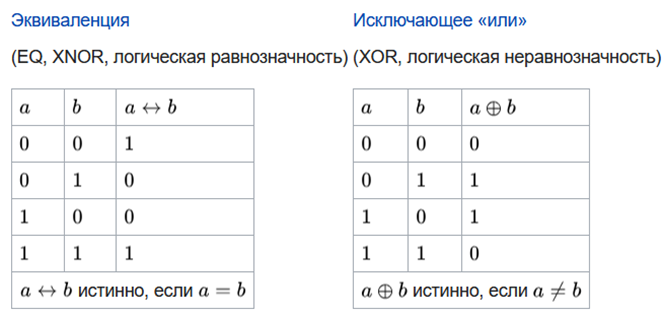
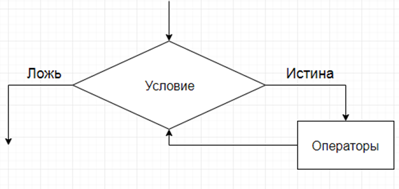

## *Базовый синтаксис*
- [Что такое виртуальная машина?](#1-что-такое-виртуальная-машина)
- [К какому типу языка программирования относится Java? Что такое исходный код? Что такое байт-код?](#2-к-какому-типу-языка-программирования-относится-java-что-такое-исходный-код-что-такое-байт-код)
- [Из каких компонентов состоит Java (JDK, JRE, JVM)?](#3-из-каких-компонентов-состоит-java-jdk-jre-jvm)
- [Для чего используется JDK?](#4-для-чего-используется-jdk)
- [Для чего используется JRE?](#5-для-чего-используется-jre)
- [Для чего используется VM?](#6-для-чего-используется-vm)
- [Что такое переменная?](#7-что-такое-переменная)
- [Расскажите про примитивные типы.](#8-расскажите-про-примитивные-типы)
- [Опишите шаги для компиляции и запуска приложения в консоли (javac java).](#9-опишите-шаги-для-компиляции-и-запуска-приложения-в-консоли-javac-java)
- [Расскажите о конструкциях ветвления (if, else, switch, тернарное выражение)?](#10-расскажите-о-конструкциях-ветвления-if-else-switch-тернарное-выражение)
- [Расскажите о таблице истинности?](#11-расскажите-о-таблице-истинности)
- [Расскажите про отличия || &&.](#12-расскажите-про-отличия--)
- [Что такое тернарное условие?](#13-что-такое-тернарное-условие)
- [Что такое циклы и для чего они используются?](#14-что-такое-циклы-и-для-чего-они-используются)
- [Для чего используется цикл for?](#15-для-чего-используется-цикл-for)
- [Для чего используется цикл foreach?](#16-для-чего-используется-цикл-foreach)
- [Для чего используется цикл while?](#17-для-чего-используется-цикл-while)
- [Для чего используется цикл do while?](#18-для-чего-используется-цикл-do-while)
- [Что такое массив?](#19-что-такое-массив)
- [Как создать массив?](#20-как-создать-массив)
- [Как присвоить значение ячейке массива?](#21-как-присвоить-значение-ячейке-массива)
- [Как можно пройти по всем элементам массива?](#22-как-можно-пройти-по-всем-элементам-массива)
- [Как можно найти элемент в массиве?](#23-как-можно-найти-элемент-в-массиве)
- [Что будет, если записывать элемент по индексу -1?](#24-что-будет-если-записывать-элемент-по-индексу--1)
- [Как удалить ячейку в массиве?](#25-как-удалить-ячейку-в-массиве)
- [Как отредактировать ячейку в массиве?](#26-как-отредактировать-ячейку-в-массиве)
- [Что такое Java code conventions?](#27-что-такое-java-code-conventions)
- [Что такое Unicode?](#28-что-такое-unicode)
- [Расскажите про алгоритм двух указателей.](#29-расскажите-про-алгоритм-двух-указателей)
- [Расскажите про жадный алгоритм.](#30-расскажите-про-жадный-алгоритм)


### 1. Что такое виртуальная машина?
+ Виртуальная машина Java (JVM — Java Virtual Machine) — это программное обеспечение, обеспечивающее выполнение байт-кода Java-приложений независимо от архитектуры компьютера и операционной системы.

#### Основные функции JVM включают:
1. Выполнение байт-кода приложения (javac .java → java .class, интерпретирует байт-код или компилирует его в машинный код).
2. Управление памятью (создание, распределение и освобождение объектов).
3. Сборка мусора (очистка неиспользуемых объектов, использование различных сборщиков мусорa).
4. Оптимизация исполнения программы.
5. Обеспечение безопасности и изоляции процессов (система защиты от несанкционированного доступа и ошибок приложений).
6. Поддержка взаимодействия с ОС (например, обработка исключительных ситуаций и управление потоками).

### 2. К какому типу языка программирования относится Java? Что такое исходный код? Что такое байт-код?
Java — строго типизированный объектно-ориентированный язык программирования (ООП). Его основными особенностями являются:
1.	Использование объектов и классов, где классы служат шаблонами для создания экземпляров (объектов).
2.	Возможность реализации иерархий наследования, полиморфизма и инкапсуляции через механизм ООП.
3.	Поддержка строгой типизации, что означает обязательную явную проверку типов переменных во время компиляции.
4.	Явное указание типов переменных и параметров методов (например, int, String, Object и др.).
5.	Строгая статическая типизация позволяет избежать многих ошибок до этапа выполнения программы.Исходный код – код, который написан на языке программирования (java), имеет расширения .java.

+ Исходный код – код, который написан на языке программирования (java), имеет расширения .java.
+ Байт-код – промежуточное представление программы, которое генерируется компилятором java (javac) после компиляции исходного кода. Байт-код не является мышиным кодом для конкретного процессора, а предназначен для  выполнения в виртуальной машине java(jvm), файлы с байт кодом имеют расширения .class. Преимущество байт-кода в том, что один и тот же байт-код может использоваться на любой платформе, где установлен jvm, что делает язык кросс-платформенной.

### 3. Из каких компонентов состоит Java (JDK, JRE, JVM)?

<p align="center">
  
</p>

### 4. Для чего используется JDK?
+ JDK (Java Development Kit) — это набор инструментов и библиотек, необходимых для разработки, компиляции и выполнения программ на языке Java. Он включает в себя всё, что нужно для полного цикла разработки приложений на Java (jre-javac-vm-набор библиотек).
### 5. Для чего используется JRE?
+ JRE (Java Runtime Environment) — это среда выполнения Java-программ. Она необходима для запуска уже скомпилированных Java-приложений. В отличие от JDK, JRE не содержит инструментов для разработки (например, компилятора), а только те компоненты, которые нужны для исполнения программ (vm-набор стандартных библиотек).
### 6. Для чего используется VM?
+ VM (Virtual Machine) - виртуальная машина служит для запуска Java-программы на конкретной платформе пользователя.
### 7. Что такое переменная?
+ Переменная в Java — это именованное место в памяти, предназначенное для хранения данных. Переменная имеет тип, который определяет, какой вид данных может в ней храниться, и имя, через которое можно получить доступ к этим данным.
+ Локальные-глобальные-статические.
### 8. Расскажите про примитивные типы.

| Тип | Размер | Диапазон | Степень диапазона | Значение по умолчанию |
|----|--------|----------|-------------------|-----------------------|
| `byte` | 8 бит (1 байт) | от -128 до 127 | −2⁷ … 2⁷−1 | `0` |
| `short` | 16 бит (2 байта) | от -32 768 до 32 767 | −2¹⁵ … 2¹⁵−1 | `0` |
| `int` | 32 бита (4 байта) | от -2 147 483 648 до 2 147 483 647 | −2³¹ … 2³¹−1 | `0` |
| `long` | 64 бита (8 байт) | от -9 223 372 036 854 775 808L до 9 223 372 036 854 775 807L | −2⁶³ … 2⁶³−1 | `0L` |
| `char` | 16 бит (2 байта) | от 0 до 65 535 | 0 … 2¹⁶−1 | `'\u0000'` |
| `float` | 32 бита (4 байта) | от `1.4e-45f` до `3.4e+38f` | ≈ ±2⁻¹⁴⁹ … ±2¹²⁸ | `0.0f` |
| `double` | 64 бита (8 байт) | от `4.9e-324` до `1.7e+308` | ≈ ±2⁻¹⁰⁷⁴ … ±2¹⁰²⁴ | `0.0` |
| `boolean` | JVM-зависимо* | `true / false` | — | `false` |
### 9. Опишите шаги для компиляции и запуска приложения в консоли (javac java).
<p align="center">
  
</p>

### 10. Расскажите о конструкциях ветвления (if, else, switch, тернарное выражение)?

<p align="center">
  
</p>

```java
if (условное_выражение) {
    // операторы, если условие true
} else if (другое_условие) {
    // операторы, если другое условие true
} else {
    // операторы, если все условия false
}

switch (проверяемая_переменная) {
    case значение1:
        действие1;
        break;
    case значениеN:
        действиеN;
        break;
    default:
        действие_по_умолчанию;
        break;
}

int number = 3;

String mark = switch (number) {
    case 5, 6 -> "Отлично";
    case 4 -> "Хорошо";
    case 1, 2 -> "Удовлетворительно";
    default -> "Неудовлетворительно";
};

Для оператор switch Java должен быть одни из следующих:
Byte, short, char, int их обёртки, String начиная с java 7, перечисления Enum.

Тернарный оператор:
ТИП_ПЕРЕМЕННОЙ ИМЯ_ПЕРЕМЕННОЙ = ЛОГИЧЕСКОЕ_ВЫРАЖЕНИЕ ? ЗНАЧЕНИЕ_1 : ЗНАЧЕНИЕ_2;
Если истина то значение 1 или ложь значение 2.
```

### 11. Расскажите о таблице истинности?

<p align="center">
  
</p>

<p align="center">
  
</p>

### 12. Расскажите про отличия || &&.
Укороченный оператор && позволяет объединить две boolean-переменных по следующему правилу:
1. Если обе переменных "истина", то все выражение будет "истина".
2. Если хотя бы одна переменная - "ложь", то все выражение будет "ложь".
  + Обычный оператор & будет последовательно прочитывать переменные value1, value2, value3 и только после этого вычислит общий результат.
  +  Укороченный оператор && при каждом считывании производит анализ выражения, чтобы раньше выдать результат.
  + Оператор || и | аналогичен выше приведённому оператору, разницей если присутствует истина то всё выражение будет истина.

### 13. Что такое тернарное условие?
```
ТИП_ПЕРЕМЕННОЙ ИМЯ_ПЕРЕМЕННОЙ = ЛОГИЧЕСКОЕ_ВЫРАЖЕНИЕ ? ЗНАЧЕНИЕ_1 : ЗНАЧЕНИЕ_2;
```
+ ТИП_ПЕРЕМЕННОЙ - может быть примитивный тип (byte, short, int, long, float, double, boolean, char) или String.
+ ИМЯ_ПЕРЕМЕННОЙ - произвольное слово, состоящее из букв латинского алфавита.
+ ЛОГИЧЕСКОЕ_ВЫРАЖЕНИЕ - здесь может быть любая операция сравнения (>, <, >=, <=, ==, !=) или переменная boolean типа.

### 14. Что такое циклы и для чего они используются?
+ Для многократного повторения участка кода пока выполняется условие.
<p align="center">
  
</p>

### 15. Для чего используется цикл for?
+ Когда нужно повторить цикл заранее известное кол-во раз.

````
for (int index = НАЧАЛЬНОЕ_ЗАЧЕНИЕ; index <= КОНЕЧНОЕ_ЗНАЧЕНИЕ; index++) {
/* ТЕЛО ЦИКЛА */
}
````
У инкремента есть 2 формы записи:
- префиксная - вида ++index
- постфиксная - вида index++
+  При использовании префиксной формы записи сначала происходит изменение переменной, а потом возврат получившегося значения.
+  При использовании постфиксной формы записи - все наоборот: после изменения переменной возвращается то значение, которое было до изменения переменной.

### 16. Для чего используется цикл foreach?
Для перебора коллекций.

```
for (тип_переменной имя_переменной : имя_массива) {
// действия, которые мы производим с переменной который мы объявили в цикле
}
```

+ Если внутри цикла необходимо производить какие-то манипуляции с индексом элемента в массиве - такая конструкция уже не подходит - в данном случае будет более предпочтительно использовать запись цикла for() с использованием индексов.
+ Цикл for-each неявно использует метод iterator(), чтобы получить объект Iterator, и затем вызывает его методы hasNext() и next() для последовательного обхода всех элементов коллекции.
+ Что бы использовать свою коллекцию для foreach, необходимо в коллекции реализовать метод iterator() от интерфейса iterable.

### 17. Для чего используется цикл while?

+ Используется когда неизвестно точное кол-во выполнение цикла.

```
while (УСЛОВИЕ) {
ТЕЛО_ЦИКЛА;
}
```
### 18. Для чего используется цикл do while?
+ В цикле do-while сначала выполняется код, а потом проверяется условие (постпроверка условия). То есть код выполняется бесконечное количество раз, пока не пройдёт условие. Данный цикл применяется, когда тело цикла должно выполниться хотя бы 1 раз.
````    
do {
System.out.println("Введите пароль: ");
password = scanner.nextInt();
} while (password != 555);
````
### 19. Что такое массив?
+ Массив — это структура данных, в которой хранятся элементы одного типа. Его можно представить, как набор пронумерованных ячеек, в каждую из которых можно поместить какие-то данные (один элемент данных в одну ячейку). Доступ к конкретной ячейке осуществляется через её номер. Номер элемента в массиве также называют индексом. В случае с Java массив однороден, то есть во всех его ячейках будут храниться элементы одного типа. Массив в Java это объект и доступ к нему осуществляется через ссылочный тип.

### 20. Как создать массив?
````
тип_данных[] имя_переменной = new тип_данных[количество_ячеек];
````
+ Так же можно не указывать кол-в элементов, а сразу их объявить.
````
тип_данных[] имя_переменной = new тип_данных[]{1, 2, 3, 4};
````
+ Создание двухмерного массива.
````
тип_данных[][] имя_переменной = new тип_данных[3][5];
````
### 21. Как присвоить значение ячейке массива?
````
ИМЯ_ПЕРЕМЕННОЙ_МАССИВА[ИНДЕКС] = ЗНАЧЕНИЕ;
````
### 22. Как можно пройти по всем элементам массива?
````
    for(int i = 0; i < array.length; i++){
    System.out.println(array[i]);
    }
    
или foreach

    for(int item: array){
    System.out.println(item);
    }
````

### 23. Как можно найти элемент в массиве?
````
for(int item: array){
    if(item == 0)
    {
        System.out.println("Найденный элемент");
        break;
    }
}
````

### 24. Что будет, если записывать элемент по индексу -1?
+ Если в Java попытаться обратиться к элементу массива за пределами его допустимого индекса, произойдет исключение. Конкретно, это будет ArrayIndexOutOfBoundsException — одно из стандартных исключений в Java, которое выбрасывается во время выполнения программы (runtime exception).
### 25. Как удалить ячейку в массиве?
+ Java массиве нельзя удалять ячейку в массиве, размеры массивов фиксированного размера.
+ Можно использовать для копирования элементов текущего массива в новый с помощью
````
var[] newArray =  Arrays.copyOf(имя массива текущего, длина текущего массива)
````

### 26. Как отредактировать ячейку в массиве?
````
array[index] = элемент для вставки.
````

### 27. Что такое Java code conventions?

Java Code Conventions (конвенции по написанию кода на Java) — это набор соглашений и стандартов, разработанных для обеспечения единообразного стиля написания Java-кода. Эти соглашения помогают разработчикам создавать понятный, поддерживаемый и легко читаемый код, а также обеспечивают его совместимость с проектами и командами.
Основные аспекты Java Code Conventions:
1.	Имена классов, переменных и методов:
      -	Классы: Имена классов начинаются с заглавной буквы и используют стиль CamelCase.
      -	Пример: MyClass, UserAccount
      -	Переменные и методы: Имена переменных и методов начинаются с маленькой буквы и также используют стиль camelCase.
      -	Пример: firstName, calculateTotal()
      -	Константы: Для имен констант используют все заглавные буквы с подчеркиванием.
      -	Пример: MAX_SIZE, DEFAULT_VALUE
2.	Отступы:
      -	Используются 4 пробела для отступа кода (не табуляция).
````
 public class MyClass {
    public void myMethod() {
        int value = 10;
    }
}
  ````
3.	Фигурные скобки:
      -	Открывающая фигурная скобка располагается на той же строке, что и объявление метода или цикла, а закрывающая скобка — на новой строке.
     
```
if (condition) {
    // тело if
} else {
    // тело else
}
```

4.	Разделение на строки:
      -	Длинные строки кода (более 80 символов) разбиваются на несколько строк для удобства чтения.
```
String example = "This is a very long line of code that should be broken " +
                 "into multiple lines to improve readability.";
```

5.	Комментарии:
      -	Используются три типа комментариев:
      -	Однострочные комментарии: //
      -	Многострочные комментарии: /* */
      -	Javadoc комментарии для документирования классов и методов: /** */
```
/**
 * Этот метод выполняет вычисление суммы
 * @param a первое число
 * @param b второе число
 * @return результат сложения
 public int sum(int a, int b) {
    return a + b;
}
 */
```
 
6.	Пробелы:
      -	Пробелы ставятся вокруг операторов и после запятых для улучшения читаемости:
```
int x = 10;
if (x > 5) {
    System.out.println("x больше 5");
}
```
7.	Организация файлов:
      -	Один класс на файл: Каждый файл должен содержать только один класс с таким же именем, как и файл.
      -	Порядок внутри класса: Сначала идут поля, затем конструкторы, а потом методы.
8.	Импорт библиотек:
      -	Не использовать импорт с *, а импортировать только необходимые классы:
```
import java.util.List;  // Хорошо
import java.util.*;     // Плохо
```

+ Пример кода, соответствующего Java Code Conventions:
```
public class Calculator {

    private int result;

    /**
     * Добавляет два числа и сохраняет результат.
     *
     * @param a первое число
     * @param b второе число
     */
    public void add(int a, int b) {
        result = a + b;
    }

    /**
     * Возвращает текущий результат.
     *
     * @return результат вычисления
     */
    public int getResult() {
        return result;
    }
}
```

### 28. Что такое Unicode?
+ Unicode — это международный стандарт кодирования, который используется для представления текста в компьютерах и других устройствах. Он охватывает практически все символы всех письменных систем мира, а также специальные символы, такие как математические знаки, символы валют, эмодзи и другие.
+ UTF-8: Переменная длина кодирования (от 1 до 4 байт на символ). Используется в большинстве веб-сайтов.
+ UTF-16: Каждый символ кодируется 2 или 4 байтами. Используется во многих языках программирования, таких как Java.
+ UTF-32: Каждый символ занимает 4 байта.

Пример:
-	Буква "A" имеет кодовую точку в Unicode — U+0041.
-	Кириллическая буква "Я" имеет кодовую точку — U+042F.
-	Эмодзи "😊" имеет кодовую точку — U+1F60A.
### 29. Расскажите про алгоритм двух указателей.
+ Алгоритм двух указателей (или "two-pointer" technique) — это алгоритмический подход, который используется для решения задач с последовательностями, такими как массивы или строки. В этом методе два указателя (или индекса) используются для одновременного обхода структуры данных с разных концов или в одном направлении, чтобы сократить количество операций.

Где используется алгоритм двух указателей:
1.	Поиск пары чисел в отсортированном массиве, сумма которых равна заданному значению.
2.	Проверка, является ли строка палиндромом.
3.	Слияние двух отсортированных массивов.
4.	Удаление дубликатов из отсортированного массива.

### 30. Расскажите про жадный алгоритм.
+ Жадный алгоритм – алгоритм, который на каждом шаге берёт самый выгодный шаг, не смотря на будущие последствия.
+ Пример кофе-машины – берётся алгоритм сдачи, в котором за каждый проход от сдачи снимается самая большая монета.
