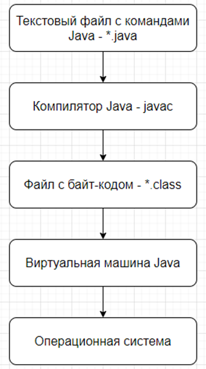
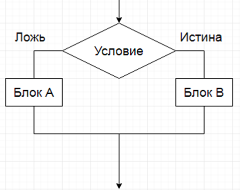

## *Базовый синтаксис*
### 1. Что такое виртуальная машина?
+ Виртуальная машина Java (JVM — Java Virtual Machine) — это программное обеспечение, обеспечивающее выполнение байт-кода Java-приложений независимо от архитектуры компьютера и операционной системы.

#### Основные функции JVM включают:
1. Выполнение байт-кода приложения (javac .java → java .class, интерпретирует байт-код или компилирует его в машинный код).
2. Управление памятью (создание, распределение и освобождение объектов).
3. Сборка мусора (очистка неиспользуемых объектов, использование различных сборщиков мусорa).
4. Оптимизация исполнения программы.
5. Обеспечение безопасности и изоляции процессов (система защиты от несанкционированного доступа и ошибок приложений).
6. Поддержка взаимодействия с ОС (например, обработка исключительных ситуаций и управление потоками).

### 2. К какому типу языка программирования относится Java? Что такое исходный код? Что такое байт-код?
+ Java относиться к объектно-ориентированному языку, в котором качестве основных элементов выступают объекты, объекту являются экземплярами классов, а классы реализуют иерархию наследования.
+ Исходный код – код, который написан на языке программирования (java), имеет расширения .java.
+ Байт-код – промежуточное представление программы, которое генерируется компилятором java (javac) после компиляции исходного кода. Байт-код не является мышиным кодом для конкретного процессора, а предназначен для  выполнения в виртуальной машине java(jvm), файлы с байт кодом имеют расширения .class. Преимущество байт-кода в том, что один и тот же байт-код может использоваться на любой платформе, где установлен jvm, что делает язык кросс-платформенной.

### 3. Из каких компонентов состоит Java (JDK, JRE, JVM)?

### 4. Для чего используется JDK?
+ JDK (Java Development Kit) — это набор инструментов и библиотек, необходимых для разработки, компиляции и выполнения программ на языке Java. Он включает в себя всё, что нужно для полного цикла разработки приложений на Java (jre-javac-vm-набор библиотек).
### 5. Для чего используется JRE?
+ JRE (Java Runtime Environment) — это среда выполнения Java-программ. Она необходима для запуска уже скомпилированных Java-приложений. В отличие от JDK, JRE не содержит инструментов для разработки (например, компилятора), а только те компоненты, которые нужны для исполнения программ (vm-набор стандартных библиотек).
### 6. Для чего используется VM?
+ VM (Virtual Machine) - виртуальная машина служит для запуска Java-программы на конкретной платформе пользователя.
### 7. Что такое переменная?
+ Переменная в Java — это именованное место в памяти, предназначенное для хранения данных. Переменная имеет тип, который определяет, какой вид данных может в ней храниться, и имя, через которое можно получить доступ к этим данным.
+ Локальные-глобальные-статические.
### 8. Расскажите про примитивные типы.

| Тип | Размер | Диапазон | Степень диапазона | Значение по умолчанию |
|----|--------|----------|-------------------|-----------------------|
| `byte` | 8 бит (1 байт) | от -128 до 127 | −2⁷ … 2⁷−1 | `0` |
| `short` | 16 бит (2 байта) | от -32 768 до 32 767 | −2¹⁵ … 2¹⁵−1 | `0` |
| `int` | 32 бита (4 байта) | от -2 147 483 648 до 2 147 483 647 | −2³¹ … 2³¹−1 | `0` |
| `long` | 64 бита (8 байт) | от -9 223 372 036 854 775 808L до 9 223 372 036 854 775 807L | −2⁶³ … 2⁶³−1 | `0L` |
| `char` | 16 бит (2 байта) | от 0 до 65 535 | 0 … 2¹⁶−1 | `'\u0000'` |
| `float` | 32 бита (4 байта) | от `1.4e-45f` до `3.4e+38f` | ≈ ±2⁻¹⁴⁹ … ±2¹²⁸ | `0.0f` |
| `double` | 64 бита (8 байт) | от `4.9e-324` до `1.7e+308` | ≈ ±2⁻¹⁰⁷⁴ … ±2¹⁰²⁴ | `0.0` |
| `boolean` | JVM-зависимо* | `true / false` | — | `false` |
### 9. Опишите шаги для компиляции и запуска приложения в консоли (javac java).

### 10. Расскажите о конструкциях ветвления (if, else, switch, тернарное выражение)?

```java
if (условное_выражение) {
    // операторы, если условие true
} else if (другое_условие) {
    // операторы, если другое условие true
} else {
    // операторы, если все условия false
}

switch (проверяемая_переменная) {
    case значение1:
        действие1;
        break;
    case значениеN:
        действиеN;
        break;
    default:
        действие_по_умолчанию;
        break;
}

int number = 3;

String mark = switch (number) {
    case 5, 6 -> "Отлично";
    case 4 -> "Хорошо";
    case 1, 2 -> "Удовлетворительно";
    default -> "Неудовлетворительно";
};

Для оператор switch Java должен быть одни из следующих:
Byte, short, char, int их обёртки, String начиная с java 7, перечисления Enum.

Тернарный оператор:
ТИП_ПЕРЕМЕННОЙ ИМЯ_ПЕРЕМЕННОЙ = ЛОГИЧЕСКОЕ_ВЫРАЖЕНИЕ ? ЗНАЧЕНИЕ_1 : ЗНАЧЕНИЕ_2;
Если истина то значение 1 или ложь значение 2.
```

### 11. Расскажите о таблице истинности?


### 12. Расскажите про отличия || &&.

### 13. Что такое тернарное условие?

### 14. Что такое циклы и для чего они используются?

### 15. Для чего используется цикл for?

### 16. Для чего используется цикл foreach?

### 17. Для чего используется цикл while?

### 18. Для чего используется цикл do while?

### 19. Что такое массив?

### 20. Как создать массив?

### 21. Как присвоить значение ячейке массива?

### 22. Как можно пройти по всем элементам массива?

### 23. Как можно найти элемент в массиве?

### 24. Что будет, если записывать элемент по индексу -1?

### 25. Как удалить ячейку в массиве?

### 26. Как отредактировать ячейку в массиве?

### 27. Что такое Java code conventions?

### 28. Что такое Unicode?

### 29. Расскажите про алгоритм двух указателей.

### 30. Расскажите про жадный алгоритм.