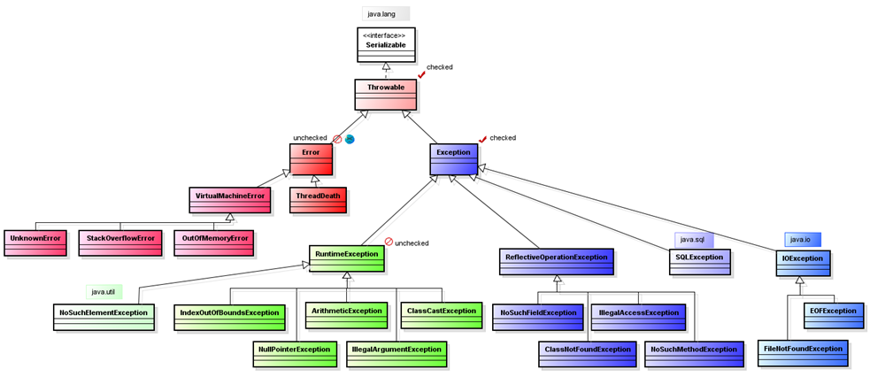

## *OOP*

- [Что такое ООП?](#1-что-такое-ооп)
- [Базовые концепции ООП?](#2-базовые-концепции-ооп)
- [Укажите из каких элементов состоит класс. Расскажите о каждом из них.](#3-укажите-из-каких-элементов-состоит-класс-расскажите-о-каждом-из-них)
- [Что такое конструктор?](#4-что-такое-конструктор)
- [Можно ли наследовать конструктор?](#5-можно-ли-наследовать-конструктор)
- [Что такое перегрузка конструктора?](#6-что-такое-перегрузка-конструктора)
- [Что такое статический метод?](#7-что-такое-статический-метод)
- [Что такое не статический метод?](#8-что-такое-не-статический-метод)
- [Для чего используется ключевое слово this?](#9-для-чего-используется-ключевое-слово-this)
- [Какой класс является базовым родительским классом для всех классов?](#10-какой-класс-является-базовым-родительским-классом-для-всех-классов)
- [Что такое наследование? Приведите примеры из реальной жизни.](#11-что-такое-наследование-приведите-примеры-из-реальной-жизни)
- [Опишите процесс создания нового объекта.](#12-опишите-процесс-создания-нового-объекта)
- [Как вызвать метод из родительского класса?](#13-как-вызвать-метод-из-родительского-класса)
- [Что такое переопределение метода?](#14-что-такое-переопределение-метода)
- [Можно ли переопределить статический метод?](#15-можно-ли-переопределить-статический-метод)
- [Что такое сокрытие метода?](#16-что-такое-сокрытие-метода)
- [Что такое виртуальная функция и используются ли они в Java?](#17-что-такое-виртуальная-функция-и-используются-ли-они-в-java)
- [Что такое перегрузка метода?](#18-что-такое-перегрузка-метода)
- [Можно ли изменить тип возвращаемых данных при перегрузке метода?](#19-можно-ли-изменить-тип-возвращаемых-данных-при-перегрузке-метода)
- [Что такое множественное наследование? Как его можно реализовать в Java.](#20-что-такое-множественное-наследование-как-его-можно-реализовать-в-java)
- [Что такое полиморфизм? Приведите примеры из реальной жизни.](#21-что-такое-полиморфизм-приведите-примеры-из-реальной-жизни)
- [Что такое инкапсуляция?](#22-что-такое-инкапсуляция)
- [Как реализована инкапсуляция в Java? ](#23-как-реализована-инкапсуляция-в-java)
- [Можно ли применить модификаторы доступа к конструкторам?](#24-можно-ли-применить-модификаторы-доступа-к-конструкторам)
- [Что такое интерфейс?](#25-что-такое-интерфейс)
- [Перечислите элементы, которые может содержать интерфейс.](#26-перечислите-элементы-которые-может-содержать-интерфейс)
- [Можно ли создать объект интерфейса? Если да, то как?](#27-можно-ли-создать-объект-интерфейса-если-да-то-как)
- [Может ли интерфейс содержать какие-либо методы с реализацией? Если да, то какие?](#28-может-ли-интерфейс-содержать-какие-либо-методы-с-реализацией-если-да-то-какие)
- [Что такое абстракция?](#29-что-такое-абстракция)
- [Что такое абстрактный класс?](#30-что-такое-абстрактный-класс)
- [Сколько абстрактных методов должен и может содержать абстрактный класс?](#31-сколько-абстрактных-методов-должен-и-может-содержать-абстрактный-класс)
- [Может ли абстрактный класс содержать обычные методы?](#32-может-ли-абстрактный-класс-содержать-обычные-методы)
- [Сколько объектов абстрактного класса можно создать в программе?](#33-сколько-объектов-абстрактного-класса-можно-создать-в-программе)
- [Что нужно делать, если наследник абстрактного класса не переопределяет все абстрактные методы родителя?](#34-что-нужно-делать-если-наследник-абстрактного-класса-не-переопределяет-все-абстрактные-методы-родителя)
- [Чем отличается интерфейс от абстрактного класса?](#35-чем-отличается-интерфейс-от-абстрактного-класса)
- [Что такое вложенные классы? Зачем они нужны?](#36-что-такое-вложенные-классы-зачем-они-нужны)
- [Какие типы вложенных классов существуют в Java?](#37-какие-типы-вложенных-классов-существуют-в-java)
- [Что такое внутренний класс? Когда он применяется?](#38-что-такое-внутренний-класс-когда-он-применяется)
- [Что такое статический вложенный класс? Когда он применяется?](#39-что-такое-статический-вложенный-класс-когда-он-применяется)
- [Сколько объектов статического вложенного класса можно создать в программе?](#40-сколько-объектов-статического-вложенного-класса-можно-создать-в-программе)
- [Что такое локальный класс? Когда он применяется?](#41-что-такое-локальный-класс-когда-он-применяется)
- [Что такое анонимный класс? Когда он применяется?](#42-что-такое-анонимный-класс-когда-он-применяется)
- [Сколько объектов анонимного класса можно создать в программе?](#43-сколько-объектов-анонимного-класса-можно-создать-в-программе)
- [Что такое исключения? Какие типы исключительных ситуаций бывают?](#44-что-такое-исключения-какие-типы-исключительных-ситуаций-бывают)
- [Назовите основные методы класса Object?](#45-назовите-основные-методы-класса-object)
- [Что такое шаблоны проектирования?](#46-что-такое-шаблоны-проектирования)
- [Объясните шаблон - декоратор. Придумайте пример, не относящийся к технике.](#47-объясните-шаблон---декоратор-придумайте-пример-не-относящийся-к-технике)
- [Объясните шаблон - стратегия. Придумайте пример, не относящийся к технике.](#48-объясните-шаблон---стратегия-придумайте-пример-не-относящийся-к-технике)
- [Объясните шаблон - синглтон. Придумайте пример, не относящийся к технике.](#49-объясните-шаблон---синглтон-придумайте-пример-не-относящийся-к-технике)
- [Объясните шаблон - фабричный метод. Придумайте пример, не относящийся к технике.](#50-объясните-шаблон---фабричный-метод-придумайте-пример-не-относящийся-к-технике)
- [Что такое enum? Когда можно его применять?](#51-что-такое-enum-когда-можно-его-применять)
- [Что такое record? Когда можно его применять?](#52-что-такое-record-когда-можно-его-применять)
- [Зачем нужны StringBuilder, StringBuffer, StringJoiner? Что они делают?](#53-зачем-нужны-stringbuilder-stringbuffer-stringjoiner-что-они-делают)
- [Чем отличаются StringBuffer и StringBuilder?](#54-чем-отличаются-stringbuffer-и-stringbuilder)
- [Каким образом производится экранирование символов и зачем это нужно?](#55-каким-образом-производится-экранирование-символов-и-зачем-это-нужно)
- [Что такое управляющие последовательности?](#56-что-такое-управляющие-последовательности)
- [Зачем нужно форматирование данных? Метод format()](#57-зачем-нужно-форматирование-данных-метод-format)
- [Что такое varargs? В каких случаях стоит его применять?](#58-что-такое-varargs-в-каких-случаях-стоит-его-применять)
- [В каких случаях может возникнуть неоднозначность при работе с varargs?](#59-в-каких-случаях-может-возникнуть-неоднозначность-при-работе-с-varargs)
- [Что такое форматированный вывод? Какие механизмы позволяют осуществить форматированный вывод?](#60-что-такое-форматированный-вывод-какие-механизмы-позволяют-осуществить-форматированный-вывод)

---

### 1. Что такое ООП?
+ Объектно-ориентированное программирование (ООП) — методология программирования, основанная на представлении программы в виде совокупности объектов, каждый из которых является экземпляром определенного класса, а классы образуют иерархию наследования.
-	объектно-ориентированное программирование использует в качестве основных логических конструктивных элементов объекты, а не алгоритмы;
-	каждый объект является экземпляром определенного класса
-	классы образуют иерархии.
### 2. Базовые концепции ООП?
   -	Инкапсуляция - свойство системы, позволяющее объединить данные и методы, работающие с ними, в классе. Для Java корректно будет говорить, что инкапсуляция это «сокрытие реализации».
   -	Наследование - свойство системы, позволяющее описать новый класс на основе уже существующего с частично или полностью заимствующейся функциональностью. Класс, от которого производится наследование, называется базовым, родительским или суперклассом.
   -	Полиморфизм - свойство системы использовать объекты с одинаковым интерфейсом без информации о типе и внутренней структуре объекта.
   -	Абстракция - выделение значимой информации и исключение из рассмотрения незначимой.

### 3. Укажите из каких элементов состоит класс. Расскажите о каждом из них.
Класс состоит из полей (атрибуты) и методов (функции для работы с этими полями). Поле (атрибут) класса — это характеристика объекта, содержит его состояние. Например для фигуры это может быть название, площадь, периметр.
Класс является ссылочным типом данных. Это шаблон для создания объекта, в свою очередь объект - это экземпляр класса.
Типы полей:
-	локальные переменные - определены внутри методов, конструкторов или иных блоков кода (циклы, итераторы и т.д.) Они объявляются и уничтожаются по завершении работы метода.
-	переменные экземпляра - доступны в пределах класса и из любого метода, конструктора или иных блоков кода конкретного класса (циклы, итераторы и т.д.).
-	статические переменные - объявляются в классе вне любого метода с помощью ключевого слова static.

### 4. Что такое конструктор?
Конструктор – это специальный метод, который вызывается при создании нового объекта. Используется для инициализации полей объекта.
Характеристика - название совпадает с именем класса, где он объявлен. Конструктор вызывается автоматически при создании нового экземпляра класса. Например new Computer() интерпретатор jvm вызывается конструктор. При неявной объявлении конструктора вызывается дефолтный – без параметров.

```java
public class Computer {
    public static void main(String[] args) {
        Computer computer = new Computer();
    } 
}

```

Оператор new выделяет память для объекта computer типа Computer. На следующем этапе происходит вызов конструктора по умолчанию, который не принимает никаких параметров. После выполнения этого выражения в памяти будет выделен участок памяти (heap будут хранится все поля объекта, а stack адреса ссылок на данный объект), где будут храниться все данные объекта. А в переменную computer будет записана ссылка на созданный объект.

### 5. Можно ли наследовать конструктор?
Нет, нельзя напрямую наследовать конструктор. В java существует правило конструктор вызывается вручную (явно или неявно через super()), конструктор класса доступен только внутри самого конструктора этого же класса.

Существует возможность реализовать механизм инициализации дочернего класса аналогично конструктору с помощью метода init() или перезагрузки базового конструктора super(…) Это обеспечивает правильную инициализацию родительского объекта при создании экземпляра потока.

```java
class Parent {
    int x;
    public Parent(int x){   
        this.x = x;
    }
}

class Child extends Parent {
    int y;
    public Child(int x, int y) {
        // Вызов родительского конструктора
        super(x); // инициализация поля родителя
        this.y = y;
        
        }
    }
```

Прямого наследования конструктора нет, но можно обеспечить корректную инициализацию объектов любого уровня иерархии классов используя механизм вызова базовых конструкторов и дополнительной инициализации полей конкретного класса.

### 6. Что такое перегрузка конструктора?
Перегрузка конструктора заключается в том, что можно объявить несколько конструкторов в одном классе. Конструктор – это особый метод, имя которого совпадает с именем класса. Однако с точки зрения синтаксиса языка, в некотором локальном пространстве не может быть двух одинаковых имен. Однако, в данном случае допускается объявление нескольких конструкторов, однако они должны отличаться набором параметров. Когда вызываем перегруженный конструктор, то из нескольких объявленных конструкторов, компилятор автоматически определяет нужный конструктор по его параметрам, которые указываются при вызове.
### 7. Что такое статический метод?
+ Статический метод  - это метод, который работает непосредственно над самим классом (полями), а не над экземпляром класса. Такие методы объявляются с помощью static. Они вызываются через имя класса – Class.статические метод, не требуют создание объекта.
+ Для статического метода нельзя использовать переменные экземпляров класса, такие как поля или обычные методы.

```java
class Parent {
    public static void print(){   
       // код
    }
}

Parent.print();
```

### 8. Что такое не статический метод?
Динамический метод, который создаётся без static, может обращаться к статическим методам и вызываться через объект. Принадлежит к объекту, в отличии от статического метода нельзя использовать через имя класса без создания объекта.
### 9. Для чего используется ключевое слово this?
+ Обращение к полю объекта:
  + Используется, когда имя поля совпадает с именем локальной переменной метода (или параме тра метода).
````java
class Person {
       private String name;

       public void setName(String name) {
           // Без использования this здесь будет ошибка,
           // потому что метод имеет параметр name
           this.name = name;
       }
   }
````
+ Ссылка на текущий объект:
  + Если класс содержит методы-конструкторы или перегруженные конструкторы, важно понимать разницу между параметрами конструктора и полями класса. 
````java
   class Example {
       int value;

       public Example(int value) {
           this.value = value;  // Указываем, что значение присваивается полю
       }
   }  
````
+ Возвращение текущего объекта:
  + В некоторых случаях нужно возвращать ссылку на текущий объект после выполнения методов.
````java
class Counter {
       private int count;

       public Counter increment() {
           count++;
           return this;  // Возвращаем ссылку на текущий объект
       }
   }
````
+ Когда нужно вызвать один конструктор из другого (например, конструктор по умолчанию вызывается в параметризированном). Вызов this() может находиться только в первой строке конструктора.

````java
public Toy(String name, int cost, String manufacturer, int age) {
        this(name, cost, manufacturer);
        this.age = age;
        System.out.println("В конструкторе с четырьмя параметрами");
    }
````
### 10. Какой класс является базовым родительским классом для всех классов?
+ Object - корневой класс в иерархии классов Java.
  + Все непримитивные типы, включая массивы, наследуют прямо или косвенно от него. Поэтому ссылочная переменная класса Object может ссылаться на объект любого другого класса.

### 11. Что такое наследование? Приведите примеры из реальной жизни.
Наследование — механизм, который позволяет описать новый класс на основе существующего (родительского). При этом свойства и функциональность родительского класса заимствуются новым классом.
### 12. Опишите процесс создания нового объекта.
Процесс создания нового объекта включает несколько ключевых этапов:
1. Создание новой переменной
   Сначала объявляем новую переменную, указывающую на объект (например, MyClass obj).
2. Резервирование места для указателя переменной в стеке
   После объявления переменная записывается в стек, где хранится ссылка на созданный объект (obj).
3. Выделение памяти в куче (heap)
   Далее компилятор выделяет необходимую область памяти для хранения полей объекта в куче (heap), используя ключевое слово new. В куче размещаются объекты классов, созданные динамически.
4. Инициализация конструктором класса
   При вызове конструктора (new MyClass()) выполняется следующая последовательность действий:
   - автоматически инициализируются поля класса значениями по умолчанию (если явно не задано иначе);
   - вызываются конструкторы базовых классов (через механизм наследования, от родительского до текущего класса — порядок вызова идет снизу вверх);
   - конструктор самого класса инициализирует свойства конкретного класса (при наличии инициализационных блоков и явной реализации конструктора).
5. Возврат адреса выделенного объекта
   Адрес созданного объекта возвращается обратно на ссылку в стеке (obj = new MyClass()). Теперь объект доступен через ссылку в стеке.
```java
class Person {
    String name;
    int age;

    public Person(String name, int age) {
        this.name = name;
        this.age = age;
    }
}
// Создание объекта в heap
       Person person = new Person(" ", 30);
```
### 13. Как вызвать метод из родительского класса?
Если метод родительского класса переопределен, а нужно вызвать оригинальную версию метода, то нужно использовать ключевое слово super, которое представляет текущий экземпляр родительского класса.
```java
class Child extends Parent {
    @Override
    public void display() {
        System.out.println("Метод display() из дочернего класса");
        super.display(); // Вызов метода родительского класса
    }
}
```
### 14. Что такое переопределение метода?
+ Это возможность задать методу родительского класса другой функционал.
  + При этом сигнатура (имя метода плюс параметры, причем порядок параметров имеет значение) метода и тип возвращаемого значения должны совпадать с сигнатурой и типом возврата в базовом классе.

### 15. Можно ли переопределить статический метод?
Нет, статический метод создается при инициализации класса один на все объекты, но его можно скрыть.
### 16. Что такое сокрытие метода?
+ Сокрытие метода - это когда дочерний класс определяет статический метод с такой же сигнатурой, что содержится в родительском классе. Статические методы можно наследовать, но переопределить их нельзя. Обычный статический метод может быть вызван из своего класса, аналогично скрытый статический метод также вызывается из своего класса.
+ Если в дочернем классе требуется изменить статический метод из родительского класса, это называется "Сокрытием статического метода" (hiding) в отличие от "переопределения" для нестатического метода (overriding).
```java
public class Animal {
    public void instanceInvoke() {
        System.out.println("Вызов метода экземпляра Animal");
    }

    public static void staticInvoke() {
        System.out.println("Вызов статического метода Animal");
    }
}

public class Cat extends Animal {
    @Override
    public void instanceInvoke() {
        System.out.println("Вызов метода экземпляра Cat");
    }

    public static void staticInvoke() {
        System.out.println("Вызов статического метода Cat");
    }
}
```
+ Во время компиляции статический метод связан со своим классом. То есть переменную какого типа мы объявляем, статический метод того же класса и будет вызван независимо от типа самого объекта. Таким образом статические методы не являются полиморфными, они всегда привязаны к классу типа объявленной переменной.

### 17. Что такое виртуальная функция и используются ли они в Java?
В Java виртуальный метод — это нестатический метод, не помеченный final или private, реализация которого выбирается во время выполнения и может быть переопределена.
### 18. Что такое перегрузка метода?
+ Перегрузка метода — это объявление в одном классе или иерархии классов нескольких методов с одинаковым именем, но разными списками параметров (типами, количеством или порядком параметров).
  + Перегружать можно как методы, так и конструкторы.
  + Выбор конкретной перегруженной версии метода осуществляется на этапе компиляции на основе переданных аргументов.
### 19. Можно ли изменить тип возвращаемых данных при перегрузке метода?
+ Можно, если списки аргументов отличаются, иначе JVM не поймет какой метод ей нужно вызвать.
  + Т.е. если меняем тип возвращаемого значения, то также должны изменить список аргументов перегружаемого метода.
### 20. Что такое множественное наследование? Как его можно реализовать в Java.
+ Множественное наследование — это механизм объектно-ориентированного программирования, при котором класс может наследоваться одновременно от нескольких суперклассов.
+ В Java множественное наследование классов запрещено, главным образом из-за ромбовидной проблемы (diamond problem). Она возникает, когда класс наследует поведение от двух классов, которые имеют общего предка, и при этом неочевидно, какую реализацию метода следует использовать.
+ Однако в Java возможно множественное наследование типов с помощью интерфейсов. Класс может реализовывать несколько интерфейсов, а при конфликте default-методов разработчик обязан явно переопределить метод и указать нужную реализацию.
+ Если требуется повторно использовать поведение нескольких классов, в Java рекомендуется применять композицию: класс содержит ссылки на необходимые объекты и делегирует им выполнение нужных операций.
### 21. Что такое полиморфизм? Приведите примеры из реальной жизни.
+ Полиморфизм — это возможность работать с несколькими типами так, будто это один и тот же тип. При этом поведение объектов будет разным в зависимости от типа, к которому они принадлежат.
+ Полиморфизм позволяет единообразно обращаться к объектам различных классов (обычно имеющих общего предка) – вещь, которую трудно переоценить. Ценность его тем выше, чем больше программа.
  + Пример - • Пульт управления один для разных моделей.
### 22. Что такое инкапсуляция?
Инкапсуляция — это принцип объектно-ориентированного программирования, заключающийся в сокрытии внутреннего состояния и реализации объекта и предоставлении доступа к нему только через публичный интерфейс.
### 23. Как реализована инкапсуляция в Java?
Модификаторы доступа: Java предоставляет четыре уровня доступа, которые помогают ограничить доступ к данным и методам класса:
+	private: доступен только в рамках того же класса.
+	default (package-private): доступен в пределах того же пакета, не наследуется за пределами пакета.
+	protected: доступен в пределах того же пакета и подклассов.
+	public: доступен из любого места.

Приватные поля: Поля (переменные) класса часто объявляются как private, чтобы они были недоступны из других классов напрямую.
Геттеры и сеттеры: Для доступа и изменения значений приватных полей используются методы get и set. Это позволяет контролировать доступ и модификацию полей, а также проверять данные перед их установкой.

### 24. Можно ли применить модификаторы доступа к конструкторам?
Да, к конструкторам в Java можно применять модификаторы доступа
.
Это позволяет контролировать создание объектов класса.

Конструкторы могут иметь модификаторы public, protected, private или быть с доступом по умолчанию (package-private).

### 25. Что такое интерфейс??
Интерфейс — это контракт, определяющий набор методов, которые класс обязан реализовать, не содержащий реализации бизнес-логики (за исключением default и static методов).
Интерфейс описывает что должен уметь объект, но не как это реализовано.
В Java интерфейсы используются для обеспечения множественного наследования типов, снижения связности и реализации полиморфизма.

### 26. Перечислите элементы, которые может содержать интерфейс.
Интерфейс в Java может содержать следующие элементы:
1. Абстрактные методы (по умолчанию public abstract)
   + Объявляют поведение, которое обязан реализовать класс.
```java
interface Flyable {
    void fly();
}
```
2. Константы 
   + Поля интерфейса всегда являются public static final.
```java
interface Constants {
    int MAX_SIZE = 100;
}
```
3. default-методы
   +  Методы с реализацией, позволяющие добавлять новое поведение, не ломая существующие реализации (с Java 8).
```java
interface Logger {
    default void log(String message) {
        System.out.println("Log: " + message);
    }
}
```
4. static-методы
   +  Принадлежат самому интерфейсу, вызываются через его имя.
```java
interface MathUtils {
    static int sum(int a, int b) {
        return a + b;
    }
}
```
5. private-методы
   +    Используются для переиспользования кода внутри интерфейса, недоступны извне (с Java 9, с реализацией).
```java
interface SecureLogger {

    default void info(String message) {
        log("INFO", message);
    }

    private void log(String level, String message) {
        System.out.println(level + ": " + message);
    }
}
```
### 27. Можно ли создать объект интерфейса? Если да, то как?
Напрямую нельзя, поскольку интерфейс не имеет реализации. Однако есть несколько реализаций как это можно обойти.
```java
// Создание анонимного класса, реализующего интерфейс Greetable
Greetable greeter = new Greetable() {
            @Override
            public void greet() {
                System.out.println("Hello from an anonymous class!");
            }
        };
// Через лямбда выражение  
Greetable greeter = () -> System.out.println("Hello from a lambda!");
// Через класс написать его реализацию
class Greeter implements Greetable {
    @Override
    public void greet() {
        System.out.println("Hello from a regular class!");
    }
}

public class Main {
    public static void main(String[] args) {
        Greetable greeter = new Greeter();
        greeter.greet();
    }
}

```
### 28. Может ли интерфейс содержать какие-либо методы с реализацией? Если да, то какие?
+ Методы по умолчанию (default methods):
  + Это методы с реализацией, которые начинаются с ключевого слова default.
  +	Они позволяют интерфейсу иметь стандартную реализацию метода, которую могут использовать классы, реализующие интерфейс. Классы также могут переопределить эти методы, если требуется иная реализация.
```java
interface MyInterface {
    default void defaultMethod() {
        System.out.println("Default method in interface");
    }
}
class MyClass implements MyInterface {
    // Может использовать реализацию по умолчанию или переопределить её
}
```
+ Статические методы (static methods):
  +	Интерфейсы могут содержать статические методы, объявленные с ключевым словом static. Такие методы принадлежат самому интерфейсу и не требуют создания объекта.
  +	Их можно вызывать только через имя интерфейса, и они не могут быть переопределены в классах, реализующих интерфейс.
```java
interface MyInterface {
    static void staticMethod() {
        System.out.println("Static method in interface");
    }
}
public class Main {
    public static void main(String[] args) {
        MyInterface.staticMethod(); // Выведет: "Static method in interface"
    }
}
```
+ Приватные методы (начиная с Java 9):
  +	Приватные методы в интерфейсах могут быть как обычными, так и статическими. Они используются для упрощения кода и предоставляют логику, которую могут использовать другие методы внутри интерфейса.
  +	Эти методы невидимы для классов, реализующих интерфейс, и служат исключительно для внутреннего использования.
```java
interface MyInterface {
    default void publicMethod() {
        privateHelperMethod(); // Вызов приватного метода
        System.out.println("Public method in interface");
    }
    private void privateHelperMethod() {
        System.out.println("Private helper method in interface");
    }
}

class MyClass implements MyInterface {}
public class Main {
    public static void main(String[] args) {
        MyInterface instance = new MyClass();
        instance.publicMethod();
        // Выведет:
        // "Private helper method in interface"
        // "Public method in interface"
    }
}
```

### 29. Что такое абстракция?
Абстракция - это парадигма ООП, которая подразумевает набор важных характеристик объекта, доступных из любого места программы. То есть абстракция выделяет значимые свойства объекта и отбрасывает незначимые.

### 30. Что такое абстрактный класс?
Это такой класс, в котором описывается общее состояние и поведение его будущих наследников. В нем абстрагируются (выделяются) главные свойства объекта, то есть предоставляется базовый функционал для классов-наследников, которые будут этот функционал реализовывать.
```java
public abstract class Vehicle { }
```
### 31. Сколько абстрактных методов должен и может содержать абстрактный класс?
В Java абстрактный класс может содержать любое количество абстрактных методов, включая ноль. Это значит, что абстрактный класс не обязан иметь абстрактные методы, но если они есть, то класс должен быть помечен как abstract.

### 32. Может ли абстрактный класс содержать обычные методы?
Да, абстрактный класс в Java может содержать обычные методы с реализацией. Это одна из ключевых особенностей абстрактных классов, которая отличает их от интерфейсов в версиях Java до 8, где методы могли быть только абстрактными.

### 33. Сколько объектов абстрактного класса можно создать в программе?
Нельзя создать ни одного объекта абстрактного класса в программе напрямую, поскольку абстрактный класс предназначен для предоставления общей функциональности и может содержать абстрактные методы без реализации. Его прямое создание запрещено, так как такие классы могут быть неполными и требуют реализации в дочерних классах.

### 34. Что нужно делать, если наследник абстрактного класса не переопределяет все абстрактные методы родителя?
Если класс-наследник абстрактного класса не переопределяет все его абстрактные методы, то он сам должен быть объявлен абстрактным. Это позволит избежать ошибок, так как абстрактные методы остаются без реализации. Такой класс-наследник не будет обязан реализовывать все абстрактные методы, но его также нельзя будет создать напрямую в виде объекта, компилятор выдаст ошибку.
```java
public abstract class Animal {
    abstract void sound();

    void sleep() {
        System.out.println("Sleeping...");
    }
}

// Dog объявлен абстрактным, потому что не реализует метод sound()
abstract class Dog extends Animal {
    // Нет реализации для метода sound(), поэтому Dog также объявлен абстрактным
}

// Класс Bulldog реализует оставшийся абстрактный метод
class Bulldog extends Dog {
    @Override
    void sound() {
        System.out.println("Woof");
    }
}
```
### 35. Чем отличается интерфейс от абстрактного класса?
| Абстрактный класс | Интерфейс |
|------------------|-----------|
| Используется для задания общей функциональности и поведения, которые могут быть разделены между классами. Может содержать как абстрактные, так и обычные методы с реализацией. | Описывает контракт, который должен реализовать класс. Определяет *что* должен делать класс, не указывая *как* это реализовано. |
| Класс может наследовать только **один** абстрактный класс (множественное наследование классов в Java запрещено). | Класс может реализовывать **несколько интерфейсов**, что позволяет поддерживать множественное наследование типов. |
| Может содержать абстрактные и обычные методы с реализацией. | Может содержать абстрактные методы, а начиная с Java 8 — `default` и `static` методы, а с Java 9 — `private` методы. |
| Может иметь поля с любыми модификаторами доступа (`private`, `protected`, `public`) и хранить состояние объекта. | Не может содержать обычные поля. Все поля интерфейса являются `public static final` (константы). |
| Может иметь конструктор, который вызывается при создании объекта подкласса. | Не может иметь конструкторов, так как интерфейс нельзя инстанцировать. |
| Методы и поля могут иметь любые модификаторы доступа. | Методы могут быть `public` или `private`, поля — всегда `public static final`. |
| Подходит, когда нужно создать базовый класс с общей реализацией и состоянием, которые будут наследоваться и расширяться. | Подходит для задания контракта и описания поведения, которое может быть реализовано разными классами, даже без общей иерархии. |

### 36. Что такое вложенные классы? Зачем они нужны?
Класс называется вложенным (Nested class), если он определен внутри другого класса. Вложенный класс должен создаваться только для того, чтобы обслуживать обрамляющий его класс. Если вложенный класс оказывается полезен в каком-либо ином контексте, он должен стать классом верхнего уровня. Вложенные классы имеют доступ ко всем (в том числе приватным) полям и методам внешнего класса, но не наоборот. Из-за этого разрешения использование вложенных классов приводит к некоторому нарушению инкапсуляции.

### 37. Какие типы вложенных классов существуют в Java?
+ Static nested class (Статический вложенный класс);
```java
class OuterClass {
    static int staticValue = 10;

    static class StaticNestedClass {
        void display() {
            System.out.println("Static value: " + staticValue);
        }
    }
}
```
+ Member inner class (Простой внутренний класс);
```java
class OuterClass {
    int outerValue = 5;

    class InnerClass {
        void display() {
            System.out.println("Outer value: " + outerValue);
        }
    }
}
```
+ Local inner class (Локальный класс);
```java
class OuterClass {
    void myMethod() {
        class LocalInnerClass {
            void display() {
                System.out.println("This is a local inner class.");
            }
        }
        LocalInnerClass local = new LocalInnerClass();
        local.display();
    }
}
```
+ Anonymous inner class (Анонимный класс).
```java
public class Main {
    public static void main(String[] args) {
        // Создаем анонимный внутренний класс, реализующий интерфейс Greeting
        Greeting greeting = new Greeting() {
            @Override
            public void sayHello() {
                System.out.println("Hello from the anonymous inner class!");
            }
        };

        // Вызываем метод sayHello
        greeting.sayHello();
    }
}
```
### 38. Что такое внутренний класс? Когда он применяется?
Внутренний класс (или нестатический вложенный класс) — это класс, который определен внутри другого класса и имеет доступ ко всем полям и методам внешнего класса, включая его приватные члены. Чтобы создать экземпляр внутреннего класса, нужно создать экземпляр внешнего класса, так как внутренний класс связан с его объектом.
Особенности и использование внутреннего класса
1.	Доступ к внешнему классу: Внутренний класс может напрямую обращаться ко всем членам внешнего класса, включая приватные. Это позволяет ему тесно взаимодействовать с внешним классом, не требуя дополнительных методов для доступа к данным.
2.	Инкапсуляция: Внутренний класс позволяет скрывать реализацию, необходимую только для внешнего класса. Это упрощает код и делает его более организованным.
3.	Использование в качестве вспомогательного класса: Когда логика внутреннего класса нужна только внешнему классу, его можно создать внутри, чтобы не засорять пространство имен.
4.	События и слушатели: Внутренние классы часто используются для создания обработчиков событий (например, в графическом интерфейсе), где обработчики напрямую взаимодействуют с элементами внешнего класса.
      Применяются при:
      +	Для объединения тесно связанных классов: Когда один класс существует только для поддержки другого, как вспомогательный.
      +	Для работы с обработчиками событий: Это особенно распространено в разработке графического интерфейса (GUI) и Android-программировании.
      +	Для улучшения инкапсуляции: Если внутренний класс не используется за пределами внешнего, его логично сделать внутренним для ограничения доступа.
      +	Для доступа к приватным членам внешнего класса: Если требуется тесное взаимодействие, внутренний класс может обращаться к приватным данным и методам внешнего класса.
### 39. Что такое статический вложенный класс? Когда он применяется?
Статический вложенный класс — это класс, определенный внутри другого класса и объявленный с модификатором static. В отличие от обычного внутреннего класса, статический вложенный класс не связан с экземпляром внешнего класса и может существовать независимо от него. Он может иметь доступ только к статическим членам внешнего класса, поэтому для обращения к нестатическим полям и методам внешнего класса ему нужен экземпляр этого внешнего класса.

### 40. Сколько объектов статического вложенного класса можно создать в программе?
Кол-во ограниченно лишь памятью. Кол-во ограниченно лишь памятью.
### 41. Что такое локальный класс? Когда он применяется?
Локальный класс — это класс, который определен внутри метода, конструктора или блока кода и доступен только в пределах этого блока. Это вид внутреннего класса, но с ограниченной областью видимости. Локальные классы обычно используются для выполнения вспомогательных задач, специфичных для метода, и часто применяются там, где нужна структура, аналогичная анонимным классам, но с возможностью определять конструкторы или дополнительные методы.
### 42. Что такое анонимный класс? Когда он применяется?
Анонимный класс — это класс без имени, который определяется и создается одновременно с объектом. Анонимные классы обычно используются для быстрого создания одноразовых объектов, особенно при реализации интерфейсов или наследовании от абстрактных классов, когда нужна простая реализация с переопределением одного или нескольких методов.
### 43. Сколько объектов анонимного класса можно создать в программе?
+ Количество объектов анонимного класса в программе не ограничено — можно создать столько экземпляров, сколько нужно для выполнения задачи. Однако каждый анонимный класс определяется как отдельная уникальная сущность, даже если они реализуют один и тот же интерфейс или наследуют один и тот же класс.
  + Каждое создание анонимного класса создает уникальный класс, даже если код, реализующий интерфейс или наследующий класс, идентичен. То есть, если два анонимных класса реализуют один интерфейс с одинаковой реализацией, они всё равно будут считаться разными классами в байт-коде.

```java
interface Greeting {
    void sayHello();
}

public class Main {
    public static void main(String[] args) {
        // Первый объект анонимного класса
        Greeting greeting1 = new Greeting() {
            @Override
            public void sayHello() {
                System.out.println("Hello from the first anonymous class!");
            }
        };

        // Второй объект анонимного класса
        Greeting greeting2 = new Greeting() {
            @Override
            public void sayHello() {
                System.out.println("Hello from the second anonymous class!");
            }
        };

        greeting1.sayHello(); // Вывод: Hello from the first anonymous class!
        greeting2.sayHello(); // Вывод: Hello from the second anonymous class!
    }
}
```
### 44. Что такое исключения? Какие типы исключительных ситуаций бывают?
Исключения в программировании — это особые ситуации или ошибки, которые возникают во время выполнения программы и нарушают её нормальное выполнение. В Java, исключения представлены объектами классов, которые наследуют Throwable. Исключения помогают обработать ошибки и предотвратить аварийное завершение программы, сохраняя её стабильность.
<p align="center">
  
</p>

Throwable - суперкласс исключений. в нем вся логика. Остальные подклассы нужны для того, чтобы определить тип исключений:
+	Error (unchecked) - неустранимые (как правило) на уровне JVM проблемы. Согласно спецификации Java, не следует пытаться обрабатывать их в собственной программе. 
     + OutOfMemoryError - ошибка переполнения памяти JVM. Программа дополнительную память всё равно не сможет обеспечить для JVM. ThreadDeath - вызывается при неожиданной остановке потока посредством метода Thread.stop(). Решение проблемы. Поиск утечки памяти или увеличение памяти виртуальной машины за счет ключей -Xmx.
     + StackOverflowError - ошибка переполнение стека. Часто возникает в рекурсивных функциях из-за неправильного условия выхода. Решение проблемы. Поиск логической ошибки в коде.
     + java.lang.LinkageError - ошибка связана с загрузкой двух одинаковых библиотек. Имена библиотек отличаются, а классы в пространстве имен остаются одинаковые.
       + Решение проблемы. Построить иерархию зависимостей библиотеки найти дублирующие классы.
     + java.lang.UnsupportedClassVersionError - ошибка связана с загрузкой скомпилированного кода на виртуальной машине с более старой версией.
       + Например, код скомпилировали на версии 13, а запустить пробуют на версии 1.8.
         + Решение проблемы. Использовать версию одинаковую со скомпилированным кодом или более новую.
+ Exception (checked) - являются результатом проблем в программе, которые в принципе решаемые и предсказуемые. Они обязательны для обработки и обычно связаны с бизнес-логикой приложения.
  +	IOException (checked) ошибки созданные неудачными или прерванными операциями ввода-вывода.  
  +	SQLException (checked) ошибки доступа к базе данных или другие ошибки, связанных с работой с базами данных.  
  +	RuntimeException (unchecked) - результат некорректного программирования, компилятор не требует их обработки.  
  + IndexOutOfBoundsException - выбрасывается, когда индекс некоторого элемента в структуре данных (массив/коллекция) не попадает в диапазон имеющихся индексов.
  + NullPointerException - ссылка на объект, к которому вы обращаетесь хранит null.
  + ClassCastException – Ошибка приведения типов. Всякий раз при приведении типов делается проверка на возможность приведения (проверка осуществляется с помощью instanceof).
  + ArithmeticException - бросается когда выполняются недопустимые арифметические операции, например деление на ноль.
+ Проверяемые исключения (checked) - это те исключения, которые проверяются при компиляции. Если вы не обработаете их, вы получите ошибку компиляции.
+ Непроверяемые исключения (unchecked) - это те исключения, которые не проверяются во время компиляции. JVM не будет «ругаться», если вы не обработаете такие исключения.

### 45. Назовите основные методы класса Object?
-	public native int hashCode() — возвращает хеш-код объекта.
-	public boolean equals(Object obj) — сравнивает объекты.
-	public String toString() — возвращает строковое представление объекта.
-	public final native Class getClass() — возвращает в рантайме класс данного объекта.
-	protected native Object clone() throws CloneNotSupportedException — клонирование объекта
-	public final native void notify() — просыпается один поток, который ждет на "мониторе" данного объекта.
-	public final native void notifyAll() — просыпаются все потоки, которые ждут на "мониторе" данного объекта.
-	public final native void wait(long timeout) throws InterruptedException — поток переходит в режим ожидания в течение указанного времени.
-	public final void wait() throws InterruptedException — приводит данный поток в ожидание, пока другой поток не вызовет notify() или notifyAll() методы для этого объекта.
-	public final void wait(long timeout, int nanos) throws InterruptedException — приводит данный поток в ожидание, пока другой поток не вызовет notify() или notifyAll() для этого метода, или пока не истечет указанный промежуток времени.
-	protected void finalize() throws Throwable — вызывается сборщиком мусора, когда garbage collector определил, что ссылок на объект больше нет.

Модификатор native сигнализирует о том, что метод реализован в платформо-зависимом коде, часто на языке С.

### 46. Что такое шаблоны проектирования?
Шаблон который должен быть реализован в надлежащей ситуации. Шаблон - часто встречающее решение при проектировании архитектуры программы. Шаблон нельзя скопировать в программу. Паттерн представляет собой общую концепцию или пример решения той или иной проблемы, которое нужно будет подстроить под нужны вашей программы.
### 47. Объясните шаблон - декоратор. Придумайте пример, не относящийся к технике.

Это структурный – паттерн проектирования, который позволяет добавлять новые функциональности или поведения к объекту без изменения его структуры или исходного кода. Декораторы позволяют гибко расширять возможности объектов путём их оборачивания в дополнительные классы.
+   Примеры в IO -> Buffered read-write.
```java
class EmailNotifier implements Notifier {
    private Notifier wrapped;

    public EmailNotifier(Notifier wrapped) {
        this.wrapped = wrapped;
    }

    @Override
    public void send(String message) {
        wrapped.send(message); // Отправка базового уведомления
        System.out.println("Sending email notification: " + message);
    }
}

Декоратор — это структурный паттерн, который позволяет 
динамически добавлять объекту новое поведение, 
не изменяя его класс, путём оборачивания в объект с тем же интерфейсом.

class SMSNotifier implements Notifier {
    private Notifier wrapped;

    public SMSNotifier(Notifier wrapped) {
        this.wrapped = wrapped;
    }

    @Override
    public void send(String message) {
        wrapped.send(message); // Отправка базового уведомления
        System.out.println("Sending SMS notification: " + message); // Добавление нового функционала
    }
}
```
### 48. Объясните шаблон - стратегия. Придумайте пример, не относящийся к технике.
Это поведенческий шаблон проектирования, который позволяет выбрать алгоритм или способ выполнения задачи во время выполнения программы. Это достигается путем определения набора алгоритмов или стратегий и их инкапсуляции, так что конкретные детали алгоритмов становятся легко взаимозаменяемыми.

```java
// Интерфейс Strategy
public interface PaymentStrategy {
    void pay(int amount);
}

// Стратегия оплаты кредитной картой
public class CreditCardPayment implements PaymentStrategy {
    private String cardNumber;

    public CreditCardPayment(String cardNumber) {
        this.cardNumber = cardNumber;
    }

    @Override
    public void pay(int amount) {
        System.out.println("Оплата " + amount + " с использованием кредитной карты: " + cardNumber);
    }
}

// Стратегия оплаты через PayPal
public class PayPalPayment implements PaymentStrategy {
    private String email;

    public PayPalPayment(String email) {
        this.email = email;
    }

    @Override
    public void pay(int amount) {
        System.out.println("Оплата " + amount + " через PayPal: " + email);
    }
}

// Стратегия оплаты наличными
public class CashPayment implements PaymentStrategy {
    @Override
    public void pay(int amount) {
        System.out.println("Оплата " + amount + " наличными");
    }
}

// Контекст, использующий стратегию оплаты
public class ShoppingCart {
    private PaymentStrategy paymentStrategy;

    // Устанавливаем стратегию оплаты
    public void setPaymentStrategy(PaymentStrategy paymentStrategy) {
        this.paymentStrategy = paymentStrategy;
    }

    public void checkout(int amount) {
        paymentStrategy.pay(amount); // Выполняем оплату с использованием выбранной стратегии
    }
}

public class Main {
    public static void main(String[] args) {
        ShoppingCart cart = new ShoppingCart();

        // Устанавливаем стратегию оплаты кредитной картой
        cart.setPaymentStrategy(new CreditCardPayment("1234-5678-9876-5432"));
        cart.checkout(100); // Оплата 100 с использованием кредитной карты

        // Меняем стратегию на оплату через PayPal
        cart.setPaymentStrategy(new PayPalPayment("user@example.com"));
        cart.checkout(150); // Оплата 150 через PayPal

        // Меняем стратегию на оплату наличными
        cart.setPaymentStrategy(new CashPayment());
        cart.checkout(50); // Оплата 50 наличными
    }
}
```

В повседневной жизни стратегия — это способ или метод достижения цели, при котором мы выбираем один из возможных путей на основе текущих условий, предпочтений или ограничений. Стратегия помогает адаптироваться к ситуации, не меняя конечную цель, а лишь подстраивая наши действия.

Спорт в команде, обучение – выбор стратегии и тд.

### 49. Объясните шаблон - синглтон. Придумайте пример, не относящийся к технике.
Синглтон (Singleton) — это шаблон проектирования, который гарантирует, что в программе будет создан только один экземпляр определенного класса, и предоставляет глобальную точку доступа к этому экземпляру. Этот паттерн полезен, когда нужен единственный объект, например, для управления доступом к общим ресурсам, как база данных или логгер.
```java
public class Singleton {
    // Статическая переменная для хранения единственного экземпляра
    private static Singleton instance;

    // Закрытый конструктор, чтобы предотвратить создание объектов извне
    private Singleton() {}

    // Метод для получения единственного экземпляра
    public static Singleton getInstance() {
        if (instance == null) { // Если экземпляра еще нет, создаем его
            instance = new Singleton();
        }
        return instance;
    }
}
```
### 50. Объясните шаблон - фабричный метод. Придумайте пример, не относящийся к технике.
Фабричный метод (Factory Method) — это шаблон проектирования, который определяет интерфейс для создания объектов, позволяя подклассам решать, какой класс инстанцировать. Этот паттерн позволяет делегировать создание объектов наследникам, что делает систему более гибкой и упрощает добавление новых типов объектов без изменения существующего кода.
```java
// Фабрика для создания пицц
public abstract class PizzaStore {
    // Фабричный метод
    protected abstract Pizza createPizza(String type);

    public Pizza orderPizza(String type) {
        Pizza pizza = createPizza(type);
        pizza.prepare();
        pizza.bake();
        pizza.cut();
        pizza.box();
        return pizza;
    }
}

// Конкретная фабрика, создающая пиццы
public class MyPizzaStore extends PizzaStore {
    @Override
    protected Pizza createPizza(String type) {
        switch (type.toLowerCase()) {
            case "margherita":
                return new MargheritaPizza();
            case "pepperoni":
                return new PepperoniPizza();
            default:
                throw new IllegalArgumentException("Unknown pizza type: " + type);
        }
    }
}
```

### 51. Что такое enum? Когда можно его применять?
В Java enum (перечисление) — это специальный тип данных, предназначенный для представления ограниченного набора фиксированных значений (констант), например: дни недели, статусы, направления, роли и т.д.

- Enum:
  - обеспечивает безопасность типов (нельзя передать «левое» значение),
  -	повышает читабельность кода,
  -	позволяет инкапсулировать логику, связанную с конкретным состоянием.

```java
public enum Status {
    ACCEPTED("Принят"),
    IN_WORK("В работе"),
    WAITING("Ожидает клиента"),
    FINISHED("Завершён");

    private final String text;

    Status(String text) {
        this.text = text;
    }

    public String info() {
        return text;
    }

    public static void main(String[] args) {
        Status toyota = Status.FINISHED;
        Status volvo = Status.WAITING;

        System.out.println("Статус Toyota: " + toyota.info());
        System.out.println("Статус Volvo: " + volvo.info());
    }
}
```

-	каждое значение (ACCEPTED, IN_WORK и т.д.) — это объект,
-	конструктор enum всегда private (явно или неявно),
-	enum нельзя создать через new.

**Наследование и интерфейсы**
+ Любой enum неявно наследуется от java.lang.Enum, поэтому:
  -	не может наследоваться от других классов,
  -	может реализовывать интерфейсы.
  

  Enum с собственным поведением (анонимные классы)

  Каждое значение enum может иметь собственную реализацию методов, так как фактически является объектом анонимного класса.
  
```java
public enum Status {
    ACCEPTED("Принят") {
        @Override
        public String getMessage() {
            return "Автомобиль принят на СТО";
        }
    },
    IN_WORK("В работе") {
        @Override
        public String getMessage() {
            return "Автомобиль в работе";
        }
    },
    WAITING("Ожидание") {
        @Override
        public String getMessage() {
            return "Автомобиль ожидает запчасти";
        }
    },
    FINISHED("Работы завершены") {
        @Override
        public String getMessage() {
            return "Все работы завершены";
        }
    };

    private final String info;

    Status(String info) {
        this.info = info;
    }

    public String getInfo() {
        return info;
    }

    public abstract String getMessage();
}
```

+ Enum:
    +   является классом
    +   наследуется от java.lang.Enum
    +   не может наследоваться от других классов
    +   может реализовывать интерфейсы
    +   может содержать:
         +   поля
         +   методы
         +   конструкторы
         +   абстрактные методы
    +   каждое значение enum — экземпляр enum (объект анонимного класса)
    +   поля enum могут быть любыми (private, final и т.д.)
    +   конструктор всегда private
    +   поддерживает switch

имеет встроенные методы:
- values() массив всех значений
- valueOf(String)
- ordinal() порядковый номер
- name() имя константы

### 52. Что такое record? Когда можно его применять?
Это специальный тип класса (Java 16+), предназначенный для хранения неизменяемых данных.

Record автоматически генерирует:

-	private final поля
-	конструктор
-	equals(), hashCode(), toString() (включают все поля класса)
-	геттеры (без get, по имени поля имя_поля())

```java
public record User(String name, int age) {}
```
**Применяется** для DTO, Value object, результатов запросов, передачи данных между слоями.

Все поля final, нельзя наследоваться от других классов, можно реализовать интерфейсы.

```java
public record PersonRecord(String name, int age) {
    public static int maxAge = 100;

    public static int getMaxAge() {
        return maxAge;
    }
    
    public void info() {
        System.out.println("Напечатать информацию");
    }
}
```
### 53. Зачем нужны StringBuilder, StringBuffer, StringJoiner? Что они делают?

String - это неизменяемый класс. После создания объект этого класса изменить нельзя. Строка - это неизменяемая последовательность символов. При любых операциях изменения строки типа String будет создан новый объект String с результирующим содержимым.

StringBuilder - это класс, являющийся изменяемой последовательностью символов. Он дает возможность создать объект класса StringBuilder, и добавлять в него другие строки без создания новых объектов..

При компиляции кода оператор "+" неявно заменяется на объект StringBuilder, к которому присоединяются эти строки.

Каждая строка создается отдельно и хранится в памяти в StringPool - специальном разделе памяти для хранения строк. StringPool.

StringJoiner удобный класс для составления строк, который  базируется на StringBuilder и имеет удобную возможность соединять строки через разделитель, а также добавлять префикс и/или суффикс к результирующей строке.

Классы StringBuilder и StringJoiner не синхронизированы. Они будут некорректно работать в многопоточной среде.

StringBuffer - это аналог StringBuilder, только с синхронизированными методами для работы в многопоточном окружении. Многопоточность мы будет проходить в курсе Middle, поэтому дальнейший разбор данного класса выходит за рамки этого урока.

### 54. Чем отличаются StringBuffer и StringBuilder?
Основное различие между StringBuffer и StringBuilder заключается в том, что StringBuffer синхронизирован, а StringBuilder — нет. Это означает, что StringBuffer безопасен для многопоточных операций, но при этом работает медленнее, чем StringBuilder. StringBuilder, напротив, является более быстрым, но не потокобезопасным.
### 55. Каким образом производится экранирование символов и зачем это нужно?
В Java экранирование позволяет включать в строки символы, которые иначе были бы невозможны или имели бы особое значение, например кавычки, обратные слэши или управляющие символы, такие как перенос строки. Другими словами позволяет отделить текст от спец. символов и вставлять спец. символы, помогает компилятору.

### 56. Что такое управляющие последовательности?
Управляющие последовательности — это экранированные символы, начинающиеся с \. 

Используются для управления выводом и форматированием.

| Экранированная последовательность | Описание |
|----------------------------------|----------|
| `\"` | Двойная кавычка |
| `\'` | Одинарная кавычка |
| `\\` | Обратный слэш |
| `\n` | Перевод строки (newline) |
| `\r` | Возврат каретки (carriage return) |
| `\t` | Табуляция |
| `\b` | Возврат на один символ (backspace) |
| `\f` | Перевод страницы (form feed) |
| `\uXXXX` | Символ Unicode (например, `\u0041` — это `A`) |
### 57. Зачем нужно форматирование данных? Метод format()
Создание необходимого форматированного текста по заданному шаблону.

Метод format() этого класса позволяет выводить различные данные - строки, числа, даты, время в желаемом виде, т.е. преобразует данные в тот формат, который нам нужен.

```java
public static void getGreeting(String name) {
    System.out.println(String.format("Привет! Я %s", name));
}
```
Спецификаторы форматирования

| Спецификатор | Описание | Пример |
|--------------|----------|--------|
| `%d` | Целое число (десятичное) | `%d` → 42 |
| `%o` | Целое число (восьмеричное) | `%o` → 52 |
| `%x` | Целое число (шестнадцатеричное) | `%x` → 2a |
| `%f` | Число с плавающей точкой | `%.2f` → 10.50 |
| `%e` | Число в экспоненциальной форме | `%.2e` → 1.05e+01 |
| `%g` | Автоматический выбор `%f` или `%e` | `%g` → 10.5 |
| `%c` | Символ | `%c` → A |
| `%s` | Строка | `%s` → Hello |
| `%b` | Булево | `%b` → true |
| `%n` | Перевод строки (новая строка) | — |
| `%%` | Символ процента | `%%` → % |

Для даты-времени

| Спецификатор | Описание | Пример |
|--------------|----------|--------|
| `%tY` | Год, 4 цифры | `%tY` → 2024 |
| `%ty` | Год, 2 цифры | `%ty` → 24 |
| `%tm` | Месяц, 2 цифры | `%tm` → 01 |
| `%td` | День месяца, 2 цифры | `%td` → 30 |
| `%te` | День месяца, без ведущего нуля | `%te` → 5 |
| `%tH` | Часы (24-часовой формат) | `%tH` → 14 |
| `%tI` | Часы (12-часовой формат) | `%tI` → 02 |
| `%tM` | Минуты | `%tM` → 05 |
| `%tS` | Секунды | `%tS` → 09 |
| `%tp` | am/pm | `%tp` → pm |
| `%tF` | Полная дата (yyyy-MM-dd) | `%tF` → 2024-01-30 |
| `%tT` | Полное время (HH:mm:ss) | `%tT` → 14:05:09 |
### 58. Что такое varargs? В каких случаях стоит его применять?
Неоднозначность при работе с varargs может возникнуть в Java в нескольких случаях, особенно если в классе есть перегруженные методы, где varargs используется наряду с другими типами параметров. Такие ситуации могут приводить к ошибкам компиляции, поскольку компилятор не может однозначно определить, какой из перегруженных методов следует вызвать.Varargs — это удобный способ создания методов, принимающих переменное количество аргументов. Это делает код более гибким и удобным, особенно в утилитах, где количество параметров заранее неизвестно. 

### 59. В каких случаях может возникнуть неоднозначность при работе с varargs?
Неоднозначность при работе с varargs может возникнуть в Java в нескольких случаях, особенно если в классе есть перегруженные методы, где varargs используется наряду с другими типами параметров. Такие ситуации могут приводить к ошибкам компиляции, поскольку компилятор не может однозначно определить, какой из перегруженных методов следует вызвать.
```java
public class AmbiguityExample {
    public static void print(String a, String b) {
        System.out.println("Два параметра: " + a + ", " + b);
    }

    public static void print(String... args) {
        System.out.println("Varargs с " + args.length + " параметрами");
    }

    public static void main(String[] args) {
        print("Hello", "World"); // Компилятор не знает, какой метод выбрать
    }
}
```
### 60. Что такое форматированный вывод? Какие механизмы позволяют осуществить форматированный вывод?
Форматированный вывод — вывод данных по заданному шаблону. Позволяет задавать конкретный вид данных: например, определённое количество знаков после запятой, выравнивание текста, представление чисел и дат в нужном формате.

```java
System.out.printf("Имя: %s, Возраст: %d, Баланс: %.2f%n", "Алиса", 30, 1234.56);
// Вывод: Имя: Алиса, Возраст: 30, Баланс: 1234.56
String formatted = String.format("Имя: %s, Возраст: %d, Баланс: %.2f", "Алиса", 30, 1234.56);
System.out.println(formatted);
// Вывод: Имя: Алиса, Возраст: 30, Баланс: 1234.56

Formatter formatter = new Formatter();
formatter.format("Имя: %s, Возраст: %d, Баланс: %.2f", "Алиса", 30, 1234.56);
System.out.println(formatter.toString());
formatter.close();
// Вывод: Имя: Алиса, Возраст: 30, Баланс: 1234.56

DecimalFormat df = new DecimalFormat("#,###.00");
System.out.println(df.format(12345.678)); // Вывод: 12,345.68

SimpleDateFormat sdf = new SimpleDateFormat("dd.MM.yyyy");
System.out.println(sdf.format(new Date())); // Вывод: 06.11.2024
```

| Спецификатор | Описание | Пример |
|--------------|----------|--------|
| `%d` | Целое число | `%d` → 10 |
| `%f` | Число с плавающей точкой | `%.2f` → 10.50 |
| `%s` | Строка | `%s` → Hello |
| `%n` | Перевод строки (новая строка) | — |
| `%t` | Дата и время | `%tY` → 2024 |

Дополнительные возможности:
-	Ширина поля: %10s — строка будет выведена с шириной 10 символов, выравненная по правому краю.
-	Количество знаков после запятой: %.2f — вывод числа с 2 знаками после запятой.
-	Предваряющие нули: %04d — целое число будет выведено с 4 знаками, заполняя недостающие места нулями (например, 0078).
```java
LocalDate date = LocalDate.now();
System.out.printf("Сегодня: %tY-%tm-%td\n", date, date, date); // Вывод: Сегодня: 2024-11-06
```